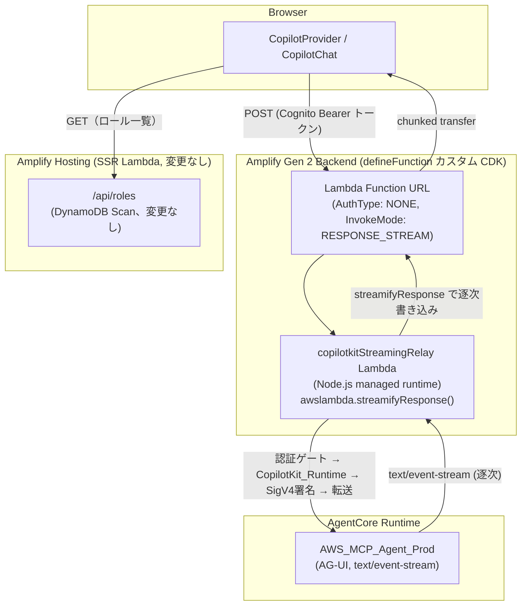

# Design Document

## Overview

現在、`src/app/api/copilotkit/route.ts` は Next.js の Route Handler として実装されており、CopilotKit_Runtime（`CopilotRuntime` + `ExperimentalEmptyAdapter`）のインスタンス化、SigV4 署名（`sigv4Fetch`）、認証ゲート（Cognito Bearer トークン検証）、セッションヘッダーの伝播（`X-Role-Names` / `X-Amzn-Bedrock-AgentCore-Runtime-Custom-UserId`）を1つのハンドラー内で行っている。Amplify Hosting はこの Route Handler を SSR_Compute（AWS Lambda、Next.js 標準の統合経由）として実行するが、この統合レイヤーは AWS Lambda のレスポンスストリーミング（`awslambda.streamifyResponse()`）を有効化しない。そのため AgentCore Runtime からの `text/event-stream` レスポンスは Lambda 内でバッファリングされ、完了後に一括でブラウザへ返される。

本設計は、CopilotKit_Runtime の中継処理（認証・SigV4署名・セッションヘッダー伝播・AgentCore Runtime への転送を含む一連の処理）を、Next.js の Route Handler から**独立した Node.js Lambda 関数**（Lambda 関数 URL、`InvokeMode: RESPONSE_STREAM`）に切り出す。この新しい Lambda は Node.js マネージドランタイム上でネイティブに `awslambda.streamifyResponse()` を使えるため、Amplify Hosting の SSR_Compute の制約を受けずにストリーミングを実現できる。

### 設計方針

1. **中継処理を Amplify Gen 2 の `defineFunction` カスタム CDK 構成で管理する**: 新しい Lambda 関数は `amplify/functions/copilotkitStreamingRelay/` 配下に配置し、`defineFunction((scope) => new lambda.Function(...))` の低レベル CDK オーバーライドパターンで `addFunctionUrl({ invokeMode: lambda.InvokeMode.RESPONSE_STREAM })` を構成する。これにより Amplify Gen 2 のバックエンド定義（`amplify/backend.ts`）の一部として管理され、既存の Amplify Hosting のデプロイフロー（Git push → 自動ビルド）と同じタイミングでデプロイされる。新たに `agentcore deploy` や独立した CDK スタックを運用者に要求しない。
2. **既存の `route.ts` のロジックを移植し、Next.js 側は薄いプロキシまたは廃止のいずれかとする**: `sigv4Fetch`・認証ゲート（`extractBearerToken`）・`extractCognitoSub`・セッションヘッダー構築ロジックは、そのまま新しい Lambda ハンドラーに移植する。CopilotKit_Runtime の呼び出しには、`@copilotkit/runtime`（インストール済みバージョン 1.59.5）の root export に含まれる `copilotRuntimeNodeHttpEndpoint` を使う。これは Next.js 専用アダプターの `copilotRuntimeNextJSAppRouterEndpoint` とは独立した Node.js 汎用アダプターであり、Fetch API の `Request` を渡す（`res` 引数を省略する）と `Promise<Response>` を直接返す呼び出し方が実装に用意されている（両アダプターとも内部で同じ Hono アプリの `honoApp.fetch(request)` を呼んでおり、動作は等価）。したがって Request/Response の手動構築は不要で、Lambda ハンドラーは Lambda 関数 URL イベントから標準の `Request` オブジェクトを1つ構築し、そのまま `copilotRuntimeNodeHttpEndpoint(...)` の戻り値の関数に渡すだけで済む（詳細は Component 1 のコードサンプルを参照）。
3. **フロントエンドは新しい Lambda 関数 URL に直接接続する**: `CopilotProvider.tsx` の `runtimeUrl` を `/api/copilotkit`（Next.js 自身のパス）から、Lambda 関数 URL のフルアドレスに変更する。関数 URL は認証なし（`AuthType.NONE`）で公開し、認証は Lambda ハンドラー内の Cognito Bearer トークン検証で行う（現行の `route.ts` と同じ認証モデルをそのまま踏襲する。関数 URL レベルで IAM 認証にすると、ブラウザから SigV4 署名済みリクエストを送る必要が生じ、フロントエンドの複雑化を招くため採用しない）。
4. **既存の `src/app/api/copilotkit/route.ts` は削除する**: 中継処理が完全に新しい Lambda に移ったため、Next.js 側に同名のプロキシを残す理由はない（二重管理・二重の認証ロジックを避ける）。ただし、既存のテスト方針（フロントエンドの lint/型チェックを優先する）に従い、削除に伴う参照エラーがないことを型チェックで確認する。
5. **SigV4 署名の credential provider を Lambda 実行ロールに変更する**: 現行の `sigv4Fetch` は `defaultProvider()`（Node.js の資格情報チェーン）を使っており、Amplify Hosting 環境では `AmplifySSRComputeRole` の資格情報が使われている。新しい Lambda では、その Lambda 自身の実行ロール（新規作成、`bedrock-agentcore:InvokeAgentRuntime` のみを許可する最小権限ロール）が同じ `defaultProvider()` の解決先になる。既存の `AmplifySSRComputeRole` に付与されていた `InvokeAgentRuntime` 権限は、この新しい Lambda 実行ロールに引き継ぐ（`AmplifySSRComputeRole` からは、Route Handler 撤去に伴い不要になるため撤去する。`RoleConfigScanAccess`（`dynamodb:Scan`、`/api/roles` 用）は撤去しない。`/api/roles` は Route Handler のまま残るため）。
6. **ロールバックしやすい段階的デプロイ**: 新しい Lambda 関数と Next.js の既存 `route.ts` は、実装の初期段階では並行して残し、フロントエンドの `runtimeUrl` を切り替える最後のコミットで `route.ts` を削除する。これにより、新しい Lambda の動作確認（sandbox 環境、または Amplify Hosting の別ブランチ）を、本番の `main` ブランチに影響を与えずに行える（Requirement 4.1）。

## Architecture



### 既存コンポーネントとの対応

| 現行実装 | 本設計での変更 |
|---|---|
| `src/app/api/copilotkit/route.ts`（Next.js Route Handler） | 削除。ロジックは `amplify/functions/copilotkitStreamingRelay/handler.ts` に移植 |
| `sigv4Fetch` / `extractBearerToken` / `extractCognitoSub` / セッションヘッダー構築（`route.ts` 内） | そのまま新しい Lambda ハンドラーに移植（ロジック自体は変更しない） |
| `AmplifySSRComputeRole` の `InvokeAgentRuntime` 権限 | 撤去し、新しい Lambda 専用の実行ロールに同等の権限を付与 |
| `AmplifySSRComputeRole` の `RoleConfigScanAccess`（`dynamodb:Scan`） | 変更なし（`/api/roles` は Route Handler のまま） |
| `CopilotProvider.tsx` の `runtimeUrl="/api/copilotkit"` | Lambda 関数 URL のフルアドレスに変更（環境変数経由でフロントエンドに渡す） |
| `NEXT_PUBLIC_AGENTCORE_RUNTIME_ARN`（Amplify Hosting 環境変数） | 新しい Lambda の環境変数として設定（Route Handler では読まなくなる） |

## Components and Interfaces

### Component 1: `copilotkitStreamingRelay`（新規、`amplify/functions/copilotkitStreamingRelay/`）

Amplify Gen 2 のカスタム関数定義パターン（`defineFunction` の低レベル CDK オーバーライド）で実装する。

```typescript
// amplify/functions/copilotkitStreamingRelay/resource.ts
import { defineFunction } from '@aws-amplify/backend';
import { Duration } from 'aws-cdk-lib';
import * as lambda from 'aws-cdk-lib/aws-lambda';
import * as iam from 'aws-cdk-lib/aws-iam';

export const copilotkitStreamingRelay = defineFunction((scope) => {
  const fn = new lambda.Function(scope, 'copilotkit-streaming-relay', {
    runtime: lambda.Runtime.NODEJS_20_X, // レスポンスストリーミング対応の Node.js マネージドランタイム
    handler: 'index.handler',
    code: lambda.Code.fromAsset(/* バンドル済みコードのパス、実装フェーズで確定 */),
    timeout: Duration.seconds(60), // AgentCore Runtime の応答時間に応じて調整
    environment: {
      AGENTCORE_RUNTIME_ARN: '', // 実装フェーズで Amplify の環境変数経由の値渡し方式を確定
    },
  });

  fn.addToRolePolicy(
    new iam.PolicyStatement({
      actions: ['bedrock-agentcore:InvokeAgentRuntime'],
      resources: ['*'], // 実装フェーズで具体的な Runtime ARN に絞る
    })
  );

  fn.addFunctionUrl({
    authType: lambda.FunctionUrlAuthType.NONE,
    invokeMode: lambda.InvokeMode.RESPONSE_STREAM,
  });

  return fn;
});
```

**ハンドラーの実装方針**（`amplify/functions/copilotkitStreamingRelay/handler.ts`）:

CopilotKit_Runtime 側の呼び出しには `@copilotkit/runtime`（インストール済みバージョン 1.59.5）が root export として提供する `copilotRuntimeNodeHttpEndpoint` を使う（`copilotRuntimeNextJSAppRouterEndpoint` は使わない。Next.js 専用アダプターではなく Node.js 汎用アダプターであるため、そのまま Lambda ハンドラーから呼び出せる。調査内容は本ファイル末尾の「未確定事項」セクション直前の確定事項を参照）。

```typescript
import { CopilotRuntime, ExperimentalEmptyAdapter, copilotRuntimeNodeHttpEndpoint } from "@copilotkit/runtime";

// モジュールスコープで1回だけ生成（route.ts と同じパターン）
const handleRequest = copilotRuntimeNodeHttpEndpoint({
  runtime,
  serviceAdapter: new ExperimentalEmptyAdapter(),
  endpoint: "/", // Lambda 関数 URL はサブパスを持たないため "/" を指定
});

export const handler = awslambda.streamifyResponse(
  async (event: LambdaFunctionURLEvent, responseStream, context) => {
    // 1. Lambda 関数 URL イベントを Fetch API の Request に変換
    const request = buildFetchRequestFromLambdaEvent(event);

    // 2. 認証ゲート（extractBearerToken 相当。401 は責任分離のため
    //    responseStream に直接ステータスコード付きで書き込む）
    // 3. Role_Set（roleNames）・actor_id（Cognito sub）の抽出（route.ts と同じロジック）
    // 4. handleRequest(request) は Fetch API の Request を受け取り Promise<Response> を
    //    直接返す（res 引数を渡さない場合、内部で isRequestLike(reqOrRequest) && !res の
    //    分岐に入り honoApp.fetch(reqOrRequest) を直接呼ぶため、IncomingMessage/
    //    ServerResponse への変換は不要）。返された Response の body（ReadableStream）を
    //    responseStream に pipe する。
    const response = await handleRequest(request);
    await pipeResponseToStream(response, responseStream);
  }
);
```

- Requirements: 1.1, 1.2, 2.1, 2.2, 2.3

### Component 2: `CopilotProvider.tsx` の変更

`runtimeUrl` を Lambda 関数 URL に向ける。関数 URL は Amplify のバックエンド出力（`amplify_outputs.json` または新規の環境変数）経由でフロントエンドに渡す。

```typescript
// 変更前: runtimeUrl="/api/copilotkit"
// 変更後: runtimeUrl={process.env.NEXT_PUBLIC_COPILOTKIT_RELAY_URL}
```

`NEXT_PUBLIC_` プレフィックスを使うことで、ビルド時にバンドルへ埋め込まれ、Amplify Hosting の SSR_Compute の環境変数制約（サーバーサイド専用変数がランタイムに渡らない問題）を回避する。関数 URL の値自体は機密情報ではない（認証なしで公開されるが、Bearer トークン検証をハンドラー内で行うため、URL 自体の秘匿性に依存しない設計とする）。

- Requirements: 1.1, 3.3

### Component 3: `amplify/backend.ts` への配線

```typescript
const backend = defineBackend({
  auth,
  data,
  copilotkitStreamingRelay, // 新規
});
```

Requirement 3.1 に基づき、この新しいリソースの存在・目的・デプロイ経路（Amplify Hosting の既存ビルドフローに統合される旨）を README に明記する（Requirement 3.2）。

- Requirements: 3.1, 3.2

## データフロー

1. ブラウザの `CopilotChat` がユーザーの発言を送信し、`CopilotProvider` が Cognito Bearer トークンをヘッダーに付与して Lambda 関数 URL にリクエストする。
2. Lambda 関数 URL が `copilotkitStreamingRelay` を `RESPONSE_STREAM` invoke mode で起動する。
3. ハンドラーが認証ゲート（Bearer トークン検証）→ Role_Set・actor_id 抽出 → SigV4 署名 → AgentCore Runtime への POST、という現行 `route.ts` と同じ順序の処理を行う。
4. AgentCore Runtime からの `text/event-stream` チャンクが到着するたびに、ハンドラーが `responseStream.write()`（または CopilotKit_Runtime が返す `Response` の `body`（`ReadableStream`）を pipe）でクライアントへ即時転送する。
5. ブラウザの CopilotKit フロントエンドが逐次到着するイベントを解釈し、`Chat_UI` にトークン単位で反映する。

## Error Handling

| エラー条件 | ハンドリング |
|---|---|
| Bearer トークンなし/無効 | Lambda 関数 URL のレスポンスとして 401 を即時返す（ストリーミングを開始しない） |
| AgentCore Runtime への SigV4 署名済みリクエストが失敗（AccessDenied 等） | エラーレスポンスをそのままクライアントへ中継し、Chat_UI がエラー表示する（Requirement 4.2） |
| Lambda 実行タイムアウト | AgentCore Runtime の応答時間に対して十分なタイムアウト値を設定する（実装フェーズで実測し確定） |
| `NEXT_PUBLIC_AGENTCORE_RUNTIME_ARN` 相当の環境変数が Lambda に未設定 | 起動時に検知し、500 エラーを返す（現行 `route.ts` の `!runtime` チェックと同等の挙動） |

## Testing Strategy

- **単体テスト**: 認証ゲート・`extractCognitoSub`・セッションヘッダー構築ロジックは `route.ts` から移植する純粋関数であり、既存のテストパターン（`*.pbt.test.ts`）を維持したまま移植先のモジュールに対して実行する。
- **ローカル検証**: `amplify/functions/copilotkitStreamingRelay/` は Amplify Gen 2 の sandbox 環境（`npx ampx sandbox`）でデプロイ・検証できるため、本番 Amplify Hosting へのデプロイ前に Lambda 関数 URL への直接リクエストで動作確認する（Requirement 4.1）。
- **結合確認**: sandbox 環境でフロントエンドの `runtimeUrl` を新しい関数 URL に向けた状態で、実際のブラウザ操作によりストリーミング表示（トークン単位の逐次表示）を目視確認する。

## 調査済み・確定事項

- **`@copilotkit/runtime` の Next.js 専用アダプターに依存しない呼び出し方法（Requirements 3.3, 3.4）**: インストール済みバージョン 1.59.5 の `package.json` の `exports` フィールドを確認した結果、root export（`import { ... } from "@copilotkit/runtime"`）に `copilotRuntimeNodeHttpEndpoint` が含まれている（`dist/lib/integrations/node-http/index.cjs` を実装確認済み）。この関数はシグネチャ `(reqOrRequest: IncomingMessage | Request, res?: ServerResponse) => Promise<void> | Promise<Response> | Response` を持ち、`res` を渡さず Fetch API の `Request`（または `Request` 互換オブジェクト）のみを渡すと、内部の `isRequestLike(reqOrRequest) && !res` 分岐に入り `honoApp.fetch(reqOrRequest)` を直接呼んで `Promise<Response>` を返す。これは `copilotRuntimeNextJSAppRouterEndpoint` が返す `handleRequest`（`hono/vercel` の `handle = (app) => (req) => app.fetch(req)` をラップしたもの）と全く同じ Hono アプリ（`createCopilotEndpointSingleRoute` で構築）の `fetch` メソッドを呼んでおり、挙動は等価である。したがって Lambda ハンドラー側で `Request`/`Response` を手動構築するフォールバック方針は不要と確定した。Lambda ハンドラーは Lambda 関数 URL イベントから標準の Fetch API `Request` オブジェクトを1つ構築し、`copilotRuntimeNodeHttpEndpoint({ runtime, serviceAdapter, endpoint: "/" })` の戻り値の関数にその `Request` を渡すだけでよい。返り値の `Response` の `body`（`ReadableStream`）を `responseStream` に pipe すればストリーミングが実現できる。

- **Lambda のタイムアウト値・メモリサイズ（タスク 6.1 で確定）**: sandbox 環境（`npx ampx sandbox`）にデプロイした関数 URL に対し、Cognito 認証済みの実際のチャットリクエスト（AgentCore Runtime `AWS_MCP_Agent`、ツール呼び出しなしの単純な応答）を送信して実測した。結果: TTFB（`RUN_STARTED` イベント到着まで）約 2.6 秒、Lambda 実行時間（応答完了まで）約 4.0 秒、メモリ使用量最大 211MB。この実測値に基づき、暫定値だった `timeout: 60秒` / `memorySize: 512MB`（`resource.ts`）は、単純な応答に対して十分な余裕（メモリは実測の約2.4倍、タイムアウトは実測の約15倍）があるため、そのまま確定値として採用した。ただし、AWS MCP Server 経由の複数ツール呼び出しを伴う複雑な問い合わせのシナリオは未実測のため、運用開始後にタイムアウトに達する事例が見られた場合は再調整が必要（`resource.ts` にコメントで明記）。
- **esbuild バンドルの出力フォーマット（タスク 6.1 で判明・確定）**: `NodejsFunction` のデフォルト CJS 出力では、`@copilotkit/runtime` がバンドルする ESM 前提の内部モジュール（`@oxc-project/runtime` 系のヘルパー）が `createRequire(import.meta.url)` を呼ぶが、CJS ビルドでは `import.meta` が存在せず `import.meta.url` が `undefined` になり、Lambda の初回 INIT で `TypeError [ERR_INVALID_ARG_VALUE]` により全リクエストが失敗する致命的な不具合があった。`bundling.format: OutputFormat.ESM`（`--format=esm`、出力ファイルは `index.mjs`）に切り替えることで解消した。ESM 出力では逆に一部の依存関係（`@copilotkit/shared` が使う `chalk`/`supports-color`）が内部で `require("os")` のような CJS の `require` 呼び出しを行っており、esbuild の ESM 出力はこれを未定義エラーに変換するため、`bundling.banner` で `createRequire(import.meta.url)` から `require` を明示的に定義するスタンダードな回避策を追加した。

- **`bedrock-agentcore:InvokeAgentRuntime` の `Resource` をブランチ環境ごとに正しい Runtime ARN に絞る方法（タスク 8.1 で確定）**: `resource.ts` は元々 Lambda の環境変数 `AGENTCORE_RUNTIME_ARN` を synth 時の `process.env` から読んでおり、この値自体が「sandbox 実行時はローカル `.env.local` / シェルの環境変数、本番 Amplify Hosting（`main` ブランチ）では Amplify コンソールの環境変数」という、デプロイ環境ごとに異なる値を渡す既存のパターン（タスク 6.1 で確定）で既に運用されている。したがって、`AWS_BRANCH` を見て ARN をコード内で分岐させる新しいロジックを追加するのではなく、IAM ポリシーの `Resource` も同じ `AGENTCORE_RUNTIME_ARN` の値（`resource.ts` 内で1回だけ読み取った `agentCoreRuntimeArn` 定数）から `[agentCoreRuntimeArn, `${agentCoreRuntimeArn}/*`]` として導出する方式を採用した。`/*` サブリソースを含めるのは、削除済みの `AmplifySSRComputeRole` の `InvokeAgentCoreRuntime` インラインポリシー（タスク 5.1 で削除前に確認済み）が同じ2エントリー構成だったことに合わせている。
  - この方式のメリット: (1) 環境変数と IAM ポリシーが同一の値から導出されるため、両者が食い違うリスクがない、(2) `AWS_BRANCH` ベースの ARN マッピングをコードにハードコードしないため、Requirement 2.4（Runtime ARN やアカウント ID をコードに露出しない）にも自然に適合する、(3) 既存の「環境変数経由で値を渡す」パターン（README・docs/deployment.md に記載済み）をそのまま拡張するだけで、新しい運用手順を増やさない。
  - **フェイルセーフの判断**: `AGENTCORE_RUNTIME_ARN` が未設定（空文字列）の場合、`Resource: '*'` へのフォールバックはせず、`bedrock-agentcore:InvokeAgentRuntime` を許可するポリシー自体を一切付与しない（IAM レベルでは何も権限を持たない状態になる）。CDK synth 自体を失敗させる方式（throw）は採用しなかった。理由は、このリポジトリがエージェント機能を「オプション拡張」として扱う方針（`product` ルール、docs/setup.md）であり、AgentCore Runtime をまだデプロイしていない新規クローン直後の `npx ampx sandbox` でも Amplify バックエンド全体（auth・data・Todo アプリ）が synth/deploy できる必要があるため。ARン未設定を synth エラーにすると、エージェント機能を使わない利用者の初回セットアップ自体を壊してしまう。実行時側は既に `handler.ts` が `AGENTCORE_RUNTIME_ARN` 未設定を検知して 500 を返す設計になっており、IAM ポリシー未付与と組み合わせることで「機能が動かない（500）」で安全に失敗し、「過剰な権限を持ったまま動く」という本番でのリスクは生じない。
  - **sandbox での事前確認結果**: sandbox 環境（`npx ampx sandbox --once`、dev Runtime ARN `arn:aws:bedrock-agentcore:us-west-2:<ACCOUNT_ID>:runtime/agents_AWS_MCP_Agent-XXXXXXXXXX` を指定）に再デプロイし、`aws iam get-role-policy` で実際にデプロイされたロールのポリシーを確認した結果、`Resource` が `["arn:aws:bedrock-agentcore:us-west-2:<ACCOUNT_ID>:runtime/agents_AWS_MCP_Agent-XXXXXXXXXX", ".../agents_AWS_MCP_Agent-XXXXXXXXXX/*"]` に絞られていることを確認した（`*` は残っていない）。関数 URL への未認証リクエスト（Bearer トークンなし）で `401 {"error":"Unauthorized"}` が返ることも確認し、認証ゲートが IAM の絞り込みによって壊れていないことを確認した。
