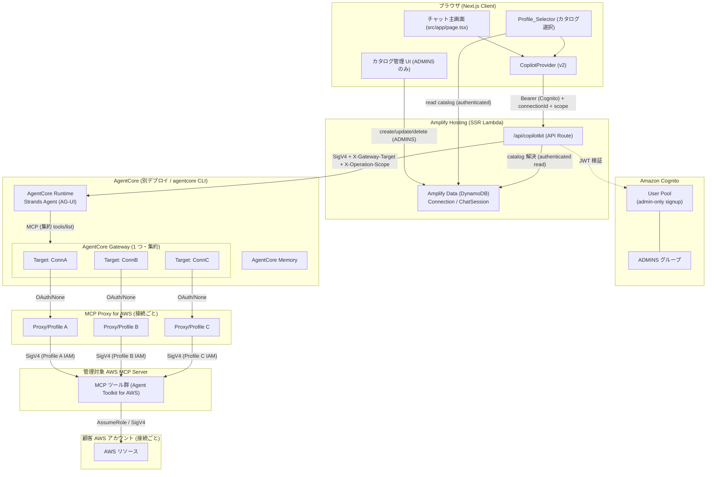
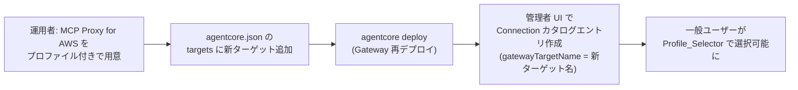
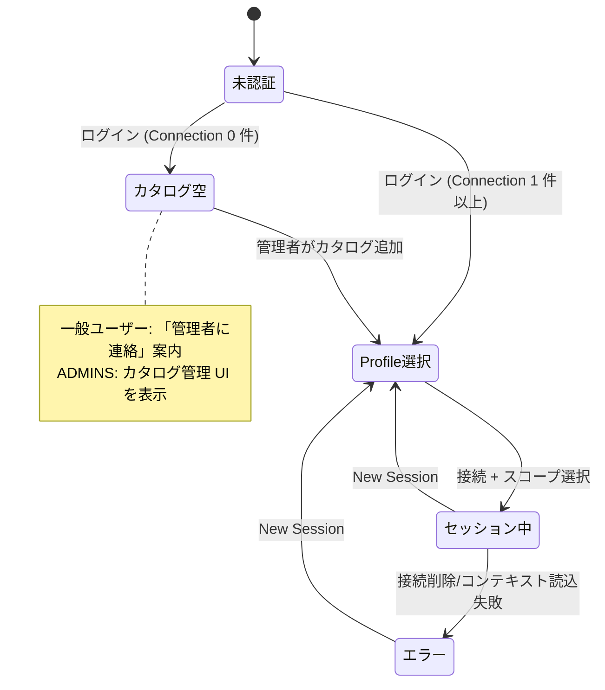
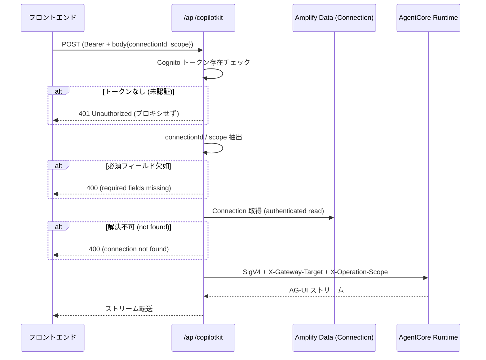

# Design Document

## Overview

本設計は、AWS MCP Server（Agent Toolkit for AWS）を AgentCore Gateway 経由でツールとして接続し、ユーザーが自然言語で AWS インフラを運用できる AI エージェント機能を定義する。**1 つの AgentCore Gateway が複数の MCP ターゲット（事前ステージング済みの接続）をホストし、それらを 1 つの仮想 MCP サーバーとして集約する**（Option A: マルチターゲット集約構成）。各 Gateway ターゲットは特定の AWS アカウント / リージョン / ロール構成を表し、運用者（管理者）が AgentCore CLI で追加・再デプロイすることで拡充される。

一般ユーザーは AWS プロファイルを自分で作成しない。管理者（ADMINS Cognito グループ）が「接続カタログ」（Amplify Data モデル）を管理し、一般の認証ユーザーはカタログを読み取って、セッションごとに 1 つの接続と操作スコープを選択する。接続は AWS アカウントへのアクセスを伴うため、本アプリは一般公開せず、Cognito のセルフサインアップを無効化する（管理者のみがユーザーを作成）。

本機能は既存の CopilotKit + AG-UI + SigV4 → AgentCore Runtime 接続アーキテクチャを拡張する形で実装し、ワークスペースの責務分離ルール（`src/` = Web、`agents/` = エージェント、`amplify/` = バックエンド）を厳守する。

### 検証済みリサーチ結果（Option A の根拠）

本設計の中核判断は AWS 公式ドキュメントで検証済みである。

1. **マルチターゲット集約**: AgentCore Gateway は複数の MCP ターゲットをホストし、`tools/list` で全ターゲットのツールを統合した集合を返す。Gateway は各ツール名にターゲット名のプレフィックスを付与し、名前衝突を解消する（出典: AgentCore Gateway core concepts、"Transform your MCP architecture with Amazon Bedrock AgentCore Gateway" ブログ）。各 Gateway ターゲット = 特定の AWS アカウント / リージョン / ロールへの事前ステージング済み接続であり、MCP Proxy for AWS が管理対象の AWS MCP Server エンドポイントへ SigV4 で接続する。

2. **AWS MCP Server のマルチプロファイル実態**: AWS MCP Server（Agent Toolkit for AWS）のマルチプロファイル機能は MCP Proxy for AWS（`mcp-proxy-for-aws` v1.6.0+、GA 2026 年 6 月）を用い、呼び出しごとの `aws_profile` パラメータで切り替える。ただし**プロキシ起動時に事前宣言したプロファイル（`--profile` / `AWS_MCP_PROXY_PROFILES`）に限られ、実行時の任意プロファイル指定は不可**（ドキュメント明記: "Only profiles declared at startup are available"）。このため本設計では、呼び出しごとの `aws_profile` 切り替えに依存せず、**各接続を独立した事前ステージング済み Gateway ターゲットとしてモデル化**する。これは Gateway の集約モデルに自然に適合し、ツール名プレフィックスによるセッション単位の分離を提供する。設計上の含意: 各 Gateway ターゲットはプロキシ/プロファイルを背後に持つ MCP エンドポイントを必要とし、運用者によるプロビジョニング（AgentCore CLI 再デプロイでターゲット追加）が前提となる。

3. **Cognito 管理者のみ作成**: Amplify Gen 2 の `defineAuth` にはセルフサインアップ無効化の直接フラグがないため、`backend.ts` で配下の Cognito ユーザープールへ override を適用する（`cfnUserPool.adminCreateUserConfig = { allowAdminCreateUserOnly: true }`、出典: Cognito `AdminCreateUserConfig` / `AllowAdminCreateUserOnly`）。ADMINS グループは `defineAuth({ groups: ["ADMINS"] })` で追加する。

### 設計の中心となる判断

1. **Gateway は別デプロイ・マルチターゲット**: Amplify Hosting のビルド環境は Docker 非対応のため、Gateway と Runtime は Amplify の CDK スタックに含めず、AgentCore CLI（`agentcore deploy`）で別途デプロイする。1 つの Gateway 構成の `targets` 配列に接続ごとのターゲットを定義する（`agents/agentcore/agentcore.json` の `agentCoreGateways`）。
2. **接続カタログは運用者管理**: 一般ユーザーは AWS プロファイルを作らない。ADMINS グループのみがカタログ（Connection モデル）を CRUD し、一般認証ユーザーは読み取りのみ。カタログエントリは UI 表示用メタデータ（displayName / awsAccountId / awsRegion / gatewayTargetName / description）で、デプロイ済み Gateway ターゲットを指す（_Requirements 3, 6.1, 9.3_）。
3. **セッション単位のターゲット固定が主たる分離機構**: セッションは 1 つの接続（= 1 つの Gateway ターゲット）に固定される。エージェントはそのターゲットのプレフィックス付きツールに利用を制限し（_Requirements 2.3_）、操作スコープも強制する（_Requirements 5_）。
4. **セッションコンテキストはヘッダー伝播**: API Route がサーバーサイドでカタログから接続を解決し、Gateway ターゲット名と操作スコープを SigV4 署名付きリクエストのヘッダーとして AgentCore Runtime に渡す（_Requirements 4.5, 7.3, 7.6_）。フロントエンドは接続 ID とスコープのみ送信する。
5. **操作スコープは多層防御**: 「フロントエンドのデフォルト（読み取り専用）」「エージェント内の強制」「AWS MCP Server の read-only モード」の 3 層で担保する（_Requirements 5.2, 5.3_）。
6. **認可は役割ベース + owner ベース**: Connection は `allow.group("ADMINS")`（書き込み）+ `allow.authenticated().to(["read"])`（読み取り）、ChatSession は `allow.owner()`。`defaultAuthorizationMode = userPool`（_Requirements 6.3, 6.4, 6.5, 9.3, 9.4_）。

### フラグすべき高感度・要注意事項

| # | 事項 | 影響レイヤー |
|---|------|------------|
| F1 | `agentcore.json` の `runtimeVersion` が `PYTHON_3_14` になっている。ag-ui-strands は 3.14 非対応のため `PYTHON_3_13`（または 3_12）へ変更が必要 | エージェント |
| F2 | Amplify Data の `defaultAuthorizationMode` を `apiKey` → `userPool` へ変更し、`defineAuth` に ADMINS グループを追加、`backend.ts` で Cognito の管理者のみ作成（`allowAdminCreateUserOnly = true`）を override する。既存サンプル Todo（apiKey）への影響、フロントエンドの認証必須化、グループ別 UI ゲートが発生（_Requirements 9.1, 6.3, 6.4_） | Amplify バックエンド + フロントエンド |
| F3 | Gateway → 各 MCP エンドポイント間のアウトバウンド認証は `mcpServer` ターゲットでは OAuth(CC) / None に限られる。AWS アカウントへのアクセスは**各 Gateway ターゲット背後の MCP Proxy for AWS が、そのプロファイルの IAM アイデンティティで管理対象 AWS MCP Server へ SigV4 接続する**ことで達成する（Req 1.5 の「SigV4 アウトバウンド」の実体）。Gateway とプロキシ背後の MCP エンドポイント間の認証方式（OAuth/None）は実装フェーズで確定する | エージェント / インフラ |
| F4 | Amplify Hosting コンピューティングロールへの `bedrock-agentcore:InvokeAgentRuntime` 権限付与（既存）に加え、API Route が Data Model（Connection カタログ）を読むための認可経路が必要 | IAM / デプロイ |
| F5 | **運用コスト**: 接続を 1 つ追加するたびに、プロキシ背後の MCP エンドポイント + Gateway ターゲット + 再デプロイ（AgentCore CLI）が必要。接続数に比例して運用負荷とコストが増える点を運用者に明示する | インフラ / 運用 |

> 注: F2・F4・F5・Gateway/Runtime の IAM 設定は高感度変更であり、実装フェーズでレビュー必須とする。

## Architecture

### システム全体構成（マルチターゲット集約）



ポイント:

- 1 つの Gateway が ConnA/ConnB/ConnC… の複数ターゲットを集約。`tools/list` は全ターゲットのツールを統合して返し、各ツール名はターゲット名でプレフィックスされる（_Requirements 1.2, 1.3_）。
- 各ターゲットは MCP Proxy for AWS を背後に持ち、プロキシがそのプロファイルの IAM アイデンティティで管理対象 AWS MCP Server へ SigV4 接続する（_Requirements 1.5_、F3）。
- AWS アカウントへのアクセスはプロキシプロファイルの IAM で達成され、エンドユーザーは AWS 認証情報を扱わない。

### 運用者（管理者）フロー: 接続追加

接続カタログのエントリと実体の Gateway ターゲットは別物であり、後者は運用者のタスクである。



- カタログエントリ（UI メタデータ）は管理者が UI で作成（_Requirements 3.1, 3.7_）。
- 実体の Gateway ターゲットのプロビジョニングは AgentCore CLI 再デプロイで行う運用者タスク（_Requirements 1.1, 3.7_）。

### 画面状態遷移



### API Route 処理フロー



接続はユーザー所有ではなく共有カタログのため、所有者検証（旧 403）は行わない。401（未認証）/ 400（欠如・未解決）で扱う（_Requirements 7.2, 7.4, 7.5_）。ChatSession の owner 認可は Data Model 側で担保される（_Requirements 6.4_）。

### レイヤーと責務

| レイヤー | ディレクトリ | 責務 | 本機能での変更 |
|---------|------------|------|--------------|
| フロントエンド | `src/` | カタログ読み取り + Profile_Selector、管理者向けカタログ CRUD、セッション固定チャット、グループ別 UI ゲート | 新規コンポーネント追加、トップページをチャット主画面化 |
| API Route | `src/app/api/copilotkit/` | 接続のサーバーサイド解決、認証ゲート、コンテキストヘッダー付与、SigV4 プロキシ | 拡張 |
| Amplify バックエンド | `amplify/` | Cognito 認証（管理者のみ作成 + ADMINS グループ）、Connection / ChatSession データモデル | 認証拡張、データモデル追加、認証モード変更 |
| エージェント | `agents/app/` | Gateway MCP 接続、全ターゲット発見 + セッションターゲットへの制限、スコープ強制 | エージェントロジック書き換え |
| AgentCore 構成 | `agents/agentcore/` | Runtime / Gateway（マルチターゲット）/ Memory のデプロイ定義 | `agentCoreGateways` 追加、Python バージョン修正 |

## Components and Interfaces

### 1. AgentCore Gateway（マルチターゲット集約）（_Requirements 1_）

1 つの Gateway に接続ごとの `mcpServer` ターゲットを定義し、Gateway がそれらを 1 つの仮想 MCP サーバーとして集約する。

**agentcore.json の構成（`agentCoreGateways`・`targets` 配列）:**

```json
{
  "agentCoreGateways": [
    {
      "name": "AWS-MCP-Gateway",
      "description": "Aggregated AWS MCP gateway hosting one target per connection",
      "targets": [
        {
          "name": "ConnA",
          "targetType": "mcpServer",
          "endpoint": "https://<proxy-a-host>/mcp"
        },
        {
          "name": "ConnB",
          "targetType": "mcpServer",
          "endpoint": "https://<proxy-b-host>/mcp"
        }
      ]
    }
  ]
}
```

- **集約とツール発見**: Gateway は `tools/list` で全ターゲットのツールを統合した集合を返す。各ツール名はターゲット名でプレフィックスされる（例 `ConnA___<tool_name>`）。名前衝突は Gateway が解消する（_Requirements 1.2, 1.3_）。
- **ルーティングとタイムアウト**: Gateway はツール呼び出しを該当ターゲットの AWS MCP Server にルーティングし、30 秒以内に応答する。タイムアウト時はツール名と Gateway ターゲット名を含むエラーを返す（_Requirements 1.4, 1.6_）。
- **接続エラー**: 接続失敗時は失敗種別（connection refused / DNS / authentication）と Gateway ターゲット名を含むエラーを返す（_Requirements 1.7_）。
- **アウトバウンド認証（F3）**: 各ターゲット背後の MCP Proxy for AWS が、起動時宣言済みプロファイルの IAM アイデンティティで管理対象 AWS MCP Server へ SigV4 接続する。これが Req 1.5 の「SigV4 ベースの IAM 認証」の実体。Gateway → プロキシエンドポイント間の認証（OAuth/None）は実装フェーズで確定する。
- **運用者による追加**: 上記「運用者フロー」のとおり、ターゲット追加は `targets` 配列への追記 + `agentcore deploy` 再デプロイで行う（_Requirements 1.1, 3.7_）。

### 2. Strands Agent（全ターゲット発見 + セッションターゲット制限）（_Requirements 2, 5_）

エージェントは起動時に Gateway へ MCP クライアントとして接続し、全ターゲットのツールを発見する。そのうえで、現在のセッションの Gateway ターゲットのプレフィックスに一致するツールのみへ利用を制限する（新ロジック、_Requirements 2.3_）。

**モジュール構成（責務分離）:**

```
agents/app/AWS_MCP_Agent/
├── main.py                     # AG-UI アプリ構築、エージェント組み立て
├── model/load.py               # Bedrock モデル (Claude Sonnet 4.5) ※既存
├── memory/session.py           # AgentCore Memory セッション ※既存
├── gateway/client.py           # 新規: Gateway MCP クライアント接続・全ツール発見
├── gateway/target_filter.py    # 新規: セッションターゲットのプレフィックスでツールを絞り込む
├── context/session_context.py  # 新規: ヘッダーからセッションコンテキスト抽出
├── scope/enforcement.py        # 新規: 操作スコープ強制（write ツール判定）
└── prompts/system.py           # 新規: システムプロンプト定義
```

**Gateway MCP クライアント接続（`gateway/client.py`）:**

Strands の `MCPClient` を使用し、Gateway の MCP エンドポイントへ streamable HTTP transport で接続する。

```python
from strands.tools.mcp import MCPClient
from mcp.client.streamable_http import streamablehttp_client

def build_gateway_client(gateway_url: str, auth_token: str) -> MCPClient:
    return MCPClient(
        lambda: streamablehttp_client(
            gateway_url,
            headers={"Authorization": f"Bearer {auth_token}"},
        ),
        startup_timeout=30,  # Requirements 2.1
    )

# 全ターゲットのツール発見: client.list_tools_sync()
```

- 起動後 30 秒以内に接続し、全 Gateway ターゲットにわたってツールを発見（_Requirements 2.1_）。接続失敗時はログ出力 + ユーザーへ到達不能エラー報告（_Requirements 2.2_）。

**ターゲット絞り込み（`gateway/target_filter.py`）:**

セッションの Gateway ターゲット名プレフィックスに一致するツールのみを許可する（_Requirements 2.3_）。

```python
def tools_for_target(all_tools, target_name: str):
    prefix = f"{target_name}___"
    return [t for t in all_tools if t.name.startswith(prefix)]

def is_tool_in_target(tool_name: str, target_name: str) -> bool:
    return tool_name.startswith(f"{target_name}___")
```

- ユーザーメッセージを解釈し、現セッションターゲットのツールのうち説明文が意図に一致するものを選択して Gateway 経由で呼ぶ（_Requirements 2.4_）。
- 一致するツールがない場合、未対応である旨と現接続で利用可能なツールのカテゴリを返す（_Requirements 2.5_）。
- ツール呼び出しエラー時は自然言語で報告し、最低 1 つの是正策を提示（_Requirements 2.6_）。

**セッションコンテキスト抽出（`context/session_context.py`）:**

API Route が付与したヘッダーから、現在のセッションのコンテキストを抽出する。

```python
@dataclass(frozen=True)
class SessionContext:
    gateway_target: str       # X-Gateway-Target
    operation_scope: str      # "readonly" | "readwrite" | "admin"
```

| ヘッダー | 用途 |
|---------|------|
| `X-Gateway-Target` | 現セッションの Gateway ターゲット名（ツール絞り込み・ルーティング）（_Requirements 4.5, 7.3_） |
| `X-Operation-Scope` | 操作スコープ（_Requirements 7.6_） |
| `X-Amzn-Bedrock-AgentCore-Runtime-User-Id` | Cognito ユーザー ID（Memory 用） |
| `X-Amzn-Bedrock-AgentCore-Runtime-Session-Id` | セッション ID（Memory 用） |

対象アカウント / リージョン / ロールは Gateway ターゲット（= プロキシのプロファイル）に内包されるため、IAM ロール ARN 等の機密値はヘッダーに含めない。

**操作スコープ強制（`scope/enforcement.py`）:**

エージェント内で、チャット内のユーザー指示に関わらず操作スコープを強制する多層防御の中核（_Requirements 5.3_）。

```python
WRITE_VERBS = ("create", "update", "delete", "put", "modify",
               "remove", "attach", "detach", "start", "stop",
               "terminate", "run", "enable", "disable")

def is_write_tool(tool_name: str) -> bool:
    """ツール名/説明から書き込み操作を判定する。"""
    ...

def is_allowed(tool_name: str, scope: str) -> bool:
    if scope == "readonly":
        return not is_write_tool(tool_name)
    return True  # readwrite / admin
```

- `readonly` 時は write 分類ツール（create/update/delete 等、状態変更を伴う操作）を拒否（_Requirements 5.2_）。
- 拒否時は、拒否された操作名・現在のスコープ制約・read-write での新規セッション開始の提案を含むメッセージを返す（_Requirements 2.8, 5.4_）。
- 防御の最終層として、`readonly` セッションを read-only モード（`--allow-write` 無効）で起動した別ターゲットへ割り当てることも検討（実装タスクで確定）。

**システムプロンプト（`prompts/system.py`）:**

現在のアクティブな接続（Gateway ターゲット）と操作スコープを動的に埋め込む。スコープ制約・対象接続・利用可能ツールのカテゴリを明示し、スコープ外操作や他ターゲットのツール使用を試みないよう指示する。

### 3. API Route の拡張（_Requirements 7_）

`src/app/api/copilotkit/route.ts` を拡張する。既存の `ExperimentalEmptyAdapter` + `HttpAgent` + `sigv4Fetch` 構成は維持する。

- リクエストボディから `connectionId` と `operationScope` を抽出（_Requirements 7.1_）。
- 未認証（Cognito トークンなし）の場合は、プロキシせず 401 を返す（_Requirements 7.5_）。
- `connectionId` / `operationScope` 欠如時は 400（_Requirements 7.2_）。
- `connectionId` を Data Model（Connection カタログ）からサーバーサイドで解決し、`gatewayTargetName` を `X-Gateway-Target` ヘッダーに付与（_Requirements 7.3_）。
- 接続が解決できない場合は 400（_Requirements 7.4_）。
- 操作スコープを `X-Operation-Scope` ヘッダーとして渡す（_Requirements 7.6_）。

**サーバーサイドからの Data Model アクセス:**

API Route は認証ユーザーのトークンを用い、Amplify Data クライアント（`runWithAmplifyServerContext` + userPool 認証）で Connection を読み取る。Connection は `allow.authenticated().to(["read"])` のため、認証済みなら読み取り可能。接続は共有カタログでありユーザー所有ではないため、所有者検証は行わない。ChatSession の owner 認可は Data Model 側で担保される。

### 4. フロントエンド（_Requirements 3, 4, 8, 9_）

トップページ（`src/app/page.tsx`）をチャット主画面に置き換える。サンプルページ（`src/app/sample/`）は参照用に残すが、ナビゲーションから除外する（structure ルール）。

**コンポーネント構成（小さく合成可能・UI とインフラ分離）:**

```
src/
├── app/page.tsx                       # チャット主画面（認証ゲート + 状態分岐 + グループ判定）
├── components/agent/
│   ├── ProfileSelector.tsx            # カタログ選択 + スコープ選択（全認証ユーザー）
│   ├── ConnectionList.tsx             # カタログ一覧表示（displayName / accountId / region）
│   ├── ConnectionCatalogManager.tsx   # 管理者専用 CRUD（ADMINS グループのみ）
│   ├── ConnectionForm.tsx             # 作成/編集フォーム + バリデーション（管理者）
│   ├── SessionChat.tsx                # セッション固定チャット（ヘッダー + CopilotChat）
│   └── SessionHeader.tsx              # 接続情報固定ヘッダー
├── lib/agent/
│   ├── CopilotProvider.tsx            # 既存。body に connectionId/scope 経路を追加
│   ├── connectionValidation.ts        # 純粋関数: フィールドバリデーション
│   ├── useConnectionCatalog.ts        # カタログ読み取りフック（全ユーザー）
│   ├── useConnectionAdmin.ts          # カタログ CRUD フック（ADMINS のみ）
│   └── useIsAdmin.ts                  # Cognito グループ判定（ADMINS 所属か）
```

- **カタログ閲覧（全認証ユーザー）**: 利用可能な Connection を一覧表示（displayName / awsAccountId / region）（_Requirements 3.4, 8.2_）。
- **管理者カタログ管理（ADMINS のみ）**: 作成（displayName 1〜100 文字、awsAccountId、awsRegion、gatewayTargetName、description 任意）（_Requirements 3.1_）、編集（_Requirements 3.2_）、削除（確認ダイアログ）（_Requirements 3.3_）。`useIsAdmin` が false の場合、これらのコントロールを一切描画しない（_Requirements 8.6, 8.7, 9.5_）。
- **バリデーション**（`connectionValidation.ts` 純粋関数）: awsAccountId = 12 桁数値、awsRegion = `[a-z]+-[a-z]+-[0-9]+`、displayName = 1〜100 文字（_Requirements 3.5_）。失敗時はフィールド単位のインラインエラーを表示し送信しない（_Requirements 3.6_）。
- **Profile_Selector**: 接続選択までチャット入力を有効化せず、チャット UI も描画しない（_Requirements 4.1_）。操作スコープ選択を提供（_Requirements 4.2_）。未選択時は read-only がデフォルト（_Requirements 5.6_）。
- **セッション固定**: アクティブ中は接続の displayName・awsAccountId・region をスクロールなしで見える固定ヘッダーに表示（_Requirements 4.3, 8.3_）。新規セッション開始なしでの接続変更を禁止（_Requirements 4.4_）。
- **New Session**: 現セッションを終了し Profile_Selector へ戻る（_Requirements 8.4_）。
- **カタログ空**: Connection 0 件時は「管理者に連絡」案内付き Profile_Selector を表示し、最低 1 件存在までチャットへのアクセスを禁止（_Requirements 8.5_）。
- **主画面 + 認証ゲート**: ルートパスをチャット主画面とし、テンプレートランディングを置き換える。いずれのビューも認証必須（_Requirements 8.1, 9.2_）。
- **エラー回復**: セッション中に接続が削除/利用不可になった場合はエラー表示 + 入力無効化（_Requirements 4.6_）。接続情報読込失敗時はエラー表示 + New Session で回復（_Requirements 8.8_）。

**セッションコンテキストの流れ:**

`ProfileSelector` で選択された `connectionId` と `operationScope` を React 状態として保持し、CopilotKit リクエストの `body`/`forwardedProps` として API Route に送る（`gatewayTargetName` はサーバーで解決）。

### 5. AgentCore Memory（既存活用）

既存の `memory/session.py`（`AgentCoreMemorySessionManager`）を活用する。`X-Amzn-Bedrock-AgentCore-Runtime-User-Id` に Cognito ユーザー ID（`sub`）、`X-Amzn-Bedrock-AgentCore-Runtime-Session-Id` にセッション ID を設定する（`amplify-frontend` ルール準拠）。チャットセッション = AgentCore Memory セッションとして対応付ける。

### 6. 認証・アクセス制御（Cognito）（_Requirements 9_）

**管理者のみ作成 + ADMINS グループ:**

`amplify/auth/resource.ts` に ADMINS グループを追加する。

```typescript
import { defineAuth } from "@aws-amplify/backend";

export const auth = defineAuth({
  loginWith: { email: true },
  groups: ["ADMINS"],
});
```

セルフサインアップ無効化は `defineAuth` に直接フラグがないため、`amplify/backend.ts` で配下の Cognito ユーザープールへ override を適用する（F2、_Requirements 9.1_）。

```typescript
import { defineBackend } from "@aws-amplify/backend";
import { auth } from "./auth/resource.js";
import { data } from "./data/resource.js";

const backend = defineBackend({ auth, data });

const { cfnUserPool } = backend.auth.resources.cfnResources;
cfnUserPool.adminCreateUserConfig = {
  allowAdminCreateUserOnly: true, // セルフサインアップ無効化 (Requirements 9.1)
};
```

- **UI ゲート**: `useIsAdmin` が Cognito トークンの `cognito:groups` に `ADMINS` を含むか判定し、管理者のみカタログ管理 UI を描画する（_Requirements 8.6, 8.7, 9.5_）。
- **データ認可**: 後述の Data Models で `allow.group("ADMINS")`（書き込み）+ `allow.authenticated().to(["read"])`（読み取り）を適用し、非管理者の書き込みを拒否する（_Requirements 9.3, 9.4_）。
- **認証必須**: 全ビューで認証を必須とする（_Requirements 9.2_）。

> 高感度変更: Cognito の管理者のみ作成 override と IAM/認可変更は実装フェーズでレビュー必須（security ルール）。

## Data Models

Amplify Gen 2（`amplify/data/resource.ts`）に 2 モデルを定義し、認証モードを userPool に変更する（F2）。

```typescript
const schema = a.schema({
  Connection: a
    .model({
      displayName: a.string().required(),       // 最大 100 文字
      awsAccountId: a.string().required(),       // 12 桁文字列
      awsRegion: a.string().required(),
      gatewayTargetName: a.string().required(),  // Gateway_Target / proxy profile 識別子
      description: a.string(),                    // 任意
      // createdAt / updatedAt は Amplify が自動生成
    })
    .authorization((allow) => [
      allow.group("ADMINS"),                      // create/update/delete (ADMINS)
      allow.authenticated().to(["read"]),         // read (任意の認証ユーザー)
    ]),

  ChatSession: a
    .model({
      ownerUserId: a.string().required(),
      connectionId: a.id().required(),            // Connection を参照
      operationScope: a.enum(["readonly", "readwrite", "admin"]),
      startedAt: a.datetime(),
      endedAt: a.datetime(),                       // 任意
    })
    .authorization((allow) => [allow.owner()]),
});

export const data = defineData({
  schema,
  authorizationModes: {
    defaultAuthorizationMode: "userPool",
  },
});
```

### モデル定義

**Connection**（運用者管理カタログ）（_Requirements 6.1_）:

| フィールド | 型 | 制約 |
|-----------|-----|------|
| id | ID | 自動生成 |
| displayName | string | 必須、最大 100 文字 |
| awsAccountId | string | 必須、12 桁文字列 |
| awsRegion | string | 必須、`[a-z]+-[a-z]+-[0-9]+` |
| gatewayTargetName | string | 必須、Gateway_Target / proxy profile 識別子 |
| description | string | 任意 |
| createdAt | datetime | 自動生成 |
| updatedAt | datetime | 自動生成 |

**ChatSession**（_Requirements 6.2_）:

| フィールド | 型 | 制約 |
|-----------|-----|------|
| id | ID | 自動生成 |
| ownerUserId | string | 必須 |
| connectionId | ID | 必須、既存 Connection を参照 |
| operationScope | enum | 必須、`readonly` / `readwrite` / `admin` |
| startedAt | datetime | 自動生成 |
| endedAt | datetime | 任意 |

### 認可と整合性

- **Connection 認可**: `allow.group("ADMINS")`（作成・編集・削除）+ `allow.authenticated().to(["read"])`（読み取り）。非管理者の書き込みは拒否される（_Requirements 6.3, 9.3, 9.4_）。
- **ChatSession 認可**: `allow.owner()` により所有者のみ CRUD 可能。owner フィールドは Cognito の `sub` に紐づく（_Requirements 6.4_）。
- **認証モード**: `defaultAuthorizationMode: "userPool"`（_Requirements 6.5_）。これによりサンプル Todo（apiKey）は動作しなくなる点を実装時にフロントエンドへ周知（F2）。
- **管理者のみ作成**: §6 の `backend.ts` override（`allowAdminCreateUserOnly = true`）でセルフサインアップを無効化（_Requirements 9.1_）。
- **参照整合性**（_Requirements 6.6_）: Connection 削除時、参照する ChatSession が存在する場合の扱い。Amplify Gen 2 では DB レベルの外部キー制約がないため、アプリ層で「(a) 参照中は削除を拒否」または「(b) 参照する ChatSession を利用不可としてマーク」を実装する。本設計は (a) 参照中の削除拒否をデフォルトとし、削除前に該当 ChatSession を検索して参照有無を確認する。フロントエンドはセッション中に接続が消えた場合のエラー回復（_Requirements 4.6, 8.8_）と組み合わせる。
- **バリデーション**: 12 桁・リージョンパターンの検証はフロントエンド（`connectionValidation.ts`）で行い、`amplify-backend` ルールに従い段階的に導入する（必要に応じて将来 Lambda リゾルバで二重化）。

## Correctness Properties

*プロパティとは、システムのすべての有効な実行において成り立つべき特性・振る舞いであり、システムが何をすべきかについての形式的な記述である。プロパティは、人間が読める仕様と機械検証可能な正しさ保証との橋渡しとなる。*

以下のプロパティは、prework のテスタビリティ分類と冗長性削減（reflection）の結果に基づく。UI レンダリング・レイアウト（3.1〜3.3, 4.2, 4.3, 5.1, 8.2〜8.4）、外部・マネージドサービス配線（Gateway 集約/ルーティング 1.1〜1.5, エージェント起動接続 2.1, ChatSession owner 認可 6.4）、LLM 駆動のツール選択（2.4, 2.5）、設定/スキーマ/スモーク（3.7, 6.1, 6.2, 6.5, 9.1）は本セクションの対象外とし、それぞれ統合テスト・コンポーネント/スナップショットテスト・シナリオテスト・設定チェックで検証する（Testing Strategy 参照）。

### Property 1: エラーの分類と識別子の付与

*任意の* AWS MCP Server への失敗入力（タイムアウト / connection refused / DNS resolution failure / authentication failure）に対して、生成されるエラーは定義された失敗種別のいずれかに分類され、かつ該当する Gateway_Target 名を含み、タイムアウトの場合は対象ツール名も含む。

**Validates: Requirements 1.6, 1.7**

### Property 2: セッションターゲットによるツール制限

*任意の* 発見済みツール集合と Gateway_Target 名に対して、エージェントが許可するツールは、その Gateway_Target 名のプレフィックス（`<target>___`）で始まるツールのみであり、他ターゲットのツールはすべて除外される。

**Validates: Requirements 2.3**

### Property 3: 操作スコープの強制

*任意の* ツールと操作スコープの組み合わせに対して、スコープ強制ロジックは「スコープが readonly の場合は write 分類ツールのみを拒否し非 write ツールを許可する」「readwrite / admin の場合は許可する」という規則どおりに許可/拒否を返し、その判定はチャットメッセージ本文の内容に依存しない。

**Validates: Requirements 2.7, 5.2, 5.3**

### Property 4: スコープ拒否メッセージの内容

*任意の* readonly セッションで拒否される write ツールに対して、生成される拒否メッセージは、拒否された操作名・現在のスコープ制約・read-write での新規セッション開始の提案を含む。

**Validates: Requirements 2.8, 5.4**

### Property 5: 接続フィールドのバリデーションと送信ゲート

*任意の* 接続入力（displayName・awsAccountId・awsRegion・gatewayTargetName）に対して、フォームが送信可能と判定されるのは、displayName が 1〜100 文字、awsAccountId が 12 桁数値、awsRegion が `[a-z]+-[a-z]+-[0-9]+`、gatewayTargetName が非空のすべてに一致する場合に限る。いずれかが不一致なら送信は阻止され、不一致フィールドごとにエラーが生成される。

**Validates: Requirements 3.5, 3.6**

### Property 6: カタログ認可の決定

*任意の* （ユーザーのグループ集合, 操作種別）の組に対して、Connection に対する操作が許可されるのは、操作が read かつユーザーが認証済みである場合、または操作が create/update/delete かつユーザーが ADMINS グループに属する場合に限る。非管理者の書き込み操作は拒否される。

**Validates: Requirements 3.4, 6.3, 9.3, 9.4**

### Property 7: セッションコンテキストのヘッダー伝播

*任意の* 解決済み Connection と選択された操作スコープに対して、API Route が AgentCore Runtime へプロキシするリクエストのヘッダーは、その Connection の gatewayTargetName を `X-Gateway-Target` として、選択されたスコープ値を `X-Operation-Scope` として含む。

**Validates: Requirements 4.5, 7.3, 7.6**

### Property 8: 接続の解決と入力検証

*任意の* チャットリクエストボディに対して、connectionId または operationScope が欠如する場合は 400（必須フィールド不足）を返し、connectionId がカタログで解決できない場合は 400（not found）を返し、解決できる場合に限りプロキシ用のヘッダー（Property 7）を構築する。

**Validates: Requirements 7.2, 7.4**

### Property 9: API Route の認証ゲート

*任意の* チャットリクエストに対して、リクエストが未認証（有効な Cognito トークンなし）の場合、API Route はリクエストをプロキシせず 401 を返す。認証済みの場合に限り後続処理へ進む。

**Validates: Requirements 7.5, 9.2**

### Property 10: チャットアクセスゲート

*任意の* （認証状態, 接続選択状態, カタログ件数）の組に対して、チャットインターフェースが描画/有効化されるのは、ユーザーが認証済みかつカタログに最低 1 件の Connection が存在しかつ接続が選択されている場合に限る。

**Validates: Requirements 4.1, 8.1, 8.5**

### Property 11: 管理者向け UI ゲート

*任意の* 認証ユーザーのグループ集合に対して、接続カタログ管理コントロール（作成・編集・削除）が描画されるのは、そのユーザーが ADMINS グループに属する場合に限り、属さない場合はこれらのコントロールは一切描画されない。

**Validates: Requirements 8.6, 8.7, 9.5**

### Property 12: セッション-接続束縛の不変性

*任意の* アクティブなチャットセッションに対して、新規セッションを開始しない限り接続を変更しようとしても、束縛された接続は変化しない。

**Validates: Requirements 4.4**

### Property 13: スコープ永続化のラウンドトリップ

*任意の* 有効なスコープ値（readonly / readwrite / admin）に対して、ChatSession を保存してから読み出すと、同じスコープ値が得られる。

**Validates: Requirements 5.5**

### Property 14: 操作スコープのデフォルト

*任意の* スコープが明示的に選択されていないセッション作成入力に対して、解決される操作スコープは readonly である。

**Validates: Requirements 5.6**

### Property 15: 参照整合性

*任意の* N 件の ChatSession から参照される Connection に対して、N > 0 の間はその Connection の削除が拒否される（参照中の削除防止）。

**Validates: Requirements 6.6**

## Error Handling

### フロントエンド

| ケース | 振る舞い | 要件 |
|--------|---------|------|
| バリデーション失敗（管理者作成/編集） | フィールド単位インラインエラー、送信阻止 | 3.6 |
| カタログ 0 件 | Profile_Selector に「管理者に連絡」案内、チャット遮断 | 8.5 |
| セッション中に接続削除/利用不可 | エラー表示、入力無効化、New Session で回復 | 4.6 |
| 接続情報読込失敗 | エラー表示、New Session で回復 | 8.8 |
| 非管理者の管理操作 | 管理 UI を非表示（コントロール非描画） | 8.7, 9.5 |

### API Route

| ケース | レスポンス | 要件 |
|--------|-----------|------|
| Cognito トークンなし（未認証） | 401 Unauthorized（プロキシせず） | 7.5, 9.2 |
| connectionId / scope 欠如 | 400 + 必須フィールド不足メッセージ | 7.2 |
| 接続解決不可 | 400 + not found メッセージ | 7.4 |
| Runtime プロキシ失敗 | 上流エラーをそのまま伝播 | — |

> 注: 接続は共有カタログでありユーザー所有ではないため、所有者不一致による 403 は行わない。403 は Data Model 側の管理者専用ミューテーション（非管理者の書き込み）に対してのみ適用される（_Requirements 9.4_）。

### エージェント / Gateway

| ケース | 振る舞い | 要件 |
|--------|---------|------|
| Gateway 接続不可 (30s) | ログ出力 + 到達不能エラー報告 | 2.2 |
| ツールタイムアウト (30s) | ツール名 + Gateway_Target 名を含むタイムアウトエラー | 1.6 |
| 接続エラー | 失敗種別 + Gateway_Target 名を含むエラー | 1.7 |
| 一致ツールなし（現接続内） | 未対応 + 現接続で利用可能なカテゴリ提示 | 2.5 |
| ツール呼び出しエラー | 自然言語報告 + 是正策 1 つ以上 | 2.6 |
| スコープ外操作 | 操作名 + スコープ + read-write 提案 | 2.8, 5.4 |
| 他ターゲットのツール要求 | セッションターゲット外として拒否 | 2.3 |

### データモデル

| ケース | 振る舞い | 要件 |
|--------|---------|------|
| 非管理者の Connection 書き込み | 認可で拒否 | 9.4 |
| 参照中の Connection 削除 | 削除を拒否（参照あり） | 6.6 |

エラー観測性: `strands-agent` ルールに従い、すべての失敗はログで観測可能にする（接続失敗・タイムアウト・スコープ拒否・ターゲット外要求を構造化ログで記録）。

## Testing Strategy

`testing` ルール（最も狭い範囲の検証を最初に、レイヤーを明示）に従い、レイヤーごとに検証手段を分ける。

### レイヤー別テスト

**フロントエンド（`src/`）:**
- lint + 型チェックを最優先（`testing` ルール）。
- バリデーション純粋関数（`connectionValidation.ts`）、チャットアクセスゲート、管理者 UI ゲート、スコープデフォルト、セッション束縛不変性のロジックをプロパティテスト対象とする（Property 5, 10, 11, 12, 14）。
- コンポーネントの描画・状態遷移（カタログ一覧 8.2、管理フォーム 3.1〜3.3、ヘッダー 4.3/8.3、スコープ選択 4.2/5.1、New Session 8.4）はコンポーネント/スナップショットテストで検証。
- 削除中セッション 4.6、コンテキスト読込失敗 8.8 はシナリオテスト。

**API Route（`src/`）:**
- ヘッダー伝播（Property 7）、接続解決・入力検証 400（Property 8）、認証ゲート 401（Property 9）をプロパティ/ユニットテストで検証。Data クライアントはモック化。

**エージェント（`agents/app/`）:**
- `testing` ルールに従いスモークテスト + インポート確認を最優先。
- セッションターゲット制限（Property 2）、スコープ強制（Property 3）、拒否メッセージ（Property 4）、エラー分類（Property 1）をプロパティ/ユニットテストで検証。Gateway/MCP transport はモック化。
- 接続失敗の報告 2.2、ツールエラー報告 2.6 はユニットテスト。
- LLM 駆動のツール選択（2.4, 2.5）はデプロイ環境でのシナリオ確認。ローカルは `uvicorn` / `agentcore dev` + curl で `/invocations` を検証。

**Amplify バックエンド（`amplify/`）:**
- カタログ認可（Property 6）、スコープ永続化ラウンドトリップ（Property 13）、参照整合性（Property 15）を sandbox で検証。
- ChatSession owner 認可（6.4）はクロスユーザーアクセス拒否の統合テスト。
- 認証モード（6.5）・スキーマ（6.1, 6.2）・管理者のみ作成（9.1）は設定/型チェック・スモーク。

**統合（デプロイ環境）:**
- Gateway 集約・ルーティング（1.1〜1.4）、SigV4 アウトバウンド（1.5）、エージェント起動接続（2.1）は AgentCore デプロイ後の統合/スモークテスト。
- フロントエンド↔エージェント結合は Amplify Hosting デプロイ環境で実施（ローカルでは SigV4 + コンピューティングロールが必要なため不可、`testing` ルール）。

### プロパティベーステスト（PBT）の方針

PBT は純粋ロジック層（バリデーション、認可決定、スコープ分類、ターゲットプレフィックス絞り込み、ヘッダー/コンテキストマッピング、デフォルト解決、ラウンドトリップ、整合性、UI/認証ゲート判定）に適用する。外部サービス配線・UI レンダリング・LLM 振る舞いには適用しない。

- ライブラリ: TypeScript 側は `fast-check`、Python 側は `hypothesis` を使用する（ゼロから実装しない）。
- 各プロパティテストは最低 100 イテレーション実行する。
- 各プロパティテストは設計プロパティを参照するタグコメントを付す。
- タグ形式: **Feature: aws-mcp-gateway-agent, Property {番号}: {プロパティ説明}**
- 各 Correctness Property は単一のプロパティベーステストで実装する。

### ユニット/統合テストのバランス

- ユニットテストは具体例・エッジケース・エラー条件（2.2, 2.6, 4.6, 8.8 等）に集中させ、過剰に書かない（入力網羅はプロパティテストが担う）。
- 統合テストは外部サービス（Gateway, Runtime, Cognito, Amplify Data 認可）の配線確認に 1〜3 例で用いる。

---

## 要件カバレッジ要約

| 要件 | 主な設計箇所 | プロパティ |
|------|------------|-----------|
| 1 (Gateway マルチターゲット集約) | Components §1, Architecture（システム構成 / 運用者フロー） | Property 1 |
| 2 (Agent 統合・ターゲット制限) | Components §2 | Property 2/3/4 |
| 3 (接続カタログ・運用者管理) | Components §4/§6, Data Models | Property 5/6 |
| 4 (セッション接続固定) | Components §3/§4 | Property 7/10/12 |
| 5 (操作スコープ) | Components §2/§4 | Property 3/4/13/14 |
| 6 (データモデル) | Data Models | Property 6/13/15 |
| 7 (API Route) | Components §3, Architecture（API Route フロー） | Property 7/8/9 |
| 8 (チャット UI) | Components §4 | Property 10/11 |
| 9 (アクセス制限・ユーザー管理) | Components §6, Data Models, Auth | Property 6/9/11 |
