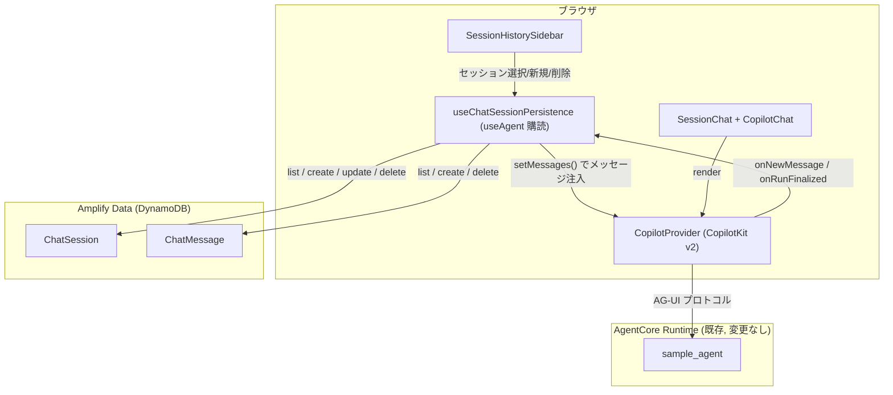
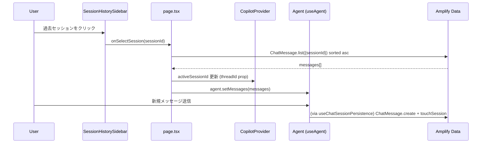

# 設計書: チャットセッション履歴管理

## Overview

現在、CopilotKit はチャットメッセージをメモリ内でのみ管理しており、ページを再読み込みすると会話が失われる。本機能は、チャットセッションとメッセージを Amplify Data（DynamoDB）に永続化し、画面左側にセッション履歴サイドバーを追加することで、ユーザーが過去の会話を一覧・選択・再開できるようにする。

主な変更点:

1. **データモデル拡張**: 既存の `ChatSession` モデルに `sessionName` / `updatedAt` を追加し、新規に `ChatMessage` モデルを追加する。
2. **永続化フック**: CopilotKit v2 の `useAgent` / `AgentSubscriber` イベント（`onNewMessage` / `onRunFinalized`）を購読し、ユーザー・アシスタント双方のメッセージを DynamoDB に書き込む。
3. **UI 追加**: `SessionHistorySidebar` コンポーネントを新設し、`page.tsx` のレイアウトに組み込む。セッション選択時は該当セッションの `ChatMessage` を取得し、`AbstractAgent.setMessages()` で該当 Agent インスタンスへ注入する。
4. **セッション名自動生成**: 最初のユーザーメッセージ送信時にクライアント側で名前を生成し、`ChatSession.sessionName` を更新する。

この機能はフロントエンド（Next.js）とバックエンド（Amplify Data）の両方に変更を加えるが、AgentCore Runtime / エージェント本体（`agents/`）には変更を加えない。CopilotKit と AgentCore の通信経路（SigV4 プロキシ）は既存のまま利用する。

## Architecture

### 全体構成



### レイヤー責務

| レイヤー | 責務 | 変更ファイル（新規/既存） |
|---|---|---|
| データモデル | ChatSession / ChatMessage の永続化スキーマと owner 認可 | `amplify/data/resource.ts`（既存拡張） |
| セッション管理フック | セッション CRUD、アクティブセッション切替、メッセージ永続化の副作用 | `src/lib/agent/useChatSessions.ts`（新規）、`src/lib/agent/chatMessagePersistence.ts`（新規） |
| 純粋ロジック | セッション名解決・生成、ソート、フィルタ、相対時刻フォーマット | `src/lib/agent/sessionNameResolver.ts`、`src/lib/agent/sessionSort.ts`、`src/lib/agent/relativeTime.ts`（すべて新規） |
| UI | サイドバー表示、インライン編集、確認モーダル | `src/components/agent/SessionHistorySidebar.tsx`（新規） |
| 画面統合 | サイドバー + SessionChat のレイアウト、アクティブセッション状態管理 | `src/app/page.tsx`（既存拡張） |

CopilotKit の Runtime API Route（`src/app/api/copilotkit/route.ts`）や AgentCore 側は変更しない。永続化はすべてクライアント側（ブラウザ）から Amplify Data クライアント経由で行う。これは既存の `useConnectionCatalog` / `useConnectionAdmin` と同じパターンであり、UI ロジックとエージェントランタイムの分離方針に合致する。

### なぜクライアント側で永続化するか

- 既存の `ChatSession` モデルは `allow.owner()` で保護されており、Cognito 認証済みユーザーのブラウザから直接 CRUD する設計が既に確立している（`useConnectionAdmin.ts` 等で同様のパターン）。
- CopilotKit v2 の `useAgent` フックはブラウザ側でエージェントのメッセージ変化（`onNewMessage` / `onMessagesChanged`）を購読できるため、サーバー側（API Route）を経由せずに永続化のフックポイントを得られる。
- `agents/` 側や API Route にメッセージ永続化ロジックを持たせると、Web アプリ本体とエージェントランタイムの責務分離方針（`structure` ステアリング）に反する。

## Components and Interfaces

### 1. データモデル（Amplify Data）

`amplify/data/resource.ts` の `ChatSession` を拡張し、`ChatMessage` を追加する（詳細は Data Models 参照）。

### 2. `sessionNameResolver.ts`（純粋関数）

```typescript
export const DEFAULT_SESSION_NAME = "新しいチャット";
export const MAX_SESSION_NAME_LENGTH = 100;
export const MAX_GENERATED_NAME_LENGTH = 30;

/** 新規セッション作成時の初期名（Requirements 4.3） */
export function defaultSessionName(): string;

/** 最初のユーザーメッセージからセッション名を生成する（Requirements 4.1, 4.4） */
export function generateSessionName(messageText: string): string;

/** ユーザー入力または生成名を確定値へ解決する（Requirements 1.3, 5.3, 5.4）
 *  - candidate が空/空白のみ → previous を返す（拒否）
 *  - candidate が100文字超 → 100文字に切り詰めて返す
 *  - それ以外 → candidate をそのまま返す
 */
export function resolveSessionName(candidate: string, previous: string): string;
```

### 3. `sessionSort.ts` / `relativeTime.ts`（純粋関数）

```typescript
// sessionSort.ts
export function sortSessionsByUpdatedAtDesc<T extends { updatedAt: string }>(sessions: T[]): T[];
export function sortMessagesByCreatedAt<T extends { createdAt: string }>(messages: T[]): T[];
export function selectNextActiveSession<T extends { id: string; updatedAt: string }>(
  remaining: T[],
): T | null;
export function selectMessageIdsForSessionDeletion<T extends { id: string; sessionId: string }>(
  messages: T[],
  sessionId: string,
): string[];

// relativeTime.ts
export function formatRelativeTime(timestamp: string, now?: Date): string;
```

`formatRelativeTime` は次のバケットに分類する: 「今」（1分未満）、「N分前」（1時間未満）、「N時間前」（24時間未満）、「昨日」（24〜48時間）、「N日前」（48時間〜7日）、それ以外は日付文字列（例: `2025/01/15`）。

### 4. `useChatSessions.ts`（フック）

既存の `useConnectionCatalog.ts` / `useConnectionAdmin.ts` と同じ構造規約（`generateClient<Schema>()`、`{ data, error }` 戻り値、try/catch でエラーメッセージ化）に従う。

```typescript
export interface UseChatSessionsResult {
  sessions: Schema["ChatSession"]["type"][];
  isLoading: boolean;
  error: string | null;
  refresh: () => void;
  createSession: (input: { connectionId: string; operationScope: string }) => Promise<MutationResult<Schema["ChatSession"]["type"]>>;
  renameSession: (id: string, candidateName: string) => Promise<MutationResult<Schema["ChatSession"]["type"]>>;
  deleteSession: (id: string) => Promise<MutationResult<{ id: string }>>;
  touchSession: (id: string) => Promise<void>;
}
```

- `createSession`: `resolveSessionName` は使わず、`defaultSessionName()` を用いて作成ペイロードを構築する（Property 1）。
- `renameSession`: 現在の `sessionName` を取得し `resolveSessionName(candidateName, current)` の結果を `update()` に渡す（Property 3）。
- `deleteSession`: `client.models.ChatMessage.list({ filter: { sessionId: { eq: id } } })` で対象メッセージを取得し、`selectMessageIdsForSessionDeletion` で ID を確定してから並行 `delete()` を実行し、最後に `ChatSession.delete()` を呼ぶ（Property 10）。
- `touchSession`: 空更新（`update({ id })`）で `updatedAt` を進める。Amplify Data は更新のたびに `updatedAt` を自動更新するため、フィールド変更が無くても呼び出せば十分（Property 2 の対象）。

### 5. `chatMessagePersistence.ts`（メッセージ永続化ロジック）

```typescript
export interface BuildChatMessageCreateInput {
  sessionId: string;
  role: "user" | "assistant";
  content: string;
}

/** ChatMessage.create() へ渡す入力を構築する（Requirements 2.1, 2.2） */
export function buildChatMessageCreateInput(
  params: BuildChatMessageCreateInput,
): { sessionId: string; role: "user" | "assistant"; content: string; createdAt: string };

/** ChatSession.create() へ渡す入力を構築する（Requirements 1.1, 4.3） */
export function buildChatSessionCreateInput(params: {
  ownerUserId: string;
  connectionId: string;
  operationScope: string;
}): {
  ownerUserId: string;
  connectionId: string;
  operationScope: string;
  sessionName: string;
  startedAt: string;
  updatedAt: string;
};
```

### 6. `useChatSessionPersistence.ts`（CopilotKit 連携フック）

`SessionChat` の内部で `useAgent()`（`@copilotkit/react-core/v2`）を呼び、`AgentSubscriber` を `subscribe()` して以下を行う。

```typescript
// 擬似コード（設計意図を示す）
const { agent } = useAgent({ agentId: "sample_agent", updates: [UseAgentUpdate.OnMessagesChanged] });

useEffect(() => {
  const { unsubscribe } = agent.subscribe({
    onNewMessage: async ({ message }) => {
      if (message.role !== "user" && message.role !== "assistant") return;
      const input = buildChatMessageCreateInput({
        sessionId: activeSessionId,
        role: message.role,
        content: extractTextContent(message),
      });
      await client.models.ChatMessage.create(input);
      await touchSession(activeSessionId);
      if (message.role === "user" && isFirstUserMessage) {
        const name = generateSessionName(input.content);
        await renameSessionSilently(activeSessionId, name); // 4.1/4.2
      }
    },
  });
  return unsubscribe;
}, [agent, activeSessionId]);
```

- CopilotKit v2 の `AbstractAgent`（`@ag-ui/client`）は `AgentSubscriber.onNewMessage` を提供しており、ストリーミング完了後に確定した `Message` を1件ずつ通知する。これを購読して DynamoDB へ書き込む。
- セッション切替時は `agent.setMessages(messages)` で AG-UI の `Message[]` 形式に変換した履歴を注入する（`AbstractAgent.setMessages()` は `@ag-ui/client` が公開する既存 API）。
- ツールコール等のメッセージ種別（`role` が `tool` 等）は本機能の対象外とし、`user` / `assistant` のテキストメッセージのみ永続化する。

### 7. `SessionHistorySidebar.tsx`

```typescript
export interface SessionHistorySidebarProps {
  sessions: Schema["ChatSession"]["type"][];
  activeSessionId: string | null;
  isLoading: boolean;
  onSelectSession: (sessionId: string) => void;
  onCreateSession: () => void;
  onRenameSession: (sessionId: string, name: string) => void;
  onDeleteSession: (sessionId: string) => void;
  collapsed: boolean;
  onToggleCollapsed: () => void;
}
```

- 各行に `sessionName` と `formatRelativeTime(updatedAt)` を表示し、`sortSessionsByUpdatedAtDesc` 済みの `sessions` をそのままレンダリングする（ソート責務はフック側に置き、コンポーネントは純粋な表示に専念）。
- ダブルクリックでインライン編集用の `<input>` に切り替え、Enter/blur で `onRenameSession` を呼ぶ。
- 削除アイコンクリックで `window.confirm` 相当の確認 UI（軽量モーダル）を表示し、確定後に `onDeleteSession` を呼ぶ。
- `collapsed` が true のときは幅を縮小し、トグルボタンのみ表示する（レスポンシブ要件 3.7）。

### 8. `page.tsx` の変更

`session_active` 状態のレンダリングを、`SessionHistorySidebar` + 既存 `CopilotProvider > SessionChat` の左右分割レイアウトに変更する。アクティブセッション ID は `page.tsx` の state として保持し、`CopilotProvider` の `threadId` prop（`@copilotkit/react-core/v2` の `CopilotKit` コンポーネントがサポートする `threadId?: string`）にセッション ID を渡すことで、CopilotKit 内部のスレッド管理とアプリ側のセッション管理を一致させる。



## Data Models

### ChatSession（拡張）

```typescript
ChatSession: a
  .model({
    ownerUserId: a.string().required(),
    connectionId: a.id().required(),
    operationScope: a.enum(["readonly", "readwrite", "admin"]),
    sessionName: a.string().required(),
    startedAt: a.datetime(),
    endedAt: a.datetime(),
    updatedAt: a.datetime().required(),
  })
  .secondaryIndexes((index) => [
    index("ownerUserId").sortKeys(["updatedAt"]).queryField("listChatSessionByOwnerUpdatedAt"),
  ])
  .authorization((allow) => [allow.owner()]),
```

補足:

- Amplify Data はモデルごとに暗黙の `createdAt` / `updatedAt` を自動生成するが、`updatedAt` をソートキーとして `secondaryIndexes` に使うには、GitHub 上の複数の実装例（`amplify-backend` エコシステム）で確認できるとおり、モデル定義内に**明示的な `updatedAt` フィールドを宣言**する必要がある。宣言した場合も Amplify は更新時に自動でこの値を書き込むため、アプリケーションコードから明示的にセットする必要はない。
- `ownerUserId` をハッシュキー、`updatedAt` をソートキーとする GSI を追加し、`listChatSessionByOwnerUpdatedAt({ ownerUserId }, { sortDirection: "DESC" })` で新しい順に取得する（Requirements 1.5）。
- `sessionName` は作成時に必須（`defaultSessionName()` で初期値を必ず埋める）。100文字の上限はアプリケーション側の `resolveSessionName` で強制する（DynamoDB/Amplify にはネイティブな文字数制約がないため）。

### ChatMessage（新規）

```typescript
ChatMessage: a
  .model({
    sessionId: a.id().required(),
    ownerUserId: a.string().required(),
    role: a.enum(["user", "assistant"]),
    content: a.string().required(),
    createdAt: a.datetime().required(),
  })
  .secondaryIndexes((index) => [
    index("sessionId").sortKeys(["createdAt"]).queryField("listChatMessageBySessionCreatedAt"),
  ])
  .authorization((allow) => [allow.owner()]),
```

補足:

- `sessionId` をハッシュキー、`createdAt` をソートキーとする GSI を追加し、`listChatMessageBySessionCreatedAt({ sessionId }, { sortDirection: "ASC" })` でセッション内メッセージを昇順取得する（Requirements 2.4）。
- `ownerUserId` を保持することで `allow.owner()` による認可を `ChatSession` と同じ方式に統一する（`ChatSession.ownerUserId` との整合はアプリケーション側で保証する）。
- `content` は CopilotKit の `Message` からテキスト部分のみ抽出した文字列を保存する（ツールコール引数や添付ファイルは対象外）。

### 型エイリアス（フロントエンド）

```typescript
type ChatSession = Schema["ChatSession"]["type"];
type ChatMessage = Schema["ChatMessage"]["type"];
```

## Correctness Properties

*A property is a characteristic or behavior that should hold true across all valid executions of a system-essentially, a formal statement about what the system should do. Properties serve as the bridge between human-readable specifications and machine-verifiable correctness guarantees.*

Property-Based Testing はこの機能の中核となる純粋関数群（セッション名解決、ソート、フィルタ、フォーマット、ペイロード構築）に適用する。DynamoDB への実際の書き込み・GSI ソート順の保証自体は Amplify/AWS のインフラ機能であり、統合テスト（1〜3件の代表例）で検証する。

### Property 1: セッション作成ペイロードの完全性

*For any* 有効な `ownerUserId`、`connectionId`、`operationScope` の組に対して、`buildChatSessionCreateInput` が返す値は `ownerUserId`・`connectionId`・`operationScope` を入力どおりに含み、かつ `sessionName` は常に `defaultSessionName()`（"新しいチャット"）に等しく、`startedAt` と `updatedAt` は常に空でない ISO 文字列である。

**Validates: Requirements 1.1, 4.3**

### Property 2: メッセージ永続化は必ず1回のセッション touch を伴う

*For any* セッション ID とメッセージ内容に対して、`ChatMessage` を作成する処理が実行された後、対応する `ChatSession` の touch（更新）呼び出しがちょうど1回、同じセッション ID を対象に発生する。

**Validates: Requirements 1.2**

### Property 3: セッション名解決の境界と空値フォールバック

*For any* 候補文字列 `candidate` と直前の名前 `previous` に対して、`resolveSessionName(candidate, previous)` の結果は次を満たす: (a) 結果の長さは常に 1 以上 `MAX_SESSION_NAME_LENGTH`(100) 以下である。(b) `candidate` が空文字列または空白のみの場合、結果は常に `previous` と等しい。(c) `candidate` が100文字を超える場合、結果は `candidate` の先頭100文字と等しい。

**Validates: Requirements 1.3, 5.3, 5.4**

### Property 4: メッセージ作成ペイロードの完全性

*For any* `sessionId`、`role`（"user" または "assistant"）、`content` の組に対して、`buildChatMessageCreateInput` が返す値は入力どおりの `sessionId`・`role`・`content` を含み、`createdAt` は常に空でない ISO 文字列である。

**Validates: Requirements 2.1, 2.2**

### Property 5: メッセージの作成日時順序保存

*For any* `createdAt` を持つメッセージのリストに対して、`sortMessagesByCreatedAt` が返すリストは (a) 入力と同じ要素の並び替え（要素の追加・削除・重複がない）であり、(b) `createdAt` に関して非減少順（昇順）である。

**Validates: Requirements 2.4**

### Property 6: 相対時刻フォーマットのバケット網羅性

*For any* タイムスタンプと基準時刻 `now` に対して、`formatRelativeTime(timestamp, now)` は常に空でない文字列を返し、経過時間に応じて次のいずれかのバケットに一致する: 1分未満は「今」、1時間未満は「N分前」、24時間未満は「N時間前」、24〜48時間は「昨日」、48時間〜7日は「N日前」、それ以外は日付形式の文字列。

**Validates: Requirements 3.2**

### Property 7: セッション一覧の更新日時降順ソート保存

*For any* `updatedAt` を持つセッションのリストに対して、`sortSessionsByUpdatedAtDesc` が返すリストは (a) 入力と同じ要素の並び替えであり、(b) `updatedAt` に関して非増加順（降順）である。

**Validates: Requirements 3.3**

### Property 8: 生成セッション名の長さ制約

*For any* 空でないメッセージ本文に対して、`generateSessionName(messageText)` が返す文字列の長さは常に `MAX_GENERATED_NAME_LENGTH`(30) 以下であり、かつ空文字列にはならない。空文字列または空白のみの入力に対しては、常に `defaultSessionName()` を返す。

**Validates: Requirements 4.1, 4.4**

### Property 9: 新規セッションは接続コンテキストを継承する

*For any* `connectionId` と `operationScope` を持つ現在のセッションに対して、そのセッションから構築される新規セッション作成入力の `connectionId` と `operationScope` は、常に現在のセッションの値と等しい。

**Validates: Requirements 6.3**

### Property 10: カスケード削除は対象セッションのメッセージのみを選択する

*For any* `sessionId` を持つメッセージのリストと削除対象の `targetSessionId` に対して、`selectMessageIdsForSessionDeletion(messages, targetSessionId)` が返す ID の集合は、`sessionId === targetSessionId` であるメッセージの ID の集合と完全に一致する（過不足がない）。

**Validates: Requirements 7.2**

### Property 11: 削除後のアクティブセッション選択

*For any* 残存セッションのリストに対して、`selectNextActiveSession(remaining)` は (a) リストが空でない場合、`updatedAt` が最大のセッションを返す。(b) リストが空の場合、`null` を返す。

**Validates: Requirements 7.3, 7.4**

## Error Handling

既存パターン（`useConnectionCatalog` / `useConnectionAdmin`）を踏襲し、Amplify Data クライアント呼び出しは常に `try/catch` でラップし、`{ data, error }` 形式で呼び出し元に返す。

| シナリオ | 処理 |
|---|---|
| `ChatSession.list` / `ChatMessage.list` が失敗 | サイドバーにエラーメッセージを表示し、再試行ボタンを提供する（既存の `catalog_empty` 相当のエラー表示パターンを再利用） |
| セッション作成に失敗（例: ネットワークエラー） | エラーを表示し、`session_active` 状態には遷移しない（既存の `sessionError` state を再利用） |
| メッセージ永続化（`onNewMessage` 内の `create`）が失敗 | チャット UI 自体は継続動作させる（エージェント応答の表示をブロックしない）。コンソールにエラーログを出力し、次回セッション読込時に該当メッセージが欠落する可能性をユーザーに通知しない（ベストエフォート永続化として設計。致命的エラーにはしない） |
| セッション名の自動生成/更新が失敗 | `sessionName` は `defaultSessionName()` のままフォールバックし、UI 上は「新しいチャット」のまま表示される（機能停止にしない） |
| 削除確認後、`ChatMessage` 削除の一部が失敗 | `ChatSession` 自体の削除は、関連メッセージ削除がすべて成功した場合のみ実行する。一部失敗時はエラーを表示し、セッションを削除せずにユーザーに再試行を促す（孤立メッセージを防ぐ） |
| 選択したセッションが（他クライアントで）削除済みだった | `ChatMessage.list` が0件を返すため、空のチャット履行として表示し、サイドバー一覧を再取得（`refresh()`）して整合させる |
| `connectionId` に対応する `Connection` が削除されている | 既存のエラー状態（`appState.kind === "error"`）にフォールバックする（変更なし） |

## Testing Strategy

### Unit Tests（例示・エッジケース）

- `SessionHistorySidebar`: セッション一覧の表示、アクティブセッションのハイライト、新規セッションボタン、折りたたみトグル（Requirements 3.1, 3.4, 3.5, 3.6, 3.7）
- インライン編集: ダブルクリックで入力欄に切り替わる、Enter/blur で確定する（Requirements 5.1, 5.2）
- セッション切替: 過去セッション選択時に `setMessages()` が呼ばれ、現在セッションが破棄されずに DynamoDB 上に残る（mock 検証、Requirements 6.1, 6.2, 6.4）
- 削除フロー: 確認プロンプト表示、確定後の削除呼び出し（Requirements 7.1）
- `useChatSessions` / `useChatSessionPersistence`: Amplify Data クライアントをモックし、CRUD 呼び出しが正しいパラメータで行われることを検証

### Property-Based Tests

- ライブラリは既存採用の `fast-check`（`package.json` に既に依存あり）を使用する。
- 各テストは最低100イテレーションで実行する（`fc.assert(fc.property(...), { numRuns: 100 })`、既存の `chatSessionAuthorization.test.ts` と同じ規約）。
- 各テストには対応する設計プロパティをコメントで明記する。タグ形式: **Feature: chat-session-history, Property {番号}: {プロパティ名}**

| テストファイル | 対応プロパティ |
|---|---|
| `chatSessionAuthorization` 系（既存, 拡張不要） | (Requirements 1.4, 2.3 は既存パターンでカバー済み) |
| `sessionCreationInput.pbt.test.ts` | Property 1 |
| `chatMessagePersistence.pbt.test.ts` | Property 2, Property 4 |
| `sessionNameResolver.pbt.test.ts` | Property 3, Property 8 |
| `sessionSort.pbt.test.ts` | Property 5, Property 7, Property 11 |
| `relativeTime.pbt.test.ts` | Property 6 |
| `newSessionContext.pbt.test.ts` | Property 9 |
| `sessionDeletionCascade.pbt.test.ts` | Property 10 |

### Integration / Smoke Tests

- Amplify sandbox（`npx ampx sandbox`）環境で、`ChatSession` / `ChatMessage` の GSI クエリが実際に `sortDirection: "DESC"` / `"ASC"` どおりの順序を返すことを1〜2件の代表データで確認する（Requirements 1.5 — SMOKE）。
- CopilotKit の `useAgent` 購読が実際のストリーミング応答に対して `onNewMessage` を発火することは、ローカルの `agentcore dev` または `uvicorn` 環境で1シナリオ確認する（`testing` ステアリング方針: ローカルではフロントエンドとエージェントの結合テストは不可のため、Amplify Hosting デプロイ環境で最終確認）。

### 静的検証

- `npm run lint`（ESLint）と TypeScript の型チェックをフロントエンド変更の最初の検証ステップとする（`testing` ステアリング方針）。
- `amplify/data/resource.ts` の変更後は `npx ampx sandbox` によるスキーマデプロイ影響を確認する（破壊的変更ではなく、既存 `ChatSession` へのフィールド追加のみ）。
