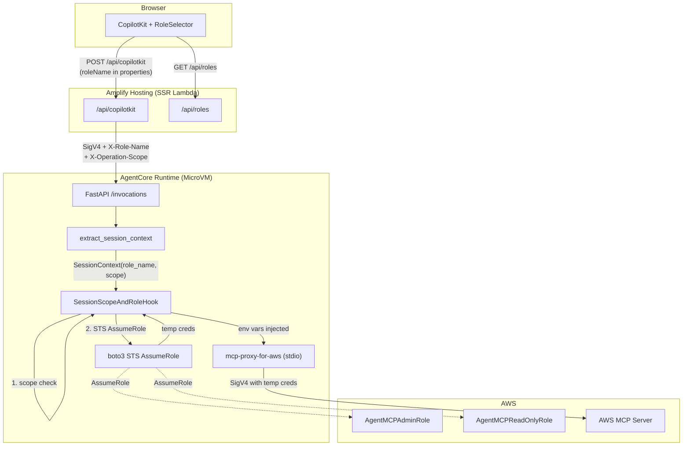

# Design Document: Direct Role Switching

## Overview

本設計は、失敗した `mcp-proxy-for-aws` の Multi_Profile_Mode 方式を、`BeforeToolCallEvent` フック内での直接 `boto3 sts:AssumeRole` 呼び出しに置き換える。Connection カタログ（DynamoDB モデル + 管理 UI）を完全撤去し、アプリケーション設定（環境変数）で定義されたロール一覧から選択する簡素なモデルに移行する。

### 設計方針

1. **最小限の変更面**: 既存の `contextvars` パターン、スコープ強制ロジック、CopilotKit + AG-UI 接続アーキテクチャは維持する
2. **環境変数駆動の設定**: ロール定義は `AGENT_ROLES` 環境変数（JSON 配列）で宣言する
3. **Per-call AssumeRole**: 認証情報のキャッシュは行わず、ツール呼び出しごとに STS を呼ぶ（有効期限切れの排除）
4. **スレッド安全性**: AgentCore Runtime の MicroVM セッションモデル（1セッション＝1 MicroVM）により、プロセス内の同時リクエストは実質1つ。環境変数のプロセスグローバル変異は安全

## Architecture



### スレッド安全性の判断

AgentCore Runtime は各アクティブセッションを独立した MicroVM で実行する。1つの MicroVM 内では同時に1つのリクエストのみが処理される。したがって：

- `os.environ` のプロセスグローバル変異は安全（同時書き込み競合なし）
- `threading.Lock` や subprocess 環境パッチは不要
- `contextvars` は引き続きリクエストスコープの `role_name` 伝播に使用

## Components and Interfaces

### Component 1: Role Configuration Module（Agent 側）

**ファイル**: `agents/app/AWS_MCP_Agent/roles/config.py`

ロール設定の読み込み・キャッシュ・検証を担当する。

```python
@dataclass(frozen=True)
class RoleConfig:
    name: str           # "admin", "readonly"
    display_name: str   # "Admin", "ReadOnly"
    role_arn: str       # "arn:aws:iam::<ACCOUNT_ID>:role/AgentMCPAdminRole"
    scope: str          # "readonly" | "readwrite" | "admin"

def load_role_configs() -> list[RoleConfig]:
    """AGENT_ROLES 環境変数から RoleConfig リストを読み込む。
    
    起動時に1回呼び出し、モジュールスコープでキャッシュする。
    0件の場合は error ログを出力して空リストを返す。
    """
    ...

def get_role_by_name(name: str) -> RoleConfig | None:
    """キャッシュ済みロール設定から name で検索する。"""
    ...

# モジュールスコープでキャッシュ
ROLE_CONFIGS: list[RoleConfig] = load_role_configs()
```

### Component 2: Session Context（Agent 側、変更）

**ファイル**: `agents/app/AWS_MCP_Agent/context/session_context.py`

`aws_profile_name` → `role_name` に置き換える。

```python
HEADER_ROLE_NAME = "X-Role-Name"
HEADER_OPERATION_SCOPE = "X-Operation-Scope"

@dataclass(frozen=True)
class SessionContext:
    role_name: str | None       # 旧 aws_profile_name
    operation_scope: str        # 変更なし

def extract_session_context(headers: Mapping[str, str]) -> SessionContext:
    """X-Role-Name と X-Operation-Scope を抽出。
    
    role_name が Role_Config に存在しない場合は None として扱い warning ログ。
    """
    ...
```

### Component 3: BeforeToolCallEvent Hook（Agent 側、書き換え）

**ファイル**: `agents/app/AWS_MCP_Agent/profile/injection.py` → リネーム先 `agents/app/AWS_MCP_Agent/roles/hook.py`

Multi_Profile_Mode の `aws_profile` 注入ロジックを完全に削除し、直接 STS AssumeRole + 環境変数注入に置き換える。

```python
class SessionScopeAndRoleHook(HookProvider):
    """Scope enforcement + STS AssumeRole credential injection."""

    def register_hooks(self, registry: HookRegistry) -> None:
        registry.add_callback(BeforeToolCallEvent, self._on_before_tool_call)

    def _on_before_tool_call(self, event: BeforeToolCallEvent) -> None:
        ctx = current_session_context.get()
        scope = ctx.operation_scope if ctx else "readonly"
        tool_name = event.tool_use["name"]

        # 1. Scope enforcement（既存ロジック維持）
        if not is_allowed(tool_name, scope):
            event.cancel_tool = build_rejection_message(tool_name, scope)
            return

        # 2. AWS 認証情報が必要なツールか判定
        if tool_name not in AWS_CREDENTIAL_TOOLS:
            return

        # 3. role_name の存在確認
        if not ctx or not ctx.role_name:
            event.cancel_tool = (
                f"Tool '{tool_name}' requires AWS credentials, but this session "
                "has no role configured. Please start a new session with a role."
            )
            return

        # 4. Role_Config から ARN を解決
        role_config = get_role_by_name(ctx.role_name)
        if role_config is None:
            event.cancel_tool = (
                f"Role '{ctx.role_name}' is not found in the current configuration."
            )
            return

        # 5. STS AssumeRole
        try:
            credentials = self._assume_role(role_config.role_arn, ctx.role_name)
        except Exception as exc:
            event.cancel_tool = (
                f"Failed to assume role '{ctx.role_name}': {exc}"
            )
            return

        # 6. 環境変数に注入（MicroVM 内は同時1リクエストなので安全）
        os.environ["AWS_ACCESS_KEY_ID"] = credentials["AccessKeyId"]
        os.environ["AWS_SECRET_ACCESS_KEY"] = credentials["SecretAccessKey"]
        os.environ["AWS_SESSION_TOKEN"] = credentials["SessionToken"]

    @staticmethod
    def _assume_role(role_arn: str, session_name: str) -> dict:
        """boto3 STS AssumeRole を呼び出し、一時認証情報を返す。"""
        import boto3
        sts = boto3.client("sts")
        response = sts.assume_role(
            RoleArn=role_arn,
            RoleSessionName=f"mcp-agent-{session_name}",
            DurationSeconds=900,  # 15分（最小値）
        )
        return response["Credentials"]
```

**AWS_CREDENTIAL_TOOLS**: `call_aws`, `run_script`, `get_presigned_url`, `get_tasks`（`suggest_aws_commands` は削除 — Multi_Profile_Mode 固有）

### Component 4: API Route 変更（Frontend 側）

**ファイル**: `src/app/api/copilotkit/route.ts`

- `connectionResolver` モジュールへの依存を削除
- `X-Aws-Profile` → `X-Role-Name` ヘッダーに変更
- `connectionId` / `awsProfileName` プロパティ検証を削除し、`roleName` のみ検証

```typescript
// リクエストボディから roleName / operationScope を抽出
const props = body?.body?.forwardedProps ?? body?.properties ?? {};
const roleName: string | undefined = props.roleName;
const operationScope: string | undefined = props.operationScope;

// ヘッダー構築
const sessionHeaders: Record<string, string> = {};
if (operationScope) {
  sessionHeaders["X-Operation-Scope"] = operationScope;
}
if (roleName) {
  sessionHeaders["X-Role-Name"] = roleName;
}
```

### Component 5: GET /api/roles エンドポイント（Frontend 側）

**ファイル**: `src/app/api/roles/route.ts`

```typescript
export interface RoleInfo {
  name: string;
  displayName: string;
  scope: "readonly" | "readwrite" | "admin";
}

export async function GET(req: NextRequest): Promise<Response> {
  // 認証チェック（Bearer トークン存在確認）
  const token = extractBearerToken(req);
  if (!token) {
    return Response.json({ error: "Unauthorized" }, { status: 401 });
  }

  // AGENT_ROLES 環境変数から読み込み（サーバーサイドのみ）
  const roles = parseRolesFromEnv();
  return Response.json({ roles });
}
```

`AGENT_ROLES` は `NEXT_PUBLIC_` プレフィックスなし（サーバーサイド限定）。`roleArn` はフロントエンドに返さない（不要 + 情報最小化）。

### Component 6: CopilotProvider 変更（Frontend 側）

**ファイル**: `src/lib/agent/CopilotProvider.tsx`

```typescript
interface CopilotProviderProps {
  children: ReactNode;
  roleName?: string;        // 旧: connectionId + awsProfileName
  operationScope?: string;  // 維持（ただしロールから自動導出）
  threadId?: string;
}

// properties 構築
function buildCopilotProperties(roleName?: string, operationScope?: string) {
  const props: Record<string, string> = {};
  if (roleName) props.roleName = roleName;
  if (operationScope) props.operationScope = operationScope;
  return Object.keys(props).length > 0 ? props : undefined;
}
```

### Component 7: RoleSelector コンポーネント（Frontend 側）

**ファイル**: `src/components/agent/RoleSelector.tsx`

```typescript
interface RoleSelectorProps {
  roles: RoleInfo[];
  isLoading: boolean;
  onSelectRole: (roleName: string, operationScope: string) => void;
}
```

Connection 選択と異なり、スコープは role 定義に含まれるため別ステップのスコープ選択は不要。ロールが1件のみの場合は自動選択してスキップ。

### Component 8: Data Model 変更（Amplify 側）

**ファイル**: `amplify/data/resource.ts`

```typescript
// Connection モデル: 完全削除
// OperationScope enum: 維持

ChatSession: a.model({
  ownerUserId: a.string().required(),
  roleName: a.string().required(),        // 旧: connectionId
  operationScope: a.ref("OperationScope").required(),
  sessionName: a.string().required(),
  startedAt: a.datetime(),
  updatedAt: a.datetime().required(),
  // endedAt: 削除
})
```

### Component 9: AgentCore 設定変更

**ファイル**: `agents/agentcore/agentcore.json`

```json
{
  "envVars": [
    {
      "name": "AGENT_ROLES",
      "value": "[{\"name\":\"admin\",\"displayName\":\"Admin\",\"roleArn\":\"arn:aws:iam::<ACCOUNT_ID>:role/AgentMCPAdminRole\",\"scope\":\"admin\"},{\"name\":\"readonly\",\"displayName\":\"ReadOnly\",\"roleArn\":\"arn:aws:iam::<ACCOUNT_ID>:role/AgentMCPReadOnlyRole\",\"scope\":\"readonly\"}]"
    }
  ]
}
```

`AWS_MCP_PROXY_PROFILES` と `AWS_CONFIG_FILE` は削除。

## Data Models

### RoleConfig（アプリケーション設定、非永続）

| フィールド | 型 | 説明 |
|---|---|---|
| name | string | ロール識別キー（例: "admin"） |
| displayName | string | UI表示名（例: "Admin"） |
| roleArn | string | IAM ロール ARN |
| scope | "readonly" \| "readwrite" \| "admin" | 操作スコープ |

**ソース**: `AGENT_ROLES` 環境変数（JSON 配列）。Agent 側とフロントエンド API Route 側の両方で参照。

### ChatSession（DynamoDB、変更）

| フィールド | 型 | 必須 | 変更 |
|---|---|---|---|
| ownerUserId | string | Yes | 維持 |
| roleName | string | Yes | **新規**（旧 connectionId を置換） |
| operationScope | OperationScope enum | Yes | 維持 |
| sessionName | string | Yes | 維持 |
| startedAt | datetime | No | 維持 |
| updatedAt | datetime | Yes | 維持 |

**削除フィールド**: `connectionId`, `endedAt`

### Connection モデル: 完全削除

### SessionContext（ランタイム、変更）

| フィールド | 型 | 変更 |
|---|---|---|
| role_name | str \| None | **新規**（旧 aws_profile_name を置換） |
| operation_scope | str | 維持 |

### API レスポンス: GET /api/roles

```json
{
  "roles": [
    { "name": "admin", "displayName": "Admin", "scope": "admin" },
    { "name": "readonly", "displayName": "ReadOnly", "scope": "readonly" }
  ]
}
```

## Correctness Properties

*A property is a characteristic or behavior that should hold true across all valid executions of a system — essentially, a formal statement about what the system should do. Properties serve as the bridge between human-readable specifications and machine-verifiable correctness guarantees.*

### Property 1: Role configuration parsing round trip

*For any* valid AGENT_ROLES JSON string, parsing it into RoleConfig objects and then serializing those objects back to JSON should produce semantically equivalent data (same name, displayName, roleArn, scope values).

**Validates: Requirements 1.1**

### Property 2: Invalid role_name resolution to None

*For any* string that does not match any name in the Role_Config, `extract_session_context` should resolve role_name to None (and log a warning), without raising an exception.

**Validates: Requirements 3.4**

### Property 3: Scope enforcement precedes AssumeRole

*For any* tool call where the operation scope is "readonly" and the tool is classified as a write operation, the hook SHALL reject the call without invoking STS AssumeRole (no network call made).

**Validates: Requirements 8.1**

### Property 4: Missing role_name cancels credential-requiring tools

*For any* tool call that requires AWS credentials, if the SessionContext has role_name = None, the hook SHALL cancel the tool call with an error message, without invoking STS AssumeRole.

**Validates: Requirements 2.6**

### Property 5: STS failure cancels tool call with descriptive error

*For any* STS AssumeRole invocation that raises an exception, the hook SHALL cancel the tool call and the cancellation message SHALL contain both the role name and a description of the failure.

**Validates: Requirements 2.4**

### Property 6: Environment variable injection contains all three credential fields

*For any* successful STS AssumeRole response, after injection, `os.environ` SHALL contain non-empty values for all three keys: AWS_ACCESS_KEY_ID, AWS_SECRET_ACCESS_KEY, and AWS_SESSION_TOKEN.

**Validates: Requirements 2.2**

### Property 7: CopilotProvider properties contain only roleName

*For any* non-empty roleName string, `buildCopilotProperties(roleName, operationScope)` should produce an object with `roleName` key set to the input value, and should NOT contain `connectionId` or `awsProfileName` keys.

**Validates: Requirements 9.6**

### Property 8: API roles endpoint excludes roleArn from response

*For any* valid AGENT_ROLES configuration, the GET /api/roles response SHALL include name, displayName, and scope for each role, but SHALL NOT include the roleArn field.

**Validates: Requirements 10.1, 10.4**

### Property 9: ChatSession with unavailable role blocks new messages

*For any* ChatSession whose stored roleName does not exist in the current Role_Config, the frontend SHALL display an error and SHALL NOT allow sending new messages (the send control is disabled).

**Validates: Requirements 7.3, 1.5**

## Error Handling

### Agent 側

| エラー条件 | ハンドリング | ユーザーへの影響 |
|---|---|---|
| `AGENT_ROLES` 未設定 or 空 | 起動時 error ログ。全ツール呼び出しを「no role configured」で拒否 | チャットは開始できるが全ツール呼び出しが失敗メッセージを返す |
| `AGENT_ROLES` JSON パースエラー | 起動時 error ログ。上記と同様 | 同上 |
| `X-Role-Name` が Role_Config に存在しない | role_name = None として扱う。warning ログ | ツール呼び出し時に「no role configured」エラー |
| STS AssumeRole: AccessDenied | tool call をキャンセル、エラーメッセージに role 名と理由を含む | 「Role 'X' の引き受けに失敗しました: AccessDenied」 |
| STS AssumeRole: ExpiredToken | 同上 | 「Role 'X' の引き受けに失敗しました: ExpiredToken」 |
| STS AssumeRole: ネットワークエラー | 同上 | 「Role 'X' の引き受けに失敗しました: [エラー詳細]」 |

### Frontend 側

| エラー条件 | ハンドリング |
|---|---|
| GET /api/roles が 401 | ログイン画面にリダイレクト |
| GET /api/roles が 500 | 「ロール一覧の取得に失敗しました」エラー表示 |
| 過去セッションの roleName が現在の Role_Config に存在しない | セッション表示はするが送信ブロック + 「このロールは利用できません」表示 |
| AGENT_ROLES 環境変数未設定（API Route 側） | GET /api/roles が空配列を返す → RoleSelector が「利用可能なロールがありません」表示 |

## Testing Strategy

### Unit Tests（例ベース）

| テスト対象 | テスト内容 |
|---|---|
| `roles/config.py` | 正常 JSON パース、空配列、不正 JSON、フィールド欠落 |
| `context/session_context.py` | X-Role-Name ヘッダー抽出、存在しない role の None 解決 |
| `roles/hook.py` | スコープ拒否 → AssumeRole 未呼出確認、role_name 欠如時の拒否、STS エラー時の拒否メッセージ |
| `copilotProperties.ts` | roleName のみの properties 構築、空入力時の undefined |
| `connectionResolver.ts` 削除確認 | インポートが全て除去されていること |
| `/api/roles/route.ts` | 認証なし → 401、正常 → roles 配列、roleArn 非公開 |

### Property-Based Tests

プロパティベーステストは本設計のコアロジック（純粋関数層）に適用可能:

- **Role config parsing**: ランダムな有効 JSON 入力に対する round-trip 検証
- **Session context extraction**: ランダムなヘッダー値に対する role_name 解決
- **Scope enforcement + hook interaction**: ランダムな (tool_name, scope, role_name) 組合せに対するフック動作の一貫性
- **CopilotProperties builder**: ランダムな入力に対する出力形式の保証

**ライブラリ**: Python 側は `hypothesis`、TypeScript 側は `fast-check`

**設定**: 各プロパティテストは最低 100 イテレーション

**タグ形式**: `Feature: direct-role-switching, Property {N}: {property_text}`

### Integration Tests

| テスト | 内容 |
|---|---|
| Agent 起動テスト | `AGENT_ROLES` 設定済みで `/ping` が 200 を返すこと |
| E2E ロール切替 | admin ロールでのツール呼び出し成功、readonly ロールでの write 拒否 |

### Migration Testing

- `amplify sandbox delete` → 再作成で新スキーマがデプロイされること
- Connection モデル参照がコードベースに残っていないこと（grep 検証）
