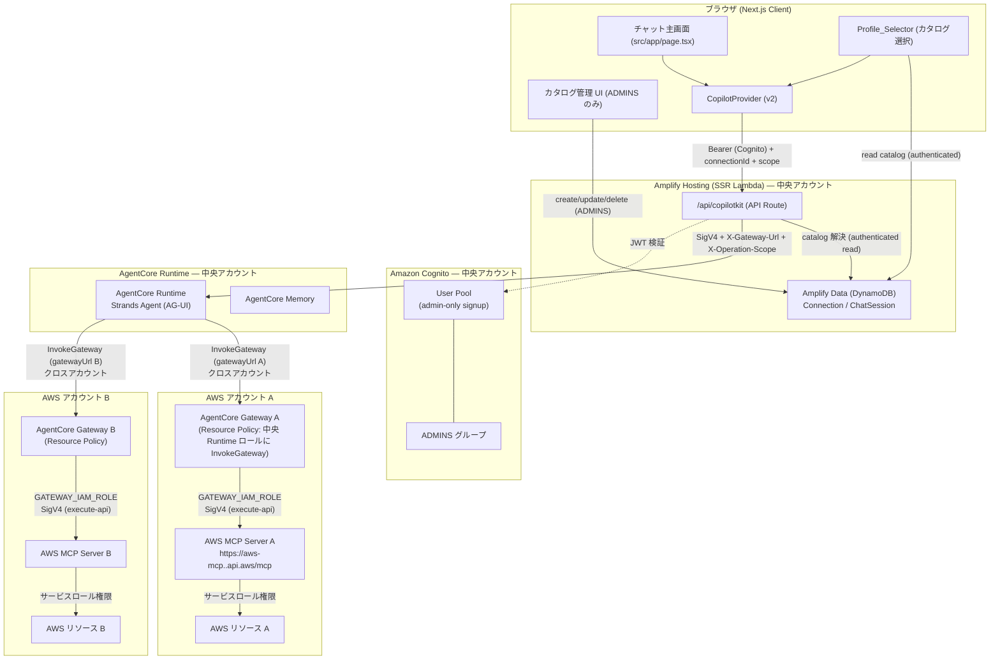
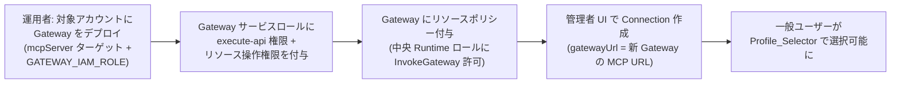
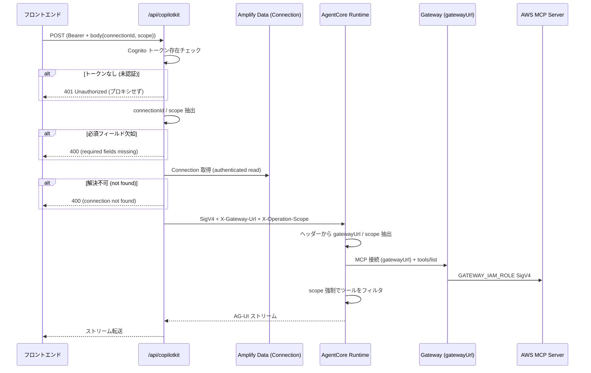
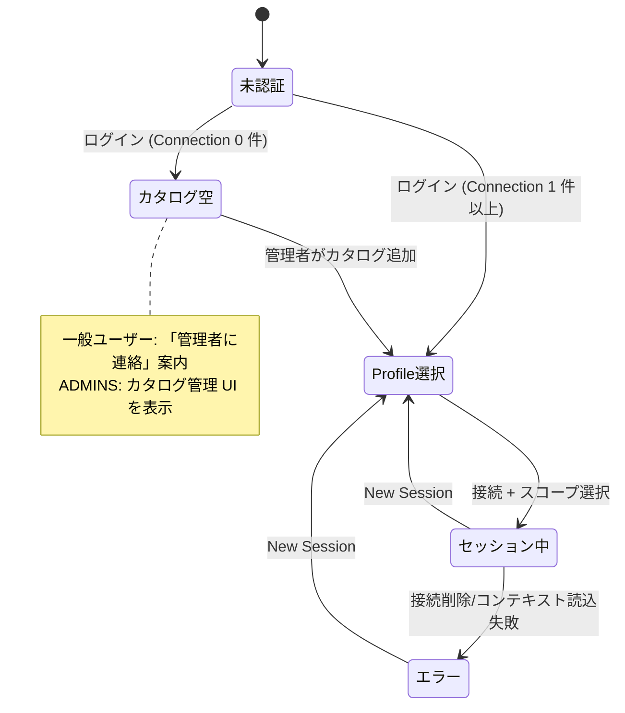

# Design Document

## Overview

本設計は、既存の「aws-mcp-gateway-agent」機能のアーキテクチャを、AWS 公式に確認された制約に基づいて刷新する。旧設計は「**1 Gateway + 複数 MCP Server ターゲット（MCP Proxy for AWS 経由）**」を前提としていたが、正しいパターンは「**AWS アカウントごとに 1 Gateway、各 Gateway に 1 つの AWS MCP ターゲット（`GATEWAY_IAM_ROLE` による直接 SigV4 接続）**」である。

中核となる 3 つの変更点は次のとおり。

1. **Gateway → AWS MCP Server の直接接続（Proxy 廃止）**: Gateway ターゲットは `targetType: mcpServer`、エンドポイント `https://aws-mcp.<region>.api.aws/mcp` を指す。認証は `GATEWAY_IAM_ROLE`（`iamCredentialProvider: { service: "execute-api", region: "<region>" }`）で、**Gateway のサービスロールがリクエストを SigV4 署名**して AWS MCP Server に接続する。MCP Proxy for AWS は不要。
2. **アカウントごとに 1 Gateway**: 各 Gateway は 1 つの AWS アカウントにスコープされ、そのサービスロールの IAM 権限が操作可能なリソースを決める。クロスアカウントは、対象アカウントごとに Gateway をデプロイし、リソースベースポリシーで中央 Runtime の実行ロールに `bedrock-agentcore:InvokeGateway` を許可することで実現する。
3. **セッションごとの動的 Gateway 接続**: 接続カタログは `gatewayUrl`（Gateway の MCP エンドポイント URL）を保持する。API Route が接続を解決し `X-Gateway-Url` ヘッダーで Runtime に渡す。エージェントはセッションごとにその Gateway URL に接続する（固定の環境変数ではない）。

加えて、各 Gateway は**単一ターゲット（AWS MCP）のみ**を持つため、旧設計のツール名プレフィックス（`<target>___`）によるターゲット分離は不要になる。エージェントは接続先 Gateway のツールをすべて利用する。**操作スコープ強制（readonly / readwrite / admin）は引き続き必須**で維持する。

ユーザー体験（ログイン → 接続選択 → チャット）は維持する。本設計は既存の CopilotKit + AG-UI + SigV4 → AgentCore Runtime 接続アーキテクチャを踏襲し、ワークスペースの責務分離ルール（`src/` = Web、`agents/` = エージェント、`amplify/` = バックエンド）を厳守する。

### 旧設計（aws-mcp-gateway-agent）との差分

| 観点 | 旧設計 | 新設計（本設計） |
|------|--------|------------------|
| Gateway 構成 | 1 Gateway + 複数 mcpServer ターゲット（集約） | アカウントごとに 1 Gateway、各 1 AWS MCP ターゲット |
| AWS MCP 接続経路 | MCP Proxy for AWS 経由（プロファイル切替） | Gateway が `GATEWAY_IAM_ROLE` で直接 SigV4 接続 |
| 接続識別子 | `gatewayTargetName`（ターゲット名） | `gatewayUrl`（Gateway の MCP URL） |
| エージェント接続先 | 固定 `GATEWAY_URL` 環境変数 | セッションごとに `X-Gateway-Url` で切替 |
| セッションヘッダー | `X-Gateway-Target` | `X-Gateway-Url` |
| ツール分離 | プレフィックス `<target>___` で絞り込み | 単一ターゲットのため絞り込み不要 |
| クロスアカウント | 単一 Gateway 内の複数ターゲット | アカウントごとの Gateway + リソースポリシー |

### 検証済みアーキテクチャの根拠（AWS 確認事項）

1. **Gateway の `mcpServer` ターゲット + `GATEWAY_IAM_ROLE`**: AgentCore Gateway は `mcpServer` ターゲットに対し `GATEWAY_IAM_ROLE` クレデンシャルプロバイダを設定でき、`iamCredentialProvider` の `service`（AWS MCP の場合 `execute-api`）と `region` を指定することで、Gateway のサービスロールがアウトバウンドリクエストを SigV4 署名する。これにより Proxy を介さず AWS MCP Server（`https://aws-mcp.<region>.api.aws/mcp`）へ IAM 認証で直接接続できる（_Requirements 1.1, 11.1, 11.2_）。
2. **Gateway のリソースベースポリシー**: Gateway はリソースベースポリシーをサポートし、他アカウントの IAM ロールに `bedrock-agentcore:InvokeGateway` を許可できる。これがクロスアカウントの中央 Runtime → 各アカウント Gateway 接続の認可基盤となる（_Requirements 2.1, 2.4_）。
3. **アカウント = Gateway 単位のスコープ**: 1 Gateway が 1 AWS アカウント / リージョンにスコープされ、Gateway のサービスロール IAM 権限が操作可能リソースを決める。複数アカウント運用は Gateway を複数デプロイして実現する（_Requirements 1.2, 2.2_）。
4. **Cognito 管理者のみ作成**: Amplify Gen 2 の `defineAuth` にはセルフサインアップ無効化フラグがないため、`backend.ts` で配下の Cognito ユーザープールへ override（`cfnUserPool.adminCreateUserConfig.allowAdminCreateUserOnly = true`）を適用する。ADMINS グループは `defineAuth({ groups: ["ADMINS"] })` で追加する（_Requirements 10.1_）。

### フラグすべき高感度・要注意事項

| # | 事項 | 影響レイヤー | 感度 |
|---|------|------------|------|
| F1 | **Gateway サービスロールの IAM 権限**: 各 Gateway のサービスロールに `execute-api:Invoke`（AWS MCP エンドポイント）と、操作対象 AWS リソースへの権限を最小権限で付与する。この権限がアカウント内の操作可能範囲を直接決定する | インフラ / IAM | 高 |
| F2 | **Gateway のリソースベースポリシー（クロスアカウント）**: 対象アカウント Gateway に、中央 Runtime 実行ロール ARN へ `bedrock-agentcore:InvokeGateway` を許可するポリシーを付与する。許可先 ARN を限定し、ワイルドカードを避ける | インフラ / IAM / クロスアカウント | 高 |
| F3 | **認証モード変更**: Amplify Data の `defaultAuthorizationMode` を `userPool` に維持し、`defineAuth` の ADMINS グループ、`backend.ts` の管理者のみ作成 override を保持する。サンプル Todo（apiKey）が動作しない点、フロントエンドの認証必須化 | Amplify バックエンド + フロントエンド | 高 |
| F4 | **API Route の Data Model 読取認可経路**: Amplify Hosting コンピューティングロールへの `bedrock-agentcore:InvokeAgentRuntime` に加え、API Route が Connection カタログを読む認可経路が必要 | IAM / デプロイ | 高 |
| F5 | **データモデル移行**: `gatewayTargetName` → `gatewayUrl` のフィールド変更は破壊的スキーマ変更。既存 Connection レコードの移行（再作成 or マイグレーション）が必要 | Amplify バックエンド | 中 |
| F6 | **運用タスクとコーディングタスクの分離**: Gateway のアカウント別デプロイ・リソースポリシー付与（Req 11.4, 11.5）は運用者の手作業であり、本機能のアプリコード実装とは別タスク。運用手順として文書化する | インフラ / 運用 | 中 |

> 注: F1・F2・F3・F4 は高感度変更であり、実装フェーズで PR レビュー必須とする（security ルール）。F6 の運用タスクはコーディングタスクと明確に分離する。

## Architecture

### システム全体構成（中央 Runtime + アカウント別 Gateway）



ポイント:

- 中央アカウントに Amplify Hosting / Cognito / AgentCore Runtime / Memory を配置。各対象 AWS アカウントに Gateway + AWS MCP Server を配置（_Requirements 2.2_）。
- 中央 Runtime はセッションコンテキストの `gatewayUrl` に応じて、対象アカウントの Gateway へクロスアカウント `InvokeGateway` する。許可は各 Gateway のリソースベースポリシーで付与（_Requirements 2.1, 2.3, 2.4_）。
- 各 Gateway は `GATEWAY_IAM_ROLE` で AWS MCP Server に直接 SigV4 接続（Proxy なし）。Gateway サービスロールの IAM 権限がそのアカウント内の操作可能リソースを決める（_Requirements 1.1, 1.2, 11.2, 11.3_）。
- エンドユーザーは AWS 認証情報を一切扱わない。

### 単一アカウント構成（最小デプロイ）

中央機能と Gateway を同一アカウントに置くことも可能。この場合 Gateway のリソースベースポリシーは同一アカウントの Runtime ロールを許可する（クロスアカウント設定は不要）。アプリコードは `gatewayUrl` で接続するため、単一/クロスアカウントいずれも同じコードパスで動作する。

### 運用者（管理者）フロー: アカウントのオンボーディング

接続カタログのエントリ（アプリのデータ）と実体の Gateway（インフラ）は別物であり、後者は運用者のタスク（F6）。



- 手順 A〜C は運用者のインフラタスク（AgentCore CLI / IAM 設定、コーディング対象外）（_Requirements 11.4, 11.5_）。
- 手順 D（カタログエントリ作成）は管理者が UI で実施（_Requirements 11.5, 5.1_）。

### セッションごとの接続フロー



接続はユーザー所有ではなく共有カタログのため、所有者検証（403）は行わない。401（未認証）/ 400（欠如・未解決）で扱う（_Requirements 8.2, 8.4, 8.5_）。ChatSession の owner 認可は Data Model 側で担保される（_Requirements 4.4_）。

### 画面状態遷移



### レイヤーと責務

| レイヤー | ディレクトリ | 責務 | 本機能での変更 |
|---------|------------|------|--------------|
| フロントエンド | `src/` | カタログ読取 + Profile_Selector、管理者向けカタログ CRUD、セッション固定チャット、グループ別 UI ゲート | `gatewayUrl` 対応にフォーム/バリデーション更新 |
| API Route | `src/app/api/copilotkit/` | 接続のサーバーサイド解決、認証ゲート、`X-Gateway-Url` / `X-Operation-Scope` 付与、SigV4 プロキシ | ヘッダー名・解決ロジック更新 |
| Amplify バックエンド | `amplify/` | Cognito 認証（管理者のみ作成 + ADMINS）、Connection（`gatewayUrl`）/ ChatSession データモデル | Connection の `gatewayTargetName` → `gatewayUrl` |
| エージェント | `agents/app/` | セッションごとの Gateway MCP 接続、スコープ強制 | 固定 `GATEWAY_URL` → 動的、単一ターゲット簡素化 |
| AgentCore / Gateway 構成 | `agents/agentcore/` + 運用 | Runtime のデプロイ定義、アカウント別 Gateway（運用タスク） | `GATEWAY_IAM_ROLE` ターゲット、リソースポリシー |

## Components and Interfaces

### 1. AgentCore Gateway（アカウントごと・単一 AWS MCP ターゲット）（_Requirements 1, 11_）

各 Gateway は 1 つの `mcpServer` ターゲットを持ち、`GATEWAY_IAM_ROLE` で AWS MCP Server に直接 SigV4 接続する。

**Gateway ターゲット構成（概念）:**

```jsonc
{
  "name": "aws-mcp-account-a",
  "targetType": "mcpServer",
  "endpoint": "https://aws-mcp.us-east-1.api.aws/mcp",
  "credentialProvider": {
    "type": "GATEWAY_IAM_ROLE",
    "iamCredentialProvider": {
      "service": "execute-api",
      "region": "us-east-1"
    }
  }
}
```

- **直接接続とツール発見**: Gateway は単一の AWS MCP ターゲットを持ち、`tools/list` はそのターゲットのツールを返す。単一ターゲットのため、ツール名プレフィックス（`<target>___`）による分離は不要（_Requirements 1.6, 3.3_）。
- **アウトバウンド SigV4（直接）**: `GATEWAY_IAM_ROLE` により Gateway のサービスロールがリクエストを SigV4 署名し、`execute-api` サービス・対象リージョンで AWS MCP Server に送る。Proxy は介在しない（_Requirements 1.1, 11.2, 11.3_）。
- **アカウントスコープ**: Gateway サービスロールの IAM 権限がそのアカウント内の操作可能リソースを決める（_Requirements 1.2_）。
- **ルーティングとタイムアウト**: Gateway はツール呼び出しを AWS MCP Server にルーティングし 30 秒以内に応答する。タイムアウト時はツール名を含むエラーを返す（_Requirements 1.3, 1.4_）。
- **接続エラー**: 接続失敗時は失敗種別（connection refused / DNS / authentication）を含むエラーを返す（_Requirements 1.5_）。
- **クロスアカウント許可**: 各 Gateway にリソースベースポリシーを付与し、中央 Runtime 実行ロールに `bedrock-agentcore:InvokeGateway` を許可する（F2、_Requirements 2.1, 2.4_）。
- **運用者によるデプロイ**: アカウント追加時の Gateway デプロイ・ロール権限・リソースポリシー付与は運用者タスク（AgentCore CLI / IAM）（F6、_Requirements 11.4_）。

### 2. Strands Agent（セッションごとの動的 Gateway 接続 + スコープ強制）（_Requirements 3, 7, 12_）

エージェントは固定の `GATEWAY_URL` をやめ、セッションコンテキスト（`X-Gateway-Url` ヘッダー）の Gateway URL に接続する。単一ターゲットのためツール絞り込みは行わず、接続先 Gateway の全ツールを利用する。操作スコープ強制は維持する。

**モジュール構成（責務分離、既存を適応）:**

```
agents/app/AWS_MCP_Agent/
├── main.py                     # 適応: 固定 GATEWAY_URL → セッション動的接続、ターゲット絞り込み削除
├── model/load.py               # 既存（変更なし）
├── memory/session.py           # 既存（変更なし）
├── gateway/client.py           # 流用: build_gateway_client / discover_tools（変更最小）
├── gateway/target_filter.py    # 削除または無効化（単一ターゲットのため不要）
├── context/session_context.py  # 適応: X-Gateway-Target → X-Gateway-Url（gateway_url フィールド）
├── scope/enforcement.py        # 維持: スコープ強制（プレフィックス依存の suffix 抽出を簡素化）
└── prompts/system.py           # 適応: gateway_target → 接続先情報、ターゲット分離文言を削除
```

**Gateway MCP クライアント接続（`gateway/client.py`、流用）:**

既存の `build_gateway_client(gateway_url, auth_token)` と `discover_tools(client)` をそのまま流用する。`gateway_url` は固定の環境変数ではなく、セッションコンテキストから渡される（_Requirements 3.1, 12.3, 12.4_）。

```python
# 既存シグネチャを流用（streamable HTTP transport、startup_timeout=30）
client = build_gateway_client(session_context.gateway_url, auth_token)
all_tools = discover_tools(client)  # tools/list（単一ターゲットの全ツール）
```

- 起動後 30 秒以内に接続し、ツールを発見（_Requirements 3.1, 3.3_）。接続失敗時はログ出力 + ユーザーへ到達不能エラー報告（_Requirements 3.2_）。

**ターゲット絞り込みの廃止（`gateway/target_filter.py`）:**

- 単一ターゲット Gateway のため、`tools_for_target` によるプレフィックス絞り込みは不要。`main.py` は `discover_tools` の結果をそのまま使う（_Requirements 12.4_、旧 Property 2 を廃止）。
- `scope/enforcement.py` は `target_filter.TARGET_SEPARATOR` に依存して suffix を抽出していたため、この依存を取り除き、ツール名全体を verb 判定対象にする（プレフィックスが無い前提）。

**セッションコンテキスト抽出（`context/session_context.py`、適応）:**

`X-Gateway-Target` を `X-Gateway-Url` に置き換え、`SessionContext.gateway_target` を `gateway_url` にリネームする（_Requirements 12.2, 12.3_）。

```python
@dataclass(frozen=True)
class SessionContext:
    gateway_url: str          # X-Gateway-Url（接続先 Gateway の MCP URL）
    operation_scope: str      # "readonly" | "readwrite" | "admin"
```

| ヘッダー | 用途 |
|---------|------|
| `X-Gateway-Url` | 現セッションの接続先 Gateway MCP URL（接続先決定）（_Requirements 6.5, 8.3_） |
| `X-Operation-Scope` | 操作スコープ（_Requirements 8.6_） |
| `X-Amzn-Bedrock-AgentCore-Runtime-User-Id` | Cognito ユーザー ID（Memory 用） |
| `X-Amzn-Bedrock-AgentCore-Runtime-Session-Id` | セッション ID（Memory 用） |

対象アカウント / リージョン / ロールは Gateway 側（サービスロール）に内包されるため、IAM ロール ARN 等の機密値はヘッダーに含めない。

**操作スコープ強制（`scope/enforcement.py`、維持）:**

チャット内のユーザー指示に関わらずスコープを強制する多層防御の中核（_Requirements 7.2, 7.3_）。

```python
def is_allowed(tool_name: str, scope: str) -> bool:
    if scope == "readonly":
        return not is_write_tool(tool_name)
    return True  # readwrite / admin
```

- `readonly` 時は write 分類ツール（create/update/delete 等、状態変更を伴う操作）を拒否（_Requirements 7.2_）。
- 拒否時は、拒否操作名・現スコープ制約・read-write での新規セッション提案を含むメッセージを返す（_Requirements 3.8, 7.4_）。
- 単一ターゲット化に伴い、verb 判定はプレフィックス分離なしでツール名全体に対して行う。

**システムプロンプト（`prompts/system.py`、適応）:**

接続先（アカウント情報）と操作スコープを動的に埋め込む。「他ターゲットのツールを使うな」という旧文言は単一ターゲットのため削除し、スコープ制約と接続先の明示に集中する。

### 3. API Route の拡張（_Requirements 8, 12_）

`src/app/api/copilotkit/route.ts` を拡張する。既存の `ExperimentalEmptyAdapter` + `HttpAgent` + `sigv4Fetch` 構成は維持する（tech / amplify-frontend ルール）。

- リクエストボディから `connectionId` と `operationScope` を抽出（_Requirements 8.1_）。
- 未認証（Cognito トークンなし）の場合は、プロキシせず 401 を返す（_Requirements 8.5_）。
- `connectionId` / `operationScope` 欠如時は 400（_Requirements 8.2_）。
- `connectionId` を Connection カタログからサーバーサイドで解決し、`gatewayUrl` を `X-Gateway-Url` ヘッダーに付与（_Requirements 8.3, 12.2_）。
- 接続が解決できない場合は 400（_Requirements 8.4_）。
- 操作スコープを `X-Operation-Scope` ヘッダーとして渡す（_Requirements 8.6_）。

**純粋ロジック（`src/lib/agent/connectionResolver.ts`、適応）:**

`ResolvedConnection.gatewayTargetName` を `gatewayUrl` に、`buildProxyHeaders` の `X-Gateway-Target` を `X-Gateway-Url` に変更する（_Requirements 12.2_）。

```typescript
export interface ResolvedConnection {
  gatewayUrl: string;        // 旧 gatewayTargetName
  operationScope: string;
}

export function buildProxyHeaders(
  gatewayUrl: string,
  operationScope: string,
): Record<string, string> {
  return {
    "X-Gateway-Url": gatewayUrl,      // 旧 X-Gateway-Target
    "X-Operation-Scope": operationScope,
  };
}
```

`validateAndExtractContext`（connectionId / operationScope の欠如検証 → 400）は変更なしで流用する。

**サーバーサイドからの Data Model アクセス（F4）:**

API Route は認証ユーザーのトークンを用い、Amplify Data クライアント（`runWithAmplifyServerContext` + userPool 認証）で Connection を読み取る。`allow.authenticated().to(["read"])` のため認証済みなら読取可能。接続は共有カタログのため所有者検証は行わない。

### 4. フロントエンド（_Requirements 5, 6, 9, 10, 12_）

トップページ（`src/app/page.tsx`）をチャット主画面とする（structure ルール）。`gatewayTargetName` 入力を `gatewayUrl` 入力に置き換える点が主な変更。

**コンポーネント構成（既存を流用・適応）:**

```
src/
├── app/page.tsx                       # チャット主画面（認証ゲート + 状態分岐 + グループ判定）
├── components/agent/
│   ├── ProfileSelector.tsx            # カタログ選択 + スコープ選択（全認証ユーザー）
│   ├── ConnectionList.tsx             # カタログ一覧（displayName / accountId / region）
│   ├── ConnectionCatalogManager.tsx   # 管理者専用 CRUD（ADMINS のみ）
│   ├── ConnectionForm.tsx             # 適応: gatewayTargetName → gatewayUrl 入力
│   ├── SessionChat.tsx                # セッション固定チャット
│   └── SessionHeader.tsx              # 接続情報固定ヘッダー
├── lib/agent/
│   ├── CopilotProvider.tsx            # body に connectionId/scope を載せる
│   ├── connectionValidation.ts        # 適応: gatewayTargetName → gatewayUrl(HTTPS) 検証
│   ├── connectionResolver.ts          # 適応: gatewayUrl / X-Gateway-Url
│   ├── useConnectionCatalog.ts        # カタログ読取フック
│   ├── useConnectionAdmin.ts          # カタログ CRUD フック（ADMINS）
│   └── useIsAdmin.ts                  # Cognito グループ判定
```

- **バリデーション**（`connectionValidation.ts` 純粋関数、適応）: `gatewayTargetName`（非空）を `gatewayUrl`（有効な HTTPS URL）の検証に置き換える。awsAccountId = 12 桁数値、awsRegion = `[a-z]+-[a-z]+-[0-9]+`、displayName = 1〜100 文字は維持（_Requirements 5.5, 12.5_）。失敗時はフィールド単位のインラインエラーを表示し送信しない（_Requirements 5.6_）。
- **Profile_Selector**: 接続選択までチャット入力を有効化せず、チャット UI も描画しない（_Requirements 6.1, 9.2_）。操作スコープ選択（readonly / readwrite）を提供（_Requirements 6.2, 7.1_）。未選択時は readonly がデフォルト（_Requirements 7.6_）。
- **セッション固定**: アクティブ中は接続の displayName・awsAccountId・region を固定ヘッダーに表示（_Requirements 6.3, 9.3_）。新規セッション開始なしの接続変更を禁止（_Requirements 6.4_）。
- **New Session**: 現セッションを終了し Profile_Selector へ戻る（_Requirements 9.4_）。
- **カタログ空 / 主画面 / 認証ゲート**: Connection 0 件時は「管理者に連絡」案内付き Profile_Selector を表示しチャットを遮断（_Requirements 9.5_）。ルートをチャット主画面とし、全ビューで認証必須（_Requirements 9.1, 10.2_）。
- **管理者 UI ゲート**: `useIsAdmin` が false の場合、カタログ管理コントロールを一切描画しない（_Requirements 9.6, 9.7, 10.5_）。
- **エラー回復**: セッション中に接続削除/利用不可ならエラー表示 + 入力無効化、接続情報読込失敗なら New Session で回復（_Requirements 6.6, 9.8_）。
- **既存フロー維持**: login → 接続選択 → チャットの流れを維持（_Requirements 12.6_）。

### 5. AgentCore Memory（既存活用）

既存の `memory/session.py`（`AgentCoreMemorySessionManager`）を活用。`X-Amzn-Bedrock-AgentCore-Runtime-User-Id` に Cognito `sub`、`X-Amzn-Bedrock-AgentCore-Runtime-Session-Id` にセッション ID を設定する（amplify-frontend ルール準拠）。

### 6. 認証・アクセス制御（Cognito）（_Requirements 10_）

既存設計を維持する。`amplify/auth/resource.ts` に ADMINS グループ、`amplify/backend.ts` で `allowAdminCreateUserOnly = true` の override（F3、_Requirements 10.1_）。`useIsAdmin` が `cognito:groups` に `ADMINS` を含むか判定（_Requirements 9.6, 9.7, 10.5_）。Data 認可は `allow.group("ADMINS")`（書込）+ `allow.authenticated().to(["read"])`（読取）（_Requirements 10.3, 10.4_）。

## Data Models

Amplify Gen 2（`amplify/data/resource.ts`）。Connection の `gatewayTargetName` を `gatewayUrl` に置き換える（F5、_Requirements 12.1_）。認証モードは userPool を維持（_Requirements 4.5_）。

```typescript
const schema = a.schema({
  Connection: a
    .model({
      displayName: a.string().required(),   // 1〜100 文字
      awsAccountId: a.string().required(),   // 12 桁文字列
      awsRegion: a.string().required(),
      gatewayUrl: a.string().required(),     // 旧 gatewayTargetName → Gateway MCP URL (HTTPS)
      description: a.string(),               // 任意
      // createdAt / updatedAt は Amplify が自動生成
    })
    .authorization((allow) => [
      allow.group("ADMINS"),                 // create/update/delete (ADMINS)
      allow.authenticated().to(["read"]),    // read (任意の認証ユーザー)
    ]),

  ChatSession: a
    .model({
      ownerUserId: a.string().required(),
      connectionId: a.id().required(),       // Connection を参照
      operationScope: a.enum(["readonly", "readwrite", "admin"]),
      startedAt: a.datetime(),
      endedAt: a.datetime(),                 // 任意
    })
    .authorization((allow) => [allow.owner()]),
});

export const data = defineData({
  schema,
  authorizationModes: { defaultAuthorizationMode: "userPool" },
});
```

### モデル定義

**Connection**（運用者管理カタログ）（_Requirements 4.1_）:

| フィールド | 型 | 制約 |
|-----------|-----|------|
| id | ID | 自動生成 |
| displayName | string | 必須、1〜100 文字 |
| awsAccountId | string | 必須、12 桁文字列 |
| awsRegion | string | 必須、`[a-z]+-[a-z]+-[0-9]+` |
| gatewayUrl | string | 必須、Gateway MCP エンドポイント URL（HTTPS） |
| description | string | 任意 |
| createdAt / updatedAt | datetime | 自動生成 |

**ChatSession**（_Requirements 4.3_）:

| フィールド | 型 | 制約 |
|-----------|-----|------|
| id | ID | 自動生成 |
| ownerUserId | string | 必須 |
| connectionId | ID | 必須、既存 Connection を参照 |
| operationScope | enum | 必須、`readonly` / `readwrite` / `admin` |
| startedAt | datetime | 自動生成 |
| endedAt | datetime | 任意 |

### 認可と整合性

- **Connection 認可**: `allow.group("ADMINS")`（作成・編集・削除）+ `allow.authenticated().to(["read"])`（読取）。非管理者の書込は拒否（_Requirements 4.2, 10.3, 10.4_）。
- **ChatSession 認可**: `allow.owner()` により所有者のみ CRUD（_Requirements 4.4_）。
- **認証モード**: `defaultAuthorizationMode: "userPool"`（_Requirements 4.5_）。サンプル Todo（apiKey）は動作しなくなる（F3）。
- **参照整合性**（_Requirements 4.6_）: Amplify Gen 2 は DB レベルの外部キー制約を持たないため、アプリ層で「参照中の Connection 削除を拒否」を実装する。削除前に該当 ChatSession を検索し参照有無を確認する。フロントエンドのセッション中エラー回復（_Requirements 6.6, 9.8_）と組み合わせる。
- **移行（F5）**: `gatewayTargetName` → `gatewayUrl` は破壊的変更。sandbox では再作成、既存データがある場合は再登録 or マイグレーションを実装フェーズで判断する（amplify-backend ルール: 段階的変更）。

## Correctness Properties

*プロパティとは、システムのすべての有効な実行において成り立つべき特性・振る舞いであり、システムが何をすべきかについての形式的な記述である。プロパティは、人間が読める仕様と機械検証可能な正しさ保証との橋渡しとなる。*

以下のプロパティは、prework のテスタビリティ分類と冗長性削減（reflection）の結果に基づく。次のものは本セクションの対象外とし、それぞれ統合テスト・コンポーネント/スナップショットテスト・シナリオテスト・設定/スモークチェックで検証する（Testing Strategy 参照）。

- 外部・マネージドサービス配線: Gateway の直接 SigV4 接続・ルーティング（1.1〜1.3, 1.6）、クロスアカウント接続（2.2, 2.3）、エージェント起動接続・ツール発見（3.1, 3.3）、ChatSession owner 認可（4.4）、MCP クライアントの per-session 接続ライフサイクル（12.4）
- IAM / リソースポリシー / 設定（運用タスク含む）: 1.2, 2.1, 2.4, 4.1, 4.3, 4.5, 10.1, 11.1〜11.5, 12.1
- LLM 駆動のツール選択・応答（3.4, 3.5）
- UI レンダリング・レイアウト・インタラクション（5.1〜5.3, 6.2, 6.3, 6.6, 7.1, 9.2〜9.4, 9.8）
- エージェントのエラー報告の例示（3.2, 3.6）、セッションコンテキスト抽出の例示（12.3）

> **旧設計からの変更**: 旧 spec の「Property 2: セッションターゲットによるツール制限（`<target>___` プレフィックス絞り込み）」は、各 Gateway が単一の AWS MCP ターゲットを持つ新アーキテクチャでは不要となるため**廃止**した。エージェントは接続先 Gateway の全ツールを利用する。これに伴い旧 15 プロパティは 14 プロパティに整理され、複数の要件節が `gatewayUrl` / `X-Gateway-Url` に再マッピングされている。

### Property 1: エラーの分類と識別子の付与

*任意の* AWS MCP Server への失敗（タイムアウト / connection refused / DNS resolution failure / authentication failure）に対して、エージェントが生成するエラーは定義された失敗種別のいずれかに分類され、タイムアウトの場合は対象ツール名を含む。

**Validates: Requirements 1.4, 1.5**

### Property 2: 操作スコープの強制

*任意の* ツールと操作スコープの組み合わせに対して、スコープ強制ロジックは「スコープが readonly の場合は write 分類ツールのみを拒否し非 write ツールを許可する」「readwrite / admin の場合は許可する」という規則どおりに許可/拒否を返し、その判定はチャットメッセージ本文の内容に依存しない。

**Validates: Requirements 3.7, 7.2, 7.3**

### Property 3: スコープ拒否メッセージの内容

*任意の* readonly セッションで拒否される write ツールに対して、生成される拒否メッセージは、拒否された操作名・現在のスコープ制約・read-write での新規セッション開始の提案を含む。

**Validates: Requirements 3.8, 7.4**

### Property 4: 接続フィールドのバリデーションと送信ゲート

*任意の* 接続入力（displayName・awsAccountId・awsRegion・gatewayUrl）に対して、フォームが送信可能と判定されるのは、displayName が 1〜100 文字、awsAccountId が 12 桁数値、awsRegion が `[a-z]+-[a-z]+-[0-9]+`、gatewayUrl が有効な HTTPS URL のすべてに一致する場合に限る。いずれかが不一致なら送信は阻止され、不一致フィールドごとにエラーが生成される。

**Validates: Requirements 5.5, 5.6, 12.5**

### Property 5: カタログ認可の決定

*任意の* （ユーザーのグループ集合, 操作種別）の組に対して、Connection に対する操作が許可されるのは、操作が read かつユーザーが認証済みである場合、または操作が create/update/delete かつユーザーが ADMINS グループに属する場合に限る。非管理者の書込操作は拒否される。

**Validates: Requirements 4.2, 5.4, 10.3, 10.4**

### Property 6: セッションコンテキストのヘッダー伝播

*任意の* 解決済み Connection と選択された操作スコープに対して、API Route が AgentCore Runtime へプロキシするリクエストのヘッダーは、その Connection の gatewayUrl を `X-Gateway-Url` として、選択されたスコープ値を `X-Operation-Scope` として含む。

**Validates: Requirements 6.5, 8.3, 8.6, 12.2**

### Property 7: 接続の解決と入力検証

*任意の* チャットリクエストボディに対して、connectionId または operationScope が欠如する場合は 400（必須フィールド不足）を返し、connectionId がカタログで解決できない場合は 400（not found）を返し、解決できる場合に限りプロキシ用のヘッダー（Property 6）を構築する。

**Validates: Requirements 8.1, 8.2, 8.4**

### Property 8: API Route の認証ゲート

*任意の* チャットリクエストに対して、リクエストが未認証（有効な Cognito トークンなし）の場合、API Route はリクエストをプロキシせず 401 を返す。認証済みの場合に限り後続処理へ進む。

**Validates: Requirements 8.5, 10.2**

### Property 9: チャットアクセスゲート

*任意の* （認証状態, 接続選択状態, カタログ件数）の組に対して、チャットインターフェースが描画/有効化されるのは、ユーザーが認証済みかつカタログに最低 1 件の Connection が存在しかつ接続が選択されている場合に限る。

**Validates: Requirements 6.1, 9.1, 9.5**

### Property 10: 管理者向け UI ゲート

*任意の* 認証ユーザーのグループ集合に対して、接続カタログ管理コントロール（作成・編集・削除）が描画されるのは、そのユーザーが ADMINS グループに属する場合に限り、属さない場合はこれらのコントロールは一切描画されない。

**Validates: Requirements 9.6, 9.7, 10.5**

### Property 11: セッション-接続束縛の不変性

*任意の* アクティブなチャットセッションに対して、新規セッションを開始しない限り接続を変更しようとしても、束縛された接続は変化しない。

**Validates: Requirements 6.4**

### Property 12: スコープ永続化のラウンドトリップ

*任意の* 有効なスコープ値（readonly / readwrite / admin）に対して、ChatSession を保存してから読み出すと、同じスコープ値が得られる。

**Validates: Requirements 7.5**

### Property 13: 操作スコープのデフォルト

*任意の* スコープが明示的に選択されていないセッション作成入力に対して、解決される操作スコープは readonly である。

**Validates: Requirements 7.6**

### Property 14: 参照整合性

*任意の* N 件の ChatSession から参照される Connection に対して、N > 0 の間はその Connection の削除が拒否される（参照中の削除防止）。

**Validates: Requirements 4.6**

## Error Handling

### フロントエンド

| ケース | 振る舞い | 要件 |
|--------|---------|------|
| バリデーション失敗（管理者作成/編集） | フィールド単位インラインエラー、送信阻止 | 5.6 |
| カタログ 0 件 | Profile_Selector に「管理者に連絡」案内、チャット遮断 | 9.5 |
| セッション中に接続削除/利用不可 | エラー表示、入力無効化、New Session で回復 | 6.6 |
| 接続情報読込失敗 | エラー表示、New Session で回復 | 9.8 |
| 非管理者の管理操作 | 管理 UI を非表示（コントロール非描画） | 9.7, 10.5 |

### API Route

| ケース | レスポンス | 要件 |
|--------|-----------|------|
| Cognito トークンなし（未認証） | 401 Unauthorized（プロキシせず） | 8.5, 10.2 |
| connectionId / scope 欠如 | 400 + 必須フィールド不足メッセージ | 8.2 |
| 接続解決不可 | 400 + not found メッセージ | 8.4 |
| Runtime プロキシ失敗 | 上流エラーをそのまま伝播 | — |

> 注: 接続は共有カタログでありユーザー所有ではないため、所有者不一致による 403 は行わない。403 は Data Model 側の管理者専用ミューテーション（非管理者の書込）に対してのみ適用される（_Requirements 10.4_）。

### エージェント / Gateway

| ケース | 振る舞い | 要件 |
|--------|---------|------|
| Gateway 接続不可 (30s) | ログ出力 + 到達不能エラー報告 | 3.2 |
| ツールタイムアウト (30s) | ツール名を含むタイムアウトエラー | 1.4 |
| 接続エラー | 失敗種別（refused / DNS / auth）を含むエラー | 1.5 |
| 一致ツールなし | 未対応 + 利用可能なツールカテゴリ提示 | 3.5 |
| ツール呼び出しエラー | 自然言語報告 + 是正策 1 つ以上 | 3.6 |
| スコープ外操作 | 操作名 + スコープ + read-write 提案 | 3.8, 7.4 |

### データモデル

| ケース | 振る舞い | 要件 |
|--------|---------|------|
| 非管理者の Connection 書込 | 認可で拒否 | 10.4 |
| 参照中の Connection 削除 | 削除を拒否（参照あり） | 4.6 |

エラー観測性: strands-agent ルールに従い、すべての失敗はログで観測可能にする（接続失敗・タイムアウト・スコープ拒否を構造化ログで記録）。

## Testing Strategy

testing ルール（最も狭い範囲の検証を最初に、レイヤーを明示）に従い、レイヤーごとに検証手段を分ける。

### レイヤー別テスト

**フロントエンド（`src/`）:**
- lint + 型チェックを最優先。
- バリデーション純粋関数（`connectionValidation.ts`、gatewayUrl 対応）、チャットアクセスゲート、管理者 UI ゲート、スコープデフォルト、セッション束縛不変性のロジックをプロパティテスト対象とする（Property 4, 9, 10, 11, 13）。
- コンポーネントの描画・状態遷移（カタログ一覧 9.2、管理フォーム 5.1〜5.3、ヘッダー 6.3/9.3、スコープ選択 6.2/7.1、New Session 9.4）はコンポーネント/スナップショットテストで検証。
- 削除中セッション 6.6、コンテキスト読込失敗 9.8 はシナリオテスト。

**API Route（`src/`）:**
- ヘッダー伝播（Property 6、`X-Gateway-Url` / `X-Operation-Scope`）、接続解決・入力検証 400（Property 7）、認証ゲート 401（Property 8）をプロパティ/ユニットテストで検証。Data クライアントはモック化。

**エージェント（`agents/app/`）:**
- testing ルールに従いスモークテスト + インポート確認を最優先。
- スコープ強制（Property 2）、拒否メッセージ（Property 3）、エラー分類（Property 1）をプロパティ/ユニットテストで検証。Gateway/MCP transport はモック化。
- 接続失敗の報告 3.2、ツールエラー報告 3.6 はユニットテスト。`extract_session_context` の `X-Gateway-Url` → `gateway_url` マッピング 12.3 はユニットテスト。
- LLM 駆動のツール選択（3.4, 3.5）はデプロイ環境でのシナリオ確認。ローカルは `uvicorn` / `agentcore dev` + curl で `/invocations` を検証。

**Amplify バックエンド（`amplify/`）:**
- カタログ認可（Property 5）、スコープ永続化ラウンドトリップ（Property 12）、参照整合性（Property 14）を sandbox で検証。
- ChatSession owner 認可（4.4）はクロスユーザーアクセス拒否の統合テスト。
- 認証モード（4.5）・スキーマ（4.1, 4.3）・管理者のみ作成（10.1）・gatewayUrl 移行（12.1）は設定/型チェック・スモーク。

**統合（デプロイ環境）/ 運用タスク:**
- Gateway の直接 SigV4 接続・ルーティング（1.1〜1.3, 1.6）、クロスアカウント接続（2.2, 2.3）、エージェント起動接続・ツール発見（3.1, 3.3）、per-session 接続ライフサイクル（12.4）は AgentCore デプロイ後の統合/スモークテスト。
- Gateway サービスロール権限（1.2, 11.3）、リソースベースポリシー（2.1, 2.4）、Gateway ターゲット構成（11.1, 11.2）、セルフサインアップ無効化（10.1）は設定検証。
- アカウントのオンボーディング（Gateway デプロイ + リソースポリシー、11.4, 11.5）は運用者の手作業（F6）。コーディングタスクとは分離し、運用手順（runbook）として文書化・手動検証する。
- フロントエンド↔エージェント結合は Amplify Hosting デプロイ環境で実施（ローカルでは SigV4 + コンピューティングロールが必要なため不可）。

### プロパティベーステスト（PBT）の方針

PBT は純粋ロジック層（バリデーション、認可決定、スコープ分類、ヘッダー/コンテキストマッピング、デフォルト解決、ラウンドトリップ、整合性、UI/認証ゲート判定、エラー分類）に適用する。外部サービス配線・IAM/リソースポリシー・UI レンダリング・LLM 振る舞い・運用タスクには適用しない。

- ライブラリ: TypeScript 側は `fast-check`、Python 側は `hypothesis` を使用する（ゼロから実装しない）。
- 各プロパティテストは最低 100 イテレーション実行する。
- 各プロパティテストは設計プロパティを参照するタグコメントを付す。
- タグ形式: **Feature: gateway-direct-connect, Property {番号}: {プロパティ説明}**
- 各 Correctness Property は単一のプロパティベーステストで実装する。

### ユニット/統合テストのバランス

- ユニットテストは具体例・エッジケース・エラー条件（3.2, 3.6, 6.6, 9.8, 12.3 等）に集中させ、過剰に書かない（入力網羅はプロパティテストが担う）。
- 統合テストは外部サービス（Gateway, Runtime, Cognito, Amplify Data 認可）の配線確認に 1〜3 例で用いる。

---

## 要件カバレッジ要約

| 要件 | 主な設計箇所 | プロパティ |
|------|------------|-----------|
| 1 (Gateway 直接接続) | Components §1, Architecture（全体構成） | Property 1 / 統合・設定 |
| 2 (クロスアカウント) | Architecture（全体構成 / オンボーディング） | 設定・IAM・統合 |
| 3 (エージェント Gateway 接続) | Components §2 | Property 2/3 |
| 4 (接続カタログ データモデル) | Data Models | Property 5/14 |
| 5 (カタログ管理 UI) | Components §4 | Property 4/5 |
| 6 (セッション接続固定) | Components §3/§4 | Property 6/9/11 |
| 7 (操作スコープ) | Components §2/§4 | Property 2/3/12/13 |
| 8 (API Route) | Components §3, Architecture（接続フロー） | Property 6/7/8 |
| 9 (チャット UI) | Components §4 | Property 9/10 |
| 10 (アクセス制限・ユーザー管理) | Components §6, Data Models | Property 5/8/10 |
| 11 (Gateway ターゲット構成・運用) | Components §1, Architecture（オンボーディング） | 設定・運用タスク |
| 12 (移行) | 全 Components / Data Models | Property 4/6 + 移行スモーク |
