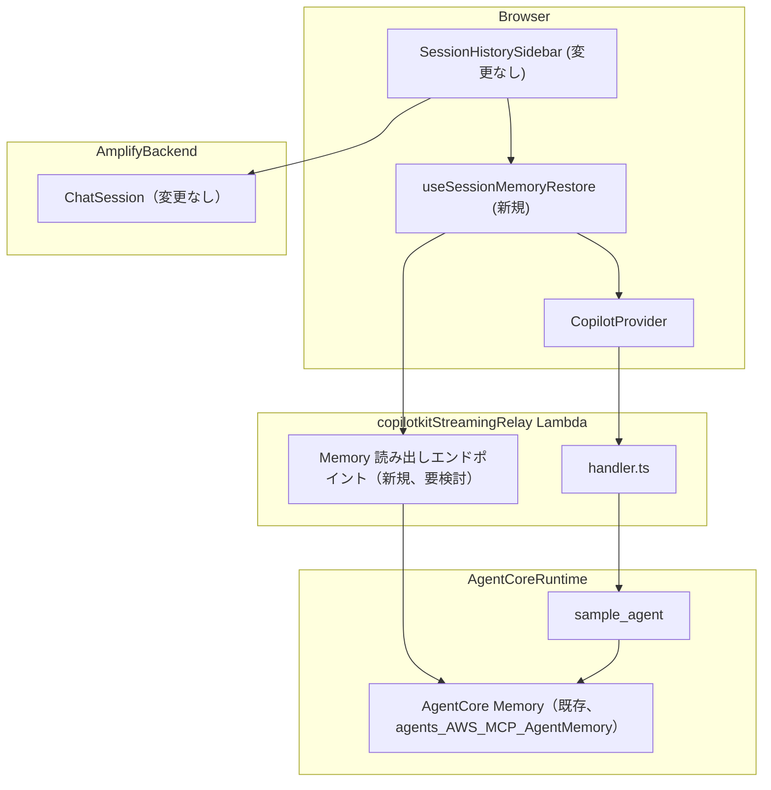

# 設計書: Memory ベースのチャット履歴

## Overview

現在、チャットメッセージの発言内容（Chat_Message）は src/lib/agent/useChatSessionPersistence.ts の onNewMessage 購読ロジックにより DynamoDB の ChatMessage モデルへ書き込まれている。この経路には既知の重複書き込みバグがあり、persistedContentKeysRef（role + 本文のキーによる重複ガード）という対策が積まれているが根本解決していない。

一方、AgentCore Runtime には AgentCore Memory（短期記憶）が既に作成・稼働している（Memory ID: `agents_AWS_MCP_AgentMemory-XXXXXXXXXX`、status: ACTIVE、`strategies: []` で長期記憶戦略は未設定 = 短期記憶のみ、`eventExpiryDuration: 30`日）。AgentCore CLI がプロジェクト内の全 Runtime（`AWS_MCP_Agent` / `AWS_MCP_Agent_Prod`）に自動的にワイヤリングする仕組みのため、`agents/` 配下のコードや CDK 設定に明示的な Memory 関連の記述は存在しない（README.md 記載の既知の仕組み）。`actor_id`（Cognito の `sub`）と `session_id` でスコープされた会話イベントが、Strands Agent の実行時に自動的にこの Memory に記録される。

本設計は以下2つの変更を行う:

1. 既存の AgentCore Memory（`agents_AWS_MCP_AgentMemory-XXXXXXXXXX`）から会話履歴を読み出すための IAM 権限・API 呼び出し経路の新規実装（Memoryリソース自体の作成は不要）
2. DynamoDB ChatMessage への書き込み・読み出しの廃止と、AgentCore Memory からの会話履歴取得（ListEvents API）による Session_Restore の実装

ChatSession（メタデータ）モデルは変更しない。

## 調査結果

- src/lib/agent/useChatSessionPersistence.ts の onNewMessage 購読・重複ガード・DynamoDB 書き込みロジック全体が削除対象
- src/app/page.tsx の SessionChatWithPersistence 内の ChatMessage 読み出しロジックが AgentCore Memory 取得に置き換わる
- src/lib/agent/chatMessagePersistence.ts の buildChatMessageCreateInput は不要になる。buildChatSessionCreateInput は継続使用
- amplify/functions/copilotkitStreamingRelay/relay.ts の extractCognitoSub が actor_id 相当の値を既に抽出済み
- AgentCore Memory（`agents_AWS_MCP_AgentMemory-XXXXXXXXXX`）は既に ACTIVE 状態で稼働中。AgentCore CLI により全 Runtime に自動ワイヤリングされているため、リソース自体の新規作成は不要。必要なのは (a) このMemoryから `ListEvents` を呼び出すためのIAM権限（`bedrock-agentcore:ListEvents`）を持つ実行ロールの用意、(b) その呼び出しをどこから行うかの経路設計のみ

## Architecture



### 主要な設計判断（未確定）

1. Memory からの読み出しをどこから行うか（Lambda拡張 vs 新規API Route）
2. Memory からの読み出しに必要な IAM 権限（`bedrock-agentcore:ListEvents`、`bedrock-agentcore:GetEvent`）をどの実行ロールに付与するか（`copilotkitStreamingRelay` Lambda の専用実行ロールに追加するか、別の経路を使うか）
3. 既存 ChatMessage モデル・GSI の削除タイミング

---

## Components and Interfaces

### 1. Memory 読み出し経路（設計判断: Lambda 拡張 方式を採用）

「調査結果」で挙げた「Lambda拡張 vs 新規API Route」について、本設計では **既存の `copilotkitStreamingRelay` Lambda にルーティング分岐を追加する方式** を採用する。

採用理由:

- `copilotkitStreamingRelay`（`handler.ts` / `relay.ts`）は既に `extractBearerToken` / `extractCognitoSub` による認証ゲートと actor_id 抽出ロジックを持っており、Memory 読み出しでも同一の認可境界（Requirements 3.1, 3.2）をそのまま再利用できる。
- 新規 Lambda 関数を追加すると、認証ゲート・SigV4 署名・actor_id 抽出のロジックを2箇所で維持することになり、`relay.ts` のコメントが明記する「意図的な差分がないこと」という前提が崩れやすくなる。
- Amplify のコンピューティングロール／実行ロールの構成を増やさずに済み、IAM 権限管理（`bedrock-agentcore:ListEvents` の追加）を既存のロールに対する追加ポリシーとして扱える。

ルーティング方式: Lambda 関数 URL は `awslambda.streamifyResponse` でラップされた単一のエントリーポイントであり、`copilotRuntimeNodeHttpEndpoint` への委譲は現在 `handler.ts` の唯一の処理経路になっている。Memory 読み出しリクエストは AG-UI/CopilotKit のリクエスト（常に `POST` + `Content-Type: application/json` の RUN 系ペイロード）とは異なる形状になるため、`handler.ts` の先頭で **HTTP メソッド（`GET`）または専用パス（例: `/memory/events`）のいずれかで分岐** し、`copilotRuntimeNodeHttpEndpoint` への委譲より前に新しいハンドラー分岐（`handleMemoryRestoreRequest` 相当）へルーティングする。

- Lambda 関数 URL 自体はパスベースのルーティング機能を持たないため、`event.rawPath` を Lambda ハンドラー内で読んで自前で分岐する必要がある（関数 URL のリソースポリシー・CORS 設定は共通のまま維持できる）。
- 既存の `copilotRuntimeNodeHttpEndpoint` の処理フロー（RUN_STARTED〜RUN_FINISHED のストリーミング応答）とは完全に別の分岐であり、Memory 読み出し分岐は `pipeResponseToStream` を使わず、通常の JSON レスポンス（`writeJsonResponse` 相当）を1回で返す。
- **全ページ取得（サーバー側ページング）**: `bedrock-agentcore:ListEvents` は `maxResults` 未指定時のデフォルトが 20 件であり、20 件を超える会話は最新 20 件に切り詰められてしまう。そのため Memory 読み出し分岐は、`ListEvents` が返す `nextToken`（サーバー側ページングトークン、クライアント入力ではない）が null/undefined になるまでループしてすべてのページを取得し、各ページの `events` を1つの配列に連結する。ページごとに `maxResults=100` を明示して往復回数を抑える。暴走防止として総ページ数・累積イベント数に安全上限（例: 50 ページ / 5000 件）を設け、上限到達時は `console.warn` のうえ取得済み分を返す（例外は投げない）。このエンドポイントはアクティブな1セッション分の履歴のみを取得するため、「全件取得」の対象は常に1セッションに閉じている（サイドバーは軽量な `ChatSession` メタデータのみを読み、`useSessionMemoryRestore` はアクティブな `sessionId` に対してのみ発火する）。したがってレスポンスは選択セッションの完全なトランスクリプトを1回で返し、`nextToken` は含めない（クライアント側ページングは行わない）。
- フロントエンドからのリクエスト形状: `GET {functionUrl}/memory/events?sessionId={sessionId}`（`sessionId` は DynamoDB `ChatSession.id` と同値）。Authorization ヘッダーに Cognito Bearer トークンを付与する点は既存の CopilotKit リクエストと同一。

Requirements: 2.1, 2.5, 3.1, 3.2, 5.1

### 2. Memory イベントのフィルタリング・変換ロジック（`memoryRestore.ts`、新規モジュール）

`amplify/functions/copilotkitStreamingRelay/memoryRestore.ts` に、`relay.ts` と同様の「純粋関数 + I/O ヘルパー」構成で実装する。

```typescript
// 型（bedrock-agentcore ListEvents レスポンスの部分型）
interface MemoryEvent {
  eventId: string;
  eventTimestamp: string;
  payload: Array<
    | { conversational: { role: string; content: { text: string } } }
    | { blob: unknown }
  >;
}

/**
 * ListEvents の結果から payload[0].conversational を持つイベントのみを
 * 抽出する（AGENT/SESSION 状態イベント = payload[0].blob を持つイベントは除外）。
 * 入力の順序を保ったまま返す純粋関数。
 */
export function filterConversationalEvents(events: MemoryEvent[]): MemoryEvent[];

/**
 * payload[0].conversational.content.text の JSON 文字列をパースし、
 * { role, content } 形式に変換する純粋関数。
 * パースに失敗した場合、または message.role / message.content が
 * 期待した形式でない場合は null を返す（呼び出し側で
 * Requirements 2.7 のフォールバック — プレーンテキスト表示または
 * 当該イベントの省略 — を行う）。
 */
export function parseConversationalEventPayload(
  event: MemoryEvent,
): { role: "user" | "assistant"; content: unknown[] } | null;

/**
 * パース済みイベント列を、CopilotKit/AG-UI が理解できる Message 形式
 * （text メッセージ、toolCall メッセージ、toolResult メッセージ）に変換する。
 *
 * - assistant の content 配列に含まれる toolUse ブロックから、対応する
 *   ツールカード相当のメッセージ構造（AG-UI の tool call メッセージ）を構築する。
 * - 後続の user イベントに含まれる toolResult ブロックを、toolUseId が一致する
 *   直前の toolUse に紐付けて、そのツールカードの実行結果として反映する
 *   （Requirements 2.6）。
 * - イベントの並び順（ListEvents が返す順序 = eventTimestamp 昇順）を保持したまま
 *   変換する（Requirements 2.2）。
 * - パースに失敗したイベント（parseConversationalEventPayload が null を返した
 *   イベント）は、変換結果から省略する（Requirements 2.7）。
 */
export function convertMemoryEventsToAGUIMessages(
  parsedEvents: Array<{ role: "user" | "assistant"; content: unknown[] }>,
): AGUIMessage[];
```

IAM 権限: `resource.ts` に、既存の `bedrock-agentcore:InvokeAgentRuntime` の絞り込みパターン（`agentCoreRuntimeArn` を synth 時に一度だけ読み、`[arn, `${arn}/*`]` を Resource に指定）と同様に、`bedrock-agentcore:ListEvents` を許可するポリシーを追加する。Memory の ARN は Runtime ARN とは別の環境変数（例: `AGENTCORE_MEMORY_ID` または Memory ARN そのもの）として管理する必要があり、これも `AGENTCORE_RUNTIME_ARN` と同じ「未設定時はポリシー自体を付与しない（フェイルセーフ）」方針に従う。

Requirements: 2.2, 2.6, 2.7

### 3. フロントエンド側の変更

**`useChatSessionPersistence.ts` の役割変更**: onNewMessage 購読・`persistedContentKeysRef` による重複ガード・`ChatMessage.create()` への DynamoDB 書き込みロジックは全て削除する（Requirements 1.1, 1.2, 4.1）。残すのは `loadMessagesIntoAgent`（`agent.setMessages()` を呼ぶ部分）相当の機能のみであり、これを新しいフック `useSessionMemoryRestore.ts` に置き換える。この新フックは：

- 選択された `activeSessionId` が変わるたびに、Component 1 で設計した Memory 読み出しエンドポイント（`GET {functionUrl}/memory/events?sessionId=...`）を呼び出す。
- レスポンスの `messages`（`convertMemoryEventsToAGUIMessages` の出力を JSON 化したもの）を `agent.setMessages()` に渡す。
- セッションを何度開いても同じ結果を返す（Memory 側の状態を変更しない読み取り専用操作のため、`persistedContentKeysRef` のような重複ガードは不要になる。重複防止は「書き込みを二重に行わない」ことではなく「同じ読み取り結果を毎回そのまま表示する」ことで実現される。Requirements 2.3）。

**セッション名自動生成ロジックの分離**: 現行の `renameSession` 呼び出しは `onNewMessage` の中で「最初のユーザーメッセージ送信時」を検知していたが、この購読自体を削除するため別の検知手段が必要になる。本設計では、CopilotKit v2 の `useAgent()` が提供する AG-UI イベント（`onNewMessage` ではなく、ユーザーがメッセージを送信した直後に発火する軽量なイベント、例えば `TextMessageStart` に相当するローカルイベント、または `SessionChatWithPersistence` 側でチャット入力送信ハンドラーに直接フックする方式）のいずれかで、DynamoDB への書き込み（Memory への書き込みではない）と分離してセッション名生成を行う。具体的な実装方式（AG-UI イベントの購読 vs 送信ハンドラーへの直接フック）は実装フェーズで確定する未確定事項として明記する。

**`src/app/page.tsx` の変更**: `SessionChatWithPersistence` 内の `useEffect`（`client.models.ChatMessage.listChatMessageBySessionCreatedAt` を呼ぶ現行ロジック）を、`useSessionMemoryRestore` フックの呼び出しに置き換える。`sortMessagesByCreatedAt` は Memory 側が既に時系列順で返すため不要になるが、防御的に順序を保証する目的で流用してもよい（実装フェーズの判断）。

Requirements: 1.1, 1.2, 1.3, 1.4, 2.2, 2.3, 2.4

### 4. 削除対象ファイル・モジュールの明示（Requirement 4.2）

| ファイル | 対象 | 扱い |
|---|---|---|
| `src/lib/agent/chatMessagePersistence.ts` | `buildChatMessageCreateInput` | 削除。`buildChatSessionCreateInput` は変更せず継続使用する |
| `src/lib/agent/useChatSessionPersistence.ts` | `onNewMessage` 購読部分全体（`persistedContentKeysRef`、`extractTextContent` を含む） | 削除。`loadMessagesIntoAgent` 相当の機能のみ `useSessionMemoryRestore.ts`（新規）に引き継ぐ |
| `src/app/page.tsx` | `SessionChatWithPersistence` 内の `ChatMessage` 読み出し `useEffect` | Memory 読み出し API 呼び出しに置き換え |
| `amplify/data/resource.ts` | `ChatMessage` モデル定義 | 「主要な設計判断（未確定）」に記載の通り、削除タイミングは実装フェーズでの判断に委ねる。本仕様の実装完了時点では読み書きの両方を停止するが、スキーマ自体の削除（破壊的変更・DynamoDB テーブル削除を伴う）は別タスクとして扱い、実装者が既存データの扱い（対象範囲外セクション記載のとおり移行しない）を確認した上で判断する |

Requirements: 4.1, 4.2

### 5. 長期記憶（Requirement 6）・保持期間変更（Requirement 7）の実装方法

- **長期記憶戦略の有効化**: AgentCore Memory の `strategies` を更新する操作（AgentCore CLI 経由、または AWS CLI の Memory 更新系 API 相当）により、`SemanticMemoryStrategy` または `SummaryMemoryStrategy`（actor_id 単位でスコープされる戦略）を1つ以上追加する。既存の `agents_AWS_MCP_AgentMemory-XXXXXXXXXX` に対する更新操作であり、新規 Memory リソースの作成は不要。
- **保持期間の変更**: 同じ Memory リソースの `eventExpiryDuration` を 30 日から 365 日に変更する操作も、既存リソースに対する更新操作として扱う。
- **高感度変更としての扱い**: この2つの変更は `AWS_MCP_Agent` と `AWS_MCP_Agent_Prod` の両 Runtime が共有する本番稼働中の Memory リソースに対する変更であり、`security` ステアリング方針（IAM・デプロイ・認証・共有リソース変更は高感度変更）に従い、**実装タスクでの適用前に必ずユーザー確認を得る**。実装タスクでは、変更内容（設定する戦略の種類、変更後の `eventExpiryDuration` 値）を事前に提示し、明示的な承認を得てから実際の更新 API 呼び出しを実行する。

Requirements: 6.1, 6.2, 6.3, 7.1, 7.2

## Data Models

### ChatSession（変更なし）

`amplify/data/resource.ts` の既存定義を維持する。

```typescript
ChatSession: a
  .model({
    ownerUserId: a.string().required(),
    roleNames: a.string().array().required(),
    sessionName: a.string().required(),
    startedAt: a.datetime(),
    updatedAt: a.datetime().required(),
  })
  .secondaryIndexes((index) => [
    index("ownerUserId")
      .sortKeys(["updatedAt"])
      .queryField("listChatSessionByOwnerUpdatedAt"),
  ])
  .authorization((allow) => [allow.owner()]),
```

本仕様はこのモデルのフィールド・認可設定を一切変更しない（Requirements 1.3）。`ChatSession.id` は Memory の `session_id` として引き続き使用する。

### ChatMessage（削除対象、実装フェーズでスキーマ削除タイミングを判断）

```typescript
ChatMessage: a
  .model({
    sessionId: a.id().required(),
    ownerUserId: a.string().required(),
    role: a.enum(["user", "assistant"]),
    content: a.string().required(),
    createdAt: a.datetime().required(),
  })
  .secondaryIndexes((index) => [
    index("sessionId")
      .sortKeys(["createdAt"])
      .queryField("listChatMessageBySessionCreatedAt"),
  ])
  .authorization((allow) => [allow.owner()]),
```

本仕様の実装完了時点で、このモデルへの読み書きコードパス（`buildChatMessageCreateInput` の呼び出し元、`listChatMessageBySessionCreatedAt` の呼び出し元）は全て削除される。モデル定義自体（および対応する DynamoDB テーブル）の削除は、Component 4 の表に記載の通り実装フェーズでの判断事項とする。

### Memory 読み出しレスポンス型（フロントエンド向け）

```typescript
/** GET {functionUrl}/memory/events?sessionId=... のレスポンス型 */
export interface MemoryRestoreResponse {
  messages: AGUIMessage[];
}
// 注: サーバー側で ListEvents の全ページを取得し、選択セッションの完全な
// トランスクリプトを1回で返すため、レスポンスに nextToken は含めない
// （クライアント側ページングは行わない）。

/** AG-UI Message の判別可能なユニオン（CopilotKit / @ag-ui/client の Message 型に準拠） */
export type AGUIMessage =
  | { id: string; role: "user" | "assistant"; content: string }
  | {
      id: string;
      role: "assistant";
      toolCallId: string;
      toolCallName: string;
      toolCallArgs: Record<string, unknown>;
    }
  | { id: string; role: "tool"; toolCallId: string; content: string };
```

`messages` は `filterConversationalEvents` → `parseConversationalEventPayload` → `convertMemoryEventsToAGUIMessages` の変換結果であり、常に時系列昇順で返す。エラー時（Requirement 2.5）はこのレスポンス型ではなく `{ error: string }` の形式で返し、フロントエンド側でエラー表示・再試行 UI に分岐する。

Requirements: 1.3, 2.1, 4.2

## Correctness Properties

*A property is a characteristic or behavior that should hold true across all valid executions of a system-essentially, a formal statement about what the system should do. Properties serve as the bridge between human-readable specifications and machine-verifiable correctness guarantees.*

プロパティベーステストは `memoryRestore.ts` の純粋関数群（フィルタリング、パース、変換）に適用する。Memory API 自体の呼び出し・IAM 権限の実効性は統合テスト（代表例）で検証する。

### Property 1: conversational イベントのみが残る（AGENT/SESSION 状態イベントの除外）

*For any* `MemoryEvent` のリスト（`payload[0].conversational` を持つイベントと `payload[0].blob` を持つイベントが任意の順序・任意の割合で混在する）に対して、`filterConversationalEvents` が返すリストは (a) 入力のうち `payload[0].conversational` を持つイベントのみを含み、`payload[0].blob` を持つイベントを1件も含まない、(b) 残ったイベントの相対順序は入力における順序と同一である。

**Validates: Requirements 2.2**

### Property 2: 不正なペイロードは常に安全にフォールバックする

*For any* `MemoryEvent`（`payload[0].conversational.content.text` が有効なJSON文字列である場合と、JSON として解釈できない文字列・期待する `message.role`/`message.content` の形を持たない場合の両方を含む）に対して、`parseConversationalEventPayload` は例外を投げず、有効な場合は `{role, content}` を返し、無効な場合は常に `null` を返す。

**Validates: Requirements 2.7**

### Property 3: toolUse と toolResult は toolUseId によって一意に紐付く

*For any* assistant イベントの `toolUse` ブロック（`toolUseId` を持つ）とその後に続く user イベントの `toolResult` ブロック（同じ `toolUseId` を持つ）の組に対して、`convertMemoryEventsToAGUIMessages` が構築するツールカード相当のメッセージ構造は、当該 `toolUseId` を持つ `toolResult` を、同じ `toolUseId` を持つ `toolUse` に対応するツールカードにのみ結び付け、異なる `toolUseId` を持つ他の `toolUse`/`toolResult` の組と混同しない。

**Validates: Requirements 2.6**

### Property 4: 変換後のメッセージ列は時系列順序を保存する

*For any* `eventTimestamp` の昇順で並んだ `MemoryEvent` のリストに対して、`convertMemoryEventsToAGUIMessages` が返す `AGUIMessage` のリストは、元のイベント列と対応する順序関係を保ったまま並ぶ（パース失敗により省略されたイベントを除き、残りの要素間の相対順序が逆転しない）。

**Validates: Requirements 2.2**

### Property 5: actor_id が一致しない場合、Memory 取得呼び出し自体が発生しない

*For any* 認証済みユーザーの actor_id と、選択された Chat_Session の実際の actor_id が異なる組み合わせに対して、Memory 読み出しハンドラーは基盤となる AgentCore_Memory の `ListEvents` 呼び出しを一度も発行せず、呼び出し前に処理を拒否する。

**Validates: Requirements 3.2**

### Property 6: 同一セッションの再取得は常に同一の結果を返す（重複防止）

*For any* 固定された `MemoryEvent` のリスト（Memory 側の状態が変化しない）に対して、`filterConversationalEvents` → `parseConversationalEventPayload` → `convertMemoryEventsToAGUIMessages` の変換パイプラインを複数回実行した結果は、実行回数に関わらず常に同一の `AGUIMessage` リストを返す（要素が累積したり増減したりしない）。

**Validates: Requirements 2.3**

## Error Handling

既存パターン（`copilotkitStreamingRelay` の 401/500 応答、`chat-session-history` design.md のエラーハンドリング表）を踏襲する。

| シナリオ | 処理 |
|---|---|
| Memory `ListEvents` 呼び出しが失敗（例: 一時的な AWS エラー、`bedrock-agentcore:ListEvents` の AccessDenied） | Memory 読み出しハンドラーは `{ error: string }` の JSON レスポンスを返す。フロントエンドはエラーインジケーターを表示し、空/部分的な会話を表示せず、再試行操作を提供する（Requirement 2.5） |
| 選択された Chat_Session の actor_id が、認証済みユーザーの actor_id と一致しない | Memory 読み出しハンドラーは `ListEvents` 呼び出しを実行する前に検証し、一致しない場合は取得自体をブロックして 403 相当のエラーを返す。データが一度でも取得された後に結果を拒棄する実装は行わない（Requirement 3.2） |
| Memory Event の `payload[0].conversational.content.text` が予期しない形式（JSON パース不可、`message.role`/`message.content` が期待する形を持たない） | `parseConversationalEventPayload` が `null` を返し、当該イベントは変換結果から省略される。Session_Restore プロセス全体は失敗させない（Requirement 2.7） |
| 選択した Chat_Session の `ownerUserId`（DynamoDB メタデータ）が現在の認証済みユーザーと一致しない | 既存の `chat-session-history` の認可拒否挙動を維持する（本仕様による変更なし、Requirement 3.3） |
| Memory 読み出しエンドポイントへのリクエストに有効な Bearer トークンがない | `copilotkitStreamingRelay` の既存の認証ゲート（401 応答）をそのまま再利用する |
| 長期記憶戦略・保持期間の更新 API 呼び出しが実装タスク中に失敗 | 更新前にユーザー確認を得るプロセス（Component 5）の後に実行するため、失敗時は変更が適用されていないことを実装者が明示的に確認し、再試行または別の戦略設定を検討する（本番共有リソースのため、部分的に適用された不整合な状態を放置しない） |

## Testing Strategy

### Unit Tests

- `memoryRestore.ts`: `filterConversationalEvents` / `parseConversationalEventPayload` / `convertMemoryEventsToAGUIMessages` を、実際に `list-events` で確認したペイロード構造（ASSISTANT の `toolUse` を含むイベント、USER の `toolResult` を含むイベント、通常発言のイベント、AGENT/SESSION 状態イベント）を模したフィクスチャで検証する。
- `handler.ts` のルーティング分岐: `GET`/専用パスへのリクエストが Memory 読み出しハンドラーに渡り、既存の AG-UI ストリーミング経路（`POST`）には影響しないことを検証する。
- `useSessionMemoryRestore.ts`: Amplify Data クライアントおよび Memory 読み出し API のモックに対して、`activeSessionId` 変更時に1回だけ呼び出されることを検証する。

### Property-Based Tests

- ライブラリは既存採用の `fast-check` を使う（`chat-session-history` と同じ規約: `fc.assert(fc.property(...), { numRuns: 100 })`）。
- 各テストには対応する設計プロパティをコメントで明記する。タグ形式: **Feature: memory-based-chat-history, Property {番号}: {プロパティ名}**

| テストファイル | 対応プロパティ |
|---|---|
| `memoryRestore.filterConversationalEvents.pbt.test.ts` | Property 1 |
| `memoryRestore.parseConversationalEventPayload.pbt.test.ts` | Property 2 |
| `memoryRestore.toolUseToolResultPairing.pbt.test.ts` | Property 3 |
| `memoryRestore.chronologicalOrder.pbt.test.ts` | Property 4 |
| `memoryRestoreAuthorization.pbt.test.ts` | Property 5 |
| `memoryRestoreIdempotency.pbt.test.ts` | Property 6 |

### Integration / Smoke Tests

- ローカル開発（`agentcore dev` または `uvicorn`）環境で、Memory 読み出しロジック（`memoryRestore.ts` の変換パイプライン）を実際の AgentCore Runtime デプロイなしに直接呼び出して検証できることを確認する（`testing` ステアリング方針、Requirement 5.1）。
- Amplify sandbox（`npx ampx sandbox`）環境で、Memory 読み出しエンドポイントに対する実際の `ListEvents` 呼び出しが actor_id/session_id で正しくスコープされることを1〜2件の代表データで確認し、Amplify Hosting 本番環境と挙動が一致することを確認する（Requirement 5.2）。
- フロントエンドとエージェントの結合テストは Amplify Hosting のデプロイ環境で行う（`testing` ステアリング方針: ローカルでは SigV4 + コンピューティングロールが必要なため結合テストができない）。

### 高感度変更（Requirement 6, 7）の適用前確認プロセス

- 長期記憶戦略（`strategies`）の有効化、および `eventExpiryDuration` の 365 日への変更は、実装タスクの実行前に変更内容（設定する戦略の種類、変更後の値）をユーザーに提示し、明示的な承認を得た上で初めて実際の更新 API 呼び出しを行う。
- これらの変更は本番共有リソース（`agents_AWS_MCP_AgentMemory-XXXXXXXXXX`）に対する変更であるため、自動テストによる検証ではなく、更新前の確認プロセスそのものをレビュー対象とする（`security` ステアリング方針）。

### 静的検証

- `npm run lint` と TypeScript の型チェックをフロントエンド変更の最初の検証ステップとする（`testing` ステアリング方針）。
- `amplify/functions/copilotkitStreamingRelay/resource.ts` の IAM ポリシー追加後は、`npx ampx sandbox` によるデプロイ影響（新規ポリシーが正しく synth されること）を確認する。
