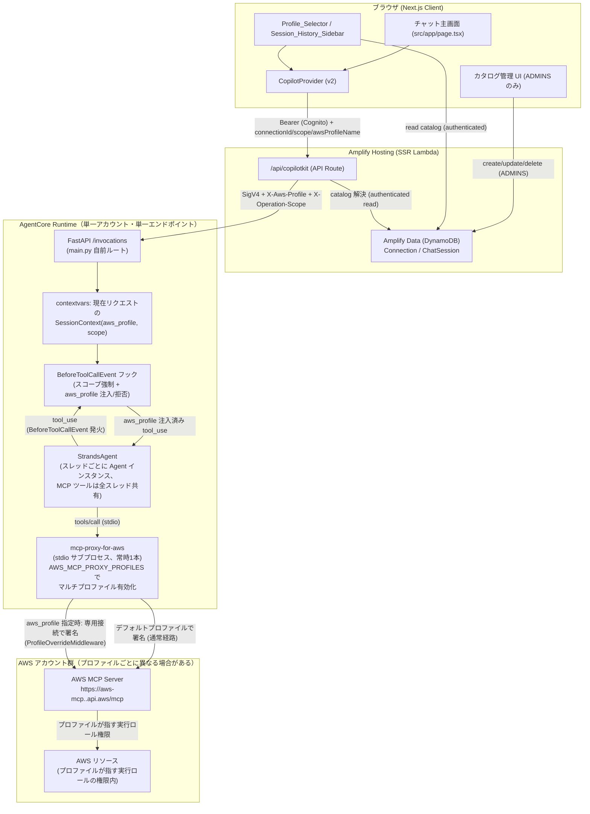
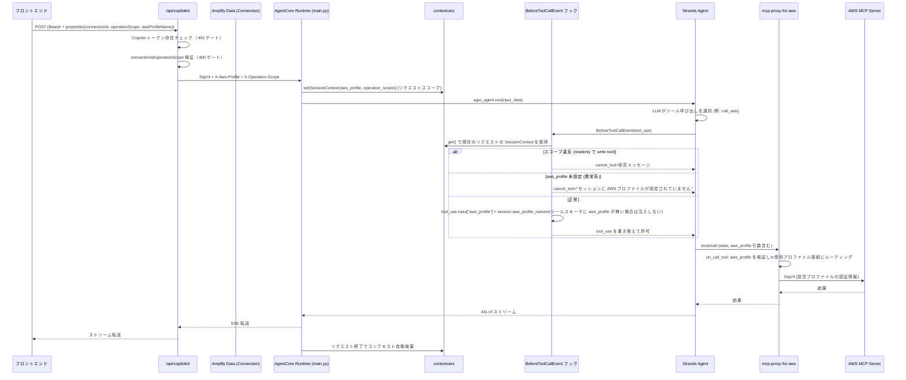
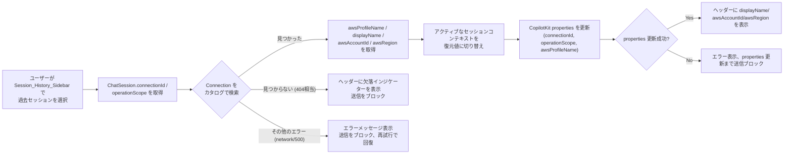

# Design Document

## Overview

本設計は、既存の「接続カタログ (Connection Catalog)」と「chat-session-history」機能を全面改定し、真のマルチアカウント対応を実現する。

現状（baseline）の問題は次の通り確認済みである。

- `Connection.gatewayUrl` は API Route から `X-Gateway-Url` ヘッダーとしてセッションごとに送信されるが、`agents/app/AWS_MCP_Agent/main.py` の `_build_gateway_agent()` はこのヘッダーを一切読み取らない。エージェントは起動時に単一の `AWS_MCP_ENDPOINT` へ、Runtime 実行ロールの SigV4 署名（`gateway/client.py` の `build_aws_mcp_client()` → `aws_iam_streamablehttp_client()`）で 1 回だけ接続し、その MCPClient を全セッションで共有している。つまり **どの Connection を選んでも、実際に操作される AWS アカウントは常に同一**。
- `main.py` にはコメントアウトされた `build_agent_for_session` の予約コードが残っているが、実装も呼び出しもされていない死んだコード。
- `ChatSession.endedAt` は書き込み経路が存在しない死んだフィールド。`ChatSession.operationScope` はスキーマ上 optional だが実質必須。

利用者との合意により、真のマルチアカウント対応は STS AssumeRole によるクロスアカウントロールチェーンではなく、依存パッケージ `mcp-proxy-for-aws`（バージョン 1.6.2、`agents/app/AWS_MCP_Agent/.venv` にインストール済み）が標準サポートする **マルチプロファイル機能** で実現する。

### 調査結果: `mcp-proxy-for-aws` のマルチプロファイル機構（設計判断の根拠）

`mcp-proxy-for-aws` の実装（`mcp_proxy_for_aws/server.py`, `mcp_proxy_for_aws/middleware/profile_switcher.py`）を確認し、以下を確定した。

1. **マルチプロファイル機能はプロキシサーバー本体の機能であり、`aws_iam_streamablehttp_client` 単体の機能ではない。** `aws_iam_streamablehttp_client(endpoint, aws_service, aws_region, aws_profile=...)` の `aws_profile` 引数は「接続時に SigV4 署名に使う 1 つのプロファイル」を指定するだけの**接続確立時のパラメータ**であり、実行時のツール呼び出し引数として使えるものではない。現行 `gateway/client.py` の `build_aws_mcp_client()` はこの低レベル関数を直接呼んでおり、プロキシサーバーのミドルウェア機構を経由していない。
2. **`aws_profile` ツールパラメータの注入は `ProfileOverrideMiddleware`（`mcp_proxy_for_aws.middleware.profile_switcher`）が行う。** このミドルウェアは `mcp-proxy-for-aws` を **stdio MCP サーバープロセスとして起動したとき**に有効化され、`AWS_MCP_PROXY_PROFILES` 環境変数（スペース区切りのプロファイル名一覧、`mcp_proxy_for_aws/server.py` の `run_proxy()` が読む）に **2 つ以上の異なるプロファイル**が列挙されている場合にのみ `on_list_tools` フックで `call_aws` / `run_script` / `get_presigned_url` / `get_tasks` / `suggest_aws_commands` のスキーマに `aws_profile`（enum 制約付き）パラメータを追加する。1 つしかプロファイルがない場合、ミドルウェアは追加されず（`server.py`: `if len(all_profiles) < 2: return None`）、`aws_profile` パラメータはスキーマに現れない。
3. **`on_call_tool` フックが実際の切り替えを行う。** ツール呼び出し引数に `aws_profile` が含まれる場合、ミドルウェアはそれを引数から取り除き（`arguments.pop("aws_profile")`）、そのプロファイル専用の **別接続**（`_get_profile_client` で遅延生成される専用 `httpx`/MCP セッション）を通じて実際の AWS MCP Server へリクエストを転送する。プロファイルが `_allowed_profiles` に無い場合は `ToolError` を投げる（Requirement 1.6 の「プロファイル解決不可時にエラー報告」と整合）。
4. **したがって、Requirement 2 の設計判断は (b) を採用する**: セッションごとに新しいエージェントインスタンスや MCP 接続を動的構築するのではなく、**単一の共有 MCP 接続**（`mcp-proxy-for-aws` の stdio サブプロセス 1 つ）を維持しつつ、各リクエストの入力コンテキスト（`X-Aws-Profile` ヘッダー）から取得した `aws_profile` 値を、Strands の `BeforeToolCallEvent` フックで対象ツール呼び出しの引数に強制注入する。ミドルウェア自体が「プロファイルごとに専用接続を張る」責務を担うため、エージェント側は接続管理を意識する必要がない。

この結論に至った経緯として、`ag_ui_strands`（`StrandsAgent` アダプター、`.venv` 内バージョンを直接確認）の実装も調査した。

5. **`StrandsAgent` はスレッド（セッション）ごとに新しい `StrandsAgentCore` インスタンスを遅延生成するが、`tools` リストは全スレッドで共有される同一オブジェクト参照である**（`ag_ui_strands/agent.py`: `self._tools = list(agent.tool_registry.registry.values())` はテンプレート Agent から一度だけ抽出され、以後すべての `self._agents_by_thread[thread_id] = StrandsAgentCore(..., tools=self._tools, ...)` で再利用される）。これは Requirement 1.1「単一エンドポイント接続を維持する」と整合し、セッションごとに MCP 接続を再確立するコストを避けられる。
6. **フックプロバイダは `StrandsAgent(agent, name, description, config, hooks=[...])` のコンストラクタで渡すことができ、`self._hooks` として保持されすべてのスレッドの `StrandsAgentCore` に転送される**（`core_kwargs["hooks"] = list(self._hooks)`）。つまり 1 つのフックプロバイダを登録すれば、全セッションの全ツール呼び出しに対して `BeforeToolCallEvent` が発火する。
7. **リクエストごとのセッションコンテキスト（`aws_profile`, `operation_scope`）をこのグローバルに共有されるフックへどう安全に届けるか**が Requirement 2.6（クロスセッション汚染防止）の核心である。`RunAgentInput` は HTTP ヘッダーを保持しないため、`StrandsAgent.run(input_data)` 内部でヘッダーを参照することはできない。よって **`contextvars.ContextVar` を用いたリクエストスコープの受け渡し**を採用する: FastAPI の `/invocations` エンドポイントで受信直後にヘッダーから `SessionContext` を抽出し、`ContextVar.set()` してから `agui_agent.run(input_data)` を呼び出す。Python の `asyncio` タスクは `ContextVar` を独立したコンテキストとしてコピーするため、並行実行中の別リクエスト（別スレッド ID、または同一スレッド内の並列ツール呼び出し）が互いの値を上書きすることはない。これにより `create_strands_app()` / `add_strands_fastapi_endpoint()` の既定エンドポイント実装（ヘッダーへのアクセスを提供しない）を使わず、`main.py` 内で同等の FastAPI ルートを自前定義する。

### フィールドの扱い（全面改定サマリー）

| フィールド | 現状 | 本改定後 |
|---|---|---|
| `Connection.awsAccountId` | 表示専用（未使用） | 表示用メタデータとして継続。ルーティングには使用しない |
| `Connection.awsRegion` | 表示専用（未使用） | 表示用メタデータとして継続 |
| `Connection.gatewayUrl` | セッションヘッダーとして送信されるが未使用 | **廃止**: エージェントは単一の `AWS_MCP_ENDPOINT` に接続し続けるため不要 |
| `Connection.awsProfileName`（新規） | なし | **新規追加**: `mcp-proxy-for-aws` に渡す実際の AWS CLI プロファイル名。唯一の実効フィールド |
| `ChatSession.endedAt` | 常に未設定（死んだフィールド） | **削除** |
| `ChatSession.operationScope` | optional、実質必須 | **必須化** |
| `ChatSession.connectionId` | 記録されるだけで未使用 | **維持し、復元に使用**: 過去セッション選択時にこの ID で Connection を再解決する |

### 高感度・要注意事項（フラグ）

| # | 事項 | 影響レイヤー | 感度 |
|---|------|------------|------|
| F1 | **Runtime 実行環境への複数プロファイル認証情報のプロビジョニング**（Requirement 7）。長期認証情報をコード/データモデルに保存しないこと | インフラ / IAM / 認証情報 | 高 |
| F2 | **`AWS_MCP_PROXY_PROFILES` 環境変数の設定**（Connection カタログの `awsProfileName` 一覧を Runtime デプロイ設定に反映する運用フロー） | インフラ / デプロイ | 高 |
| F3 | **API Route の `X-Aws-Profile` ヘッダー伝播ロジック**（`X-Gateway-Url` の置き換え）。認証済みユーザーのセッションコンテキストが正しいリクエストにのみ紐づくこと | 認証経路 | 高 |
| F4 | **データモデルの破壊的変更**（`gatewayUrl` 削除、`awsProfileName` 追加必須化、`endedAt` 削除、`operationScope` 必須化）。既存カタログ/セッションデータへの影響 | Amplify バックエンド | 中 |
| F5 | **エージェント側の `BeforeToolCallEvent` フックによるツール引数改変**。スコープ強制と `aws_profile` 注入の両方を担う共有フックのため、実装ミスが全セッションに影響する | エージェント | 高 |

F1〜F3, F5 は PR レビュー必須の高感度変更として扱う（security / repo-workflow ルール）。

## Architecture

### システム全体構成（マルチプロファイル・単一エンドポイント）



ポイント:

- エージェントは **単一の AWS MCP エンドポイント**へ、**単一の `mcp-proxy-for-aws` サブプロセス**を介して接続する。旧設計（`gateway-direct-connect`）の Gateway/クロスアカウント構成とは異なり、本設計はシングルアカウント/シングルリージョンの Runtime から、複数の AWS CLI プロファイル（各プロファイルが異なる AWS アカウントの認証情報を指してよい）を切り替えて操作する。
- `X-Aws-Profile` ヘッダーはリクエストごとに API Route が付与し、Runtime 側では `contextvars` を用いてリクエストのライフサイクル内でのみ有効な値として保持する。これにより、全スレッドで共有される単一のフックが、常に「今処理中のリクエスト」の値だけを参照する。
- スコープ強制（`scope/enforcement.py`、既存実装を流用）は `aws_profile` の値に関わらず独立して動作する。

### セッション開始〜ツール呼び出しのシーケンス



### 過去セッション選択時の接続復元フロー



### レイヤーと責務（変更点）

| レイヤー | ディレクトリ | 本機能での変更 |
|---------|------------|--------------|
| フロントエンド | `src/` | `gatewayUrl` 入力/表示を `awsProfileName` に置換。セッション復元ロジック追加（Requirement 5） |
| API Route | `src/app/api/copilotkit/` | `X-Gateway-Url` → `X-Aws-Profile` ヘッダーへ置換 |
| Amplify バックエンド | `amplify/` | Connection: `gatewayUrl` 削除 + `awsProfileName` 追加。ChatSession: `endedAt` 削除 + `operationScope` 必須化 |
| エージェント | `agents/app/AWS_MCP_Agent/` | `gateway/client.py`: 直接 SigV4 接続 → `mcp-proxy-for-aws` stdio サブプロセス接続。`main.py`: 自前 FastAPI ルート + `contextvars` + フック登録。`context/session_context.py`: `X-Gateway-Url` → `X-Aws-Profile`。新規 `profile/injection.py`: フック本体 |

## Components and Interfaces

### 1. `agents/app/AWS_MCP_Agent/gateway/client.py`（変更: 直接接続 → MCP_Proxy 経由接続）

`build_aws_mcp_client()` を削除し、`mcp-proxy-for-aws` を stdio サブプロセスとして起動する `build_aws_mcp_proxy_client()` に置き換える。

```python
from mcp import StdioServerParameters
from mcp.client.stdio import stdio_client
from strands.tools.mcp import MCPClient


def build_aws_mcp_proxy_client(
    endpoint: str = "https://aws-mcp.us-east-1.api.aws/mcp",
    region: str = "us-east-1",
) -> MCPClient:
    """Build an MCPClient backed by the mcp-proxy-for-aws stdio subprocess.

    Multi-profile mode (aws_profile tool parameter) is enabled by the
    AWS_MCP_PROXY_PROFILES environment variable set on the Runtime
    container (see Requirement 1.3). This function does not read that
    variable directly -- it is inherited by the subprocess environment.
    """
    return MCPClient(
        lambda: stdio_client(
            StdioServerParameters(
                command="mcp-proxy-for-aws",
                args=[endpoint, "--service", "aws-mcp", "--region", region],
            )
        ),
        startup_timeout=60,
    )
```

- Requirement 1.1 (単一エンドポイント接続): サブプロセスは 1 つだけ起動され、`main.py` で 1 回だけ構築される（既存の `_default_agent` 構築パターンを流用）。
- Requirement 1.2 (起動時接続失敗でブロック): `MCPClient` のコンテキストマネージャ確立（`list_tools_sync()` 呼び出し）を起動シーケンスの一部として実行し、失敗時は例外を再スローして FastAPI アプリの起動自体を失敗させる（既存の `discover_tools()` の `GatewayConnectionError` 相当のパターンを流用、例外名は `McpProxyConnectionError` に変更）。
- `build_gateway_client()`（Gateway 直接接続用）は本改定では使用しない。Gateway 概念自体を使わないため、`gateway/` ディレクトリ名は維持するが用途を「MCP_Proxy への接続」に変更する（ディレクトリ名の変更は本タスクのスコープ外とし、コメントで明記する）。

### 2. `agents/app/AWS_MCP_Agent/context/session_context.py`（変更: ヘッダー名・フィールド変更）

`X-Gateway-Url` を削除し、`X-Aws-Profile` を追加する。`gateway_url` フィールドは廃止する。

```python
HEADER_AWS_PROFILE = "X-Aws-Profile"
HEADER_OPERATION_SCOPE = "X-Operation-Scope"

VALID_SCOPES = frozenset({"readonly", "readwrite", "admin"})
DEFAULT_SCOPE = "readonly"


@dataclass(frozen=True)
class SessionContext:
    aws_profile_name: str | None   # None means "not provided" (Requirement 2.5 error path)
    operation_scope: str


def extract_session_context(headers: Mapping[str, str]) -> SessionContext:
    """X-Aws-Profile が空/欠如の場合は aws_profile_name=None を設定する（例外にしない）。
    存在チェックと拒否判断はフック側（Requirement 2.5）で行う。
    """
```

`MissingGatewayUrlError` は削除する。`aws_profile_name` の欠如はもはや致命的エラーではなく（Gateway URL のように接続先を決定するものではないため）、フック層で「ツール呼び出し拒否」として扱う（Requirement 2.5）。

### 3. `agents/app/AWS_MCP_Agent/profile/injection.py`（新規: BeforeToolCallEvent フック）

スコープ強制と `aws_profile` 注入/拒否を 1 つの `HookProvider` に統合する。既存の `scope/enforcement.py`（`is_allowed`, `build_rejection_message`）はロジックを変更せず、そのままインポートして使う。

```python
from __future__ import annotations

import contextvars
import logging

from strands.hooks import BeforeToolCallEvent, HookProvider, HookRegistry

from context.session_context import SessionContext
from scope.enforcement import build_rejection_message, is_allowed

logger = logging.getLogger(__name__)

# リクエストスコープの SessionContext。main.py の FastAPI ルートが
# リクエスト受信直後に set() し、Strands の BeforeToolCallEvent フックが
# get() で読む。asyncio task はデフォルトで contextvars を独立コピーする
# ため、並行リクエスト間で値が混在しない (Requirements 2.6)。
current_session_context: contextvars.ContextVar[SessionContext | None] = (
    contextvars.ContextVar("current_session_context", default=None)
)

AUTH_REQUIRING_TOOLS = frozenset(
    {"call_aws", "run_script", "get_presigned_url", "get_tasks", "suggest_aws_commands"}
)


class SessionScopeAndProfileHook(HookProvider):
    """全セッション共有の BeforeToolCallEvent フック。

    1. スコープ強制: is_allowed(tool_name, scope) が False ならツールを拒否する。
    2. aws_profile 注入: 対象ツールのスキーマに aws_profile プロパティが
       存在する場合のみ、現在のリクエストの aws_profile_name を強制的に
       設定する。セッションに aws_profile_name が無い場合は拒否する
       (Requirement 2.5)。ツールスキーマに aws_profile が無い場合
       (Multi_Profile_Mode 無効、Requirement 1.5) は注入も拒否も行わない。
    """

    def register_hooks(self, registry: HookRegistry) -> None:
        registry.add_callback(BeforeToolCallEvent, self._on_before_tool_call)

    def _on_before_tool_call(self, event: BeforeToolCallEvent) -> None:
        ctx = current_session_context.get()
        scope = ctx.operation_scope if ctx else "readonly"
        tool_name = event.tool_use["name"]

        if not is_allowed(tool_name, scope):
            event.cancel_tool = build_rejection_message(tool_name, scope)
            return

        if not self._tool_accepts_aws_profile(event):
            return  # Multi_Profile_Mode disabled for this tool; nothing to do.

        if ctx is None or not ctx.aws_profile_name:
            event.cancel_tool = (
                "このセッションには AWS プロファイルが設定されていません。"
                "新しいセッションを開始してください。"
            )
            logger.warning(
                "profile_injection.missing_profile",
                extra={"tool_name": tool_name},
            )
            return

        event.tool_use["input"]["aws_profile"] = ctx.aws_profile_name

    @staticmethod
    def _tool_accepts_aws_profile(event: BeforeToolCallEvent) -> bool:
        if event.tool_use["name"] not in AUTH_REQUIRING_TOOLS:
            return False
        tool = event.selected_tool
        if tool is None:
            return False
        schema = getattr(tool, "tool_spec", {}) or {}
        props = (
            schema.get("inputSchema", {}).get("json", {}).get("properties", {})
        )
        return "aws_profile" in props
```

- Requirement 1.4/1.5: `_tool_accepts_aws_profile` がツールスキーマを検査することで、`AWS_MCP_PROXY_PROFILES` が単一プロファイルしかない（`ProfileOverrideMiddleware` が有効化されない）場合には注入も拒否も行わない、という Multi_Profile_Mode の有効/無効に正しく追従する。
- Requirement 1.6: `aws_profile` が許可リストに含まれない場合のエラーは `mcp-proxy-for-aws` 自身の `ProfileOverrideMiddleware._call_with_profile()` が `ToolError` として返す。エージェント側はこれを再試行しない（既存の `AfterToolCallEvent` フックを追加せず、Strands のデフォルト動作である「1 回だけ実行してエラーをそのまま LLM に返す」に委ねる。自動リトライロジックを実装しないことが Requirement 1.6 の遵守そのものである）。
- Requirement 1.8: スコープ判定 (`is_allowed`) は `aws_profile` の値を一切参照しないため、両者は独立して動作する。

### 4. `agents/app/AWS_MCP_Agent/main.py`（変更: 自前 FastAPI ルート + contextvars 設定）

`create_strands_app()` / `add_strands_fastapi_endpoint()` は HTTP ヘッダーへのアクセスを提供しないため使用しない。同等の AG-UI プロトコル契約（`POST /invocations`, `GET /ping`）を自前の FastAPI ルートで再現し、ヘッダー抽出 → `contextvars.set()` → `agui_agent.run()` の順で処理する。

```python
from fastapi import FastAPI, Request
from fastapi.responses import StreamingResponse
from fastapi.middleware.cors import CORSMiddleware
from ag_ui.core import RunAgentInput
from ag_ui.encoder import EventEncoder
from ag_ui_strands import StrandsAgent, StrandsAgentConfig

from context.session_context import extract_session_context
from gateway.client import build_aws_mcp_proxy_client
from profile.injection import SessionScopeAndProfileHook, current_session_context
from prompts.system import build_system_prompt
from model.load import load_model
from memory.session import get_memory_session_manager

AWS_MCP_ENDPOINT = os.environ.get("AWS_MCP_ENDPOINT", "https://aws-mcp.us-east-1.api.aws/mcp")
AWS_MCP_REGION = os.environ.get("AWS_MCP_REGION", "us-east-1")


def _build_template_agent() -> Agent:
    mcp_client = build_aws_mcp_proxy_client(endpoint=AWS_MCP_ENDPOINT, region=AWS_MCP_REGION)
    system_prompt = build_system_prompt(operation_scope="admin")  # per-session prompt refined via hooks
    return Agent(model=load_model(), system_prompt=system_prompt, tools=[mcp_client])


_template_agent = _build_template_agent()

config = StrandsAgentConfig(session_manager_provider=session_manager_provider)
agui_agent = StrandsAgent(
    agent=_template_agent,
    name="AWS_MCP_Agent",
    config=config,
    hooks=[SessionScopeAndProfileHook()],
)

app = FastAPI(title="AWS_MCP_Agent")
app.add_middleware(CORSMiddleware, allow_origins=["*"], allow_credentials=True, allow_methods=["*"], allow_headers=["*"])


@app.post("/invocations")
async def invocations(input_data: RunAgentInput, request: Request):
    ctx = extract_session_context(request.headers)
    token = current_session_context.set(ctx)
    try:
        encoder = EventEncoder(accept=request.headers.get("accept"))

        async def event_generator():
            async for event in agui_agent.run(input_data):
                yield encoder.encode(event)

        return StreamingResponse(event_generator(), media_type=encoder.get_content_type())
    finally:
        current_session_context.reset(token)


@app.get("/ping")
async def ping():
    return {"status": "Healthy"}
```

- Requirement 8.3: コメントアウトされた `build_agent_for_session` の予約コードは削除する。
- `current_session_context.reset(token)` を `finally` で呼ぶことで、ストリーミング完了後にコンテキストが確実にクリアされる（Requirement 2.6 の「他のリクエストへの持ち越し禁止」を厳密化）。

### 5. `agents/app/AWS_MCP_Agent/prompts/system.py`（変更: `gateway_url` 引数を削除）

`build_system_prompt(gateway_url, operation_scope, ...)` から `gateway_url` 引数を削除する。接続先アカウントの説明は「セッションに紐づく AWS プロファイル経由で操作する」という一般的な文言に変更し、具体的なプロファイル名やアカウント ID はプロンプトに埋め込まない（プロンプトインジェクション対策・機密情報の最小化）。

### 6. `src/lib/agent/connectionResolver.ts`（変更: `gatewayUrl` → `awsProfileName`）

```typescript
export interface ConnectionResolveInput {
  connectionId: string | undefined;
  operationScope: string | undefined;
  awsProfileName?: string | undefined;
}

export interface ResolvedConnection {
  awsProfileName?: string;   // 空/未指定であれば X-Aws-Profile ヘッダーを付与しない
  operationScope: string;
}

export function buildProxyHeaders(
  operationScope: string,
  awsProfileName?: string,
): Record<string, string> {
  const headers: Record<string, string> = { "X-Operation-Scope": operationScope };
  if (awsProfileName && awsProfileName.trim().length > 0) {
    headers["X-Aws-Profile"] = awsProfileName;
  }
  return headers;
}
```

`validateAndExtractContext` は `connectionId` / `operationScope` の必須検証ロジックはそのまま維持し、`gatewayUrl` フォールバック処理を削除する。`awsProfileName` は必須ではない（欠如時はヘッダーを付与しないだけであり、400 を返す理由にはしない。ヘッダー欠如時の拒否はエージェント側フックの責務、Requirement 2.3/2.5）。

### 7. `src/app/api/copilotkit/route.ts`（変更: `X-Gateway-Url` → `X-Aws-Profile`）

`frontendGatewayUrl` の抽出・フォールバックロジックを削除し、`props.awsProfileName` を抽出して `buildProxyHeaders(operationScope, awsProfileName)` に渡す。`_sessionHeaders` の「一度設定されたら維持する」という既存の挙動（CopilotKit が properties を全リクエストに含めない問題への対処）はそのまま残すが、Requirement 2.3 の「前回リクエストの値を流用してはならない」という要求と一見矛盾するように見えるため、次の区別を明確にする。

- Requirement 2.3 が禁止するのは「**同一チャットセッション内で** `awsProfileName` が省略された単発リクエストに対して、別のセッションや過去のデフォルト値を**新規に補完**すること」であり、CopilotKit の実装都合で properties が省略される追加リクエスト（同一会話内のツール結果送信など）に限っては、直前に設定済みの同一セッションのヘッダーを維持することは許容される。ただし、**新しい会話（新しい `threadId`）を開始した場合は必ず properties が送信される**ため、`_sessionHeaders` はスレッド単位ではなくモジュールスコープの単一変数のままでは複数スレッドの並行処理に耐えられない。この点は既存コードの制約であり、本改定でも解消しないが、Requirement 5（セッション復元）でセッション切り替え時に必ず新しい properties が送信されることを保証することで実害を避ける（Components §8, §9 参照）。

### 8. `src/lib/agent/CopilotProvider.tsx`（変更: `gatewayUrl` → `awsProfileName`）

```typescript
interface CopilotProviderProps {
  children: ReactNode;
  connectionId?: string;
  operationScope?: string;
  awsProfileName?: string;   // 旧 gatewayUrl
  threadId?: string;
}
```

`properties` 構築ロジックは `connectionId` / `operationScope` / `awsProfileName` の 3 フィールドを `Record<string, string>` に変換する純粋なマッピングである。Correctness Property 3 で扱う。

### 9. `src/app/page.tsx`（変更: セッション復元ロジック追加、Requirement 5）

新規の復元フックを追加する: `src/lib/agent/useSessionRestore.ts`（新規ファイル）。

```typescript
export type RestoreResult =
  | { kind: "resolved"; connection: { id: string; displayName: string; awsAccountId: string; awsRegion: string; awsProfileName: string }; operationScope: string }
  | { kind: "missing_connection" }
  | { kind: "lookup_error"; message: string };

export function resolveRestoredSession(
  storedConnectionId: string,
  storedOperationScope: string,
  lookup: () => Promise<{ data: Connection | null; error: string | null }>,
): Promise<RestoreResult> { /* ... */ }
```

- 「見つからない」（`data === null && error === null`）と「その他のエラー」（`error !== null`）を明確に区別する（Requirement 5.3 vs 5.7）。
- `page.tsx` はセッション選択時（`handleSelectSession`）にこのフックを呼び出し、`resolved` の場合のみ `sessionState`（`connectionId`, `operationScope`, `awsProfileName` を含む拡張型）を更新して `CopilotProvider` に新しい `threadId` + properties を渡す。`missing_connection` / `lookup_error` の場合は専用のエラー状態（`SessionChat` の `error` prop、Requirement 5.3/5.7/5.8 用に「欠落インジケーター」と「エラーメッセージ」を区別する 2 種の表示）に遷移し、送信を無効化する。
- `SessionHeader`（既存コンポーネント、変更なし）に渡す `displayName` / `awsAccountId` / `awsRegion` は、復元済みの場合は復元先 Connection の値、欠落時は専用の「元の接続が見つかりません」インジケーターに置き換える。

### 10. `src/components/agent/ConnectionForm.tsx` / `ConnectionCatalogManager.tsx` / `ConnectionList.tsx`（変更: `gatewayUrl` → `awsProfileName`）

- `ConnectionForm`: `gatewayUrl` の `<input type="url">` フィールドを削除し、`awsProfileName` の `<input type="text">`（1〜256 文字、必須）を追加する。バリデーションは `connectionValidation.ts` の更新版（下記）を使う。
- `ConnectionCatalogManager`: 一覧表示の `URL: {conn.gatewayUrl}` を `Profile: {conn.awsProfileName}` に変更する。
- `ConnectionList`（Profile_Selector 用の読み取り専用一覧）: 表示フィールドに変更はない（`gatewayUrl` は元々表示していなかった）が、型定義から `gatewayUrl` を削除し `awsProfileName` を追加する。

### 11. `src/lib/agent/connectionValidation.ts`（変更: `gatewayUrl` バリデーション → `awsProfileName` バリデーション）

```typescript
export interface ConnectionInput {
  displayName: string;
  awsAccountId: string;
  awsRegion: string;
  awsProfileName: string;
  description?: string;
}

const AWS_PROFILE_NAME_PATTERN = /^[A-Za-z0-9_.-]{1,64}$/;

// awsProfileName: 1〜64 文字、英数字・ハイフン・アンダースコア・ピリオドのみ
// (Requirement 3.1 の Data Model 制約と一致させる。Requirement 6.1 の
//  "1〜256文字" というフォーム欄の説明よりも、実際に永続化可能な
//  Data Model 制約 (1-64, 制限charset) を正としてフロントエンド検証に採用する
//  -- Data Model が拒否する値をフォームが通過させることは無いようにするため)
```

> **設計判断**: Requirement 6.1 は「1 to 256 characters」と記載するが、Requirement 3.1（Data Model）は「1 to 64 characters, restricted to alphanumeric, hyphens, underscores, periods」と記載しており、両者は矛盾する。フロントエンドのフォーム入力欄の `maxLength` 属性は 256 を上限として設定してよいが（Requirement 6.1 の文言を満たす）、**送信可否を決めるバリデーションロジックは Data Model の制約（1-64 文字、許可文字種）を上限として適用する**。これにより、フォームが通過させた値が Data Model の書き込みで拒否される事態を防ぐ。

### 12. `src/lib/agent/useConnectionAdmin.ts` / `useConnectionCatalog.ts` / `useChatSessions.ts`（変更: フィールド名の追従のみ）

- `useConnectionAdmin.ts`: `ConnectionCreateInput` / `ConnectionUpdateInput` の `gatewayUrl` を `awsProfileName` に置換。ロジック変更なし。
- `useConnectionCatalog.ts`: 型変更のみ（`Schema["Connection"]["type"]` が自動的に反映）。ロジック変更なし。
- `useChatSessions.ts`: `ChatSession.create()` に渡す `operationScope` は既に必須値を渡しているため、Data Model の必須化（Requirement 4.2）と衝突しない。`buildChatSessionCreateInput`（`chatMessagePersistence.ts`）にも変更は不要。

## Data Models

`amplify/data/resource.ts` を以下のように変更する（Connection / ChatSession のみ抜粋、Todo / ChatMessage は変更なし）。

```typescript
Connection: a
  .model({
    displayName: a.string().required(),
    awsAccountId: a.string().required(),
    awsRegion: a.string().required(),
    awsProfileName: a.string().required(),   // 新規: mcp-proxy-for-aws に渡す AWS CLI プロファイル名
    description: a.string(),
    // gatewayUrl は削除
  })
  .authorization((allow) => [
    allow.group("ADMINS"),
    allow.authenticated().to(["read"]),
  ]),

ChatSession: a
  .model({
    ownerUserId: a.string().required(),
    connectionId: a.id().required(),
    operationScope: a.enum(["readonly", "readwrite", "admin"]).required(), // optional → required
    sessionName: a.string().required(),
    startedAt: a.datetime(),
    updatedAt: a.datetime().required(),
    // endedAt は削除
  })
  .secondaryIndexes((index) => [
    index("ownerUserId").sortKeys(["updatedAt"]).queryField("listChatSessionByOwnerUpdatedAt"),
  ])
  .authorization((allow) => [allow.owner()]),
```

### Before / After 比較

**Connection**

| フィールド | Before | After |
|---|---|---|
| `displayName` | required string | 変更なし |
| `awsAccountId` | required string | 変更なし（表示用メタデータとして継続、Requirement 3.3） |
| `awsRegion` | required string | 変更なし（表示用メタデータとして継続） |
| `gatewayUrl` | required string | **削除** |
| `awsProfileName` | (存在しない) | **新規追加**: required string, 1-64 文字, `^[A-Za-z0-9_.-]{1,64}$` |
| `description` | optional string | 変更なし |

**ChatSession**

| フィールド | Before | After |
|---|---|---|
| `ownerUserId` | required string | 変更なし |
| `connectionId` | required id | 変更なし（復元の正式な参照として意味付けを明確化） |
| `operationScope` | optional enum | **required enum**（値は readonly/readwrite/admin で変更なし） |
| `sessionName` | required string | 変更なし |
| `startedAt` | optional datetime | 変更なし |
| `endedAt` | optional datetime | **削除** |
| `updatedAt` | required datetime | 変更なし |

### 認可

- Connection: `allow.group("ADMINS")`（create/update/delete）+ `allow.authenticated().to(["read"])`（read）。変更なし（Requirement 3.5, 3.6）。
- ChatSession: `allow.owner()`。変更なし（Requirement 4.6, 4.7）。
- 認証モード: `defaultAuthorizationMode: "userPool"`。変更なし。

## Correctness Properties

*プロパティとは、システムのすべての有効な実行において成り立つべき特性・振る舞いであり、システムが何をすべきかについての形式的な記述である。プロパティは、人間が読める仕様と機械検証可能な正しさ保証との橋渡しとなる。*

以下は prework の分類とプロパティ振り返り（重複排除）の結果である。次の要件はプロパティテスト対象外とし、それぞれ別の手段で検証する（Testing Strategy 参照）: スキーマ宣言そのもの（3.1〜3.4, 4.1, 4.2, 4.4, 4.5）、AppSync の宣言的認可・必須フィールド強制（4.3, 4.6, 4.7 は統合テスト）、外部ライブラリ（`mcp-proxy-for-aws`）自身の配線動作（1.1, 1.2, 1.4, 1.5）、ドキュメント/運用手順（7.1〜7.4, 7.6, 8.1, 8.3, 8.6）、UI レンダリング事実（6.1, 6.5）、低分散のエッジケース（1.6, 1.7, 5.5, 8.5 の一部は個別ユニットテスト）。

### Property 1: プロファイル一覧の重複排除

*For any* list of Connection catalog entries (each with an `awsProfileName` value, possibly empty, whitespace-only, or duplicated across entries), the function that derives the `AWS_MCP_PROXY_PROFILES` value SHALL produce a space-separated list containing each distinct non-empty, trimmed `awsProfileName` value exactly once, preserving first-occurrence order, and SHALL exclude empty or whitespace-only values.

**Validates: Requirements 1.3**

### Property 2: 操作スコープ強制はプロファイルと独立

*For any* tool name, operation scope, and `aws_profile` value (including `None`/absent), the scope-allow/deny decision produced by `is_allowed(tool_name, scope)` SHALL depend only on `tool_name` and `scope`, and SHALL be identical regardless of which `aws_profile` value (or absence thereof) accompanies the same tool call.

**Validates: Requirements 1.8**

### Property 3: セッションコンテキストから CopilotKit properties への変換

*For any* combination of `connectionId`, `operationScope`, and `awsProfileName` values (each present, absent, or empty), whether sourced from a freshly selected Connection or from a restored past Chat_Session, the function that builds the CopilotKit `properties` object SHALL include a key for exactly the fields that are non-empty, using the corresponding value unchanged, and SHALL omit keys for fields that are absent or empty.

**Validates: Requirements 2.1, 5.4**

### Property 4: API Route のヘッダー構築と非引き継ぎ

*For any* two consecutive requests where the first carries a non-empty `awsProfileName` and `operationScope` and the second either (a) carries its own non-empty `awsProfileName`/`operationScope` or (b) omits `awsProfileName` entirely, the header-construction function SHALL set `X-Operation-Scope` to the current request's scope and SHALL set `X-Aws-Profile` if and only if the *current* request supplies a non-empty `awsProfileName` — for case (b) within a genuinely new session context (a fresh `connectionId`), the function SHALL NOT substitute the first request's `awsProfileName` value.

**Validates: Requirements 2.2, 2.3, 8.4**

### Property 5: `aws_profile` の注入または拒否の決定表

*For any* tool call whose tool schema declares an `aws_profile` parameter, and any session context that either carries a non-empty `aws_profile_name` or does not, the `BeforeToolCallEvent` hook SHALL either (a) set `tool_use["input"]["aws_profile"]` to exactly the session's `aws_profile_name` and allow the call, when the session context carries a non-empty value, or (b) cancel the tool call with a message identifying the missing profile, when the session context lacks one — and for tool schemas that do NOT declare an `aws_profile` parameter, the hook SHALL leave the tool call arguments unmodified in either case.

**Validates: Requirements 2.4, 2.5, 7.5**

### Property 6: リクエスト間の `aws_profile` 分離

*For any* set of N concurrently executing simulated tool invocations, each carrying its own distinct `SessionContext` value set via the request-scoped `contextvars.ContextVar`, the hook SHALL resolve, for each invocation, the `aws_profile` value belonging exclusively to that invocation's own context — no invocation's resolved value SHALL match a different concurrently-running invocation's context value, regardless of interleaving or execution order.

**Validates: Requirements 2.6**

### Property 7: 接続カタログの認可決定

*For any* combination of a user's group membership (member of ADMINS or not) and a requested Connection operation (`read`, `create`, `update`, `delete`), the operation SHALL be permitted if and only if the operation is `read` and the user is authenticated, or the operation is one of `create`/`update`/`delete` and the user is a member of ADMINS; all other combinations SHALL be denied with no partial access granted.

**Validates: Requirements 3.5, 3.6**

### Property 8: 過去セッション復元の解決関数

*For any* stored `(connectionId, operationScope)` pair from a past Chat_Session and any simulated Connection-lookup outcome (resolved with a Connection record, "not found", or a non-absence error such as a network/server failure), the session-restoration resolver SHALL produce exactly one of three states: (a) a *resolved* state exposing the looked-up `awsProfileName`/`displayName`/`awsAccountId`/`awsRegion` and the stored `operationScope`, with sending permitted; (b) a *missing-connection* state with sending blocked, when the lookup outcome is "not found"; or (c) a *lookup-error* state with sending blocked, when the lookup outcome is a non-absence error — and only state (a) SHALL permit sending new messages.

**Validates: Requirements 5.1, 5.2, 5.3, 5.6, 5.7, 5.8**

### Property 9: 接続フォームの入力検証ゲート

*For any* combination of `displayName`, `awsAccountId`, `awsRegion`, and `awsProfileName` input values, the ConnectionForm SHALL be submittable if and only if `displayName` is 1-100 characters, `awsAccountId` matches a 12-digit numeric pattern, `awsRegion` matches `[a-z]+-[a-z]+-[0-9]+`, and `awsProfileName` is 1-64 characters composed only of alphanumeric characters, hyphens, underscores, and periods (i.e. not empty or whitespace-only) — when any field violates its constraint, submission SHALL be blocked and an inline error SHALL be generated identifying that specific field.

**Validates: Requirements 6.2, 6.3, 6.4**

### Property 10: 管理者向け UI ゲート

*For any* authenticated user's group membership set, the Connection catalog management controls (create/edit/delete) and the `awsProfileName` input field SHALL be rendered if and only if the user is a member of the ADMINS group; for users who are not members, these controls SHALL NOT be rendered under any circumstance, and the catalog SHALL render in read-only mode.

**Validates: Requirements 6.6, 6.7, 8.5**

### Property 11: 既存 Connection の選択可否ゲート

*For any* Connection record whose `awsProfileName` field is present-and-non-blank, absent, or present-but-whitespace-only (representing pre-existing records migrated before this field became required), the Profile_Selector's selectability predicate SHALL classify the Connection as selectable for starting a new Chat_Session if and only if `awsProfileName` is present and not blank/whitespace-only.

**Validates: Requirements 8.2**

## Error Handling

### フロントエンド

| ケース | 振る舞い | 要件 |
|--------|---------|------|
| `ConnectionForm` バリデーション失敗（`awsProfileName` 空/不正文字種、`awsAccountId`/`awsRegion` 不正） | フィールド単位インラインエラー、送信阻止 | 6.2, 6.4 |
| 過去セッションの Connection が見つからない | ヘッダーに欠落インジケーター表示、送信ブロック | 5.3, 5.8 |
| 過去セッションの Connection 検索がネットワーク/サーバーエラーで失敗 | エラーメッセージ表示、再試行 or 新規セッションまで送信ブロック | 5.7 |
| セッション復元後の CopilotKit properties 更新が失敗 | エラー表示、properties 更新成功まで送信ブロック | 5.5 |
| `awsProfileName` が未設定の既存 Connection | Profile_Selector で選択不可として表示 | 8.2 |
| 非管理者によるカタログ管理操作 | 管理 UI コントロールを非表示（描画しない） | 6.7, 8.5 |

### API Route

| ケース | レスポンス | 要件 |
|--------|-----------|------|
| Cognito トークンなし（未認証） | 401 Unauthorized（プロキシせず） | 既存動作を維持 |
| `connectionId` / `operationScope` 欠如 | 400 + 必須フィールド不足メッセージ | 既存動作を維持 |
| `awsProfileName` が properties に含まれない | `X-Aws-Profile` ヘッダーを付与せず転送（拒否しない） | 2.3 |

### エージェント

| ケース | 振る舞い | 要件 |
|--------|---------|------|
| 起動時に `mcp-proxy-for-aws` サブプロセスへの接続に失敗 | Runtime 初期化をブロックし、以後のセッションリクエストを拒否 | 1.2 |
| セッションに `aws_profile_name` が無く、対象ツールが `aws_profile` を要求する | ツール呼び出しを拒否（`cancel_tool`）、不足を示すメッセージを返す | 2.5 |
| `aws_profile` が Runtime 実行環境で解決不可（許可プロファイル一覧に存在しない） | `mcp-proxy-for-aws` の `ProfileOverrideMiddleware` が `ToolError` を返す。エージェントは 1 回のみ試行し、自動リトライしない | 1.6 |
| フックのエラー報告ステップ自体が失敗 | ツール実行結果を成功として報告しないことだけは保証する（報告自体はベストエフォート） | 1.7 |
| readonly スコープで write 分類ツールが呼ばれる | `cancel_tool` に操作名・現スコープ・readwrite での新規セッション提案を含む拒否メッセージ | 既存 `scope/enforcement.py` の動作を維持 |

### データモデル

| ケース | 振る舞い | 要件 |
|--------|---------|------|
| 非管理者の Connection 書込 | AppSync 認可で拒否 | 3.6 |
| `operationScope` を欠いた ChatSession の create/update | AppSync が `.required()` 制約で拒否、レコードは永続化されない | 4.3 |
| 非所有者による ChatSession の読み書き | AppSync の `allow.owner()` で拒否 | 4.7 |

## Testing Strategy

testing ルール（最も狭い範囲の検証を最初に、レイヤーを明示）に従う。

### フロントエンド（`src/`）

- lint + 型チェックを最優先。
- Property 3（properties 構築）, 4（ヘッダー構築、Node 側だが `src/lib` に実装）, 9（フォーム検証ゲート）, 10（管理者 UI ゲート）, 11（選択可否ゲート）を `fast-check` によるプロパティテストで検証。
- Property 8（セッション復元リゾルバ）は `resolveRestoredSession()` を純粋関数として実装し、`fast-check` でモック化した 3 種のルックアップ結果（resolved / not-found / error）を生成してテストする。
- `ConnectionForm` の `awsProfileName` フィールド有無、`ConnectionCatalogManager` の一覧表示（`awsProfileName` 列）はコンポーネント/スナップショットテスト。
- 復元後のヘッダー表示（displayName/awsAccountId/awsRegion、または欠落インジケーター）はコンポーネントテスト。properties 更新失敗時のブロック挙動（5.5）はユニットテスト。

### API Route（`src/app/api/copilotkit/`）

- Property 4（ヘッダー構築 + 非引き継ぎ）を `fast-check` でテスト。Data クライアント・SigV4 署名部分はモック化。
- 401/400 の既存ゲート挙動は変更しないため、既存テストを流用・確認するのみ。

### エージェント（`agents/app/AWS_MCP_Agent/`）

- testing ルールに従いスモークテスト + インポート確認を最優先。
- Property 1（プロファイル重複排除）: Connection カタログのモックデータから `AWS_MCP_PROXY_PROFILES` 相当の文字列を組み立てる純粋関数を実装し、`hypothesis` でテスト（この関数は運用ドキュメント/デプロイスクリプト側に置く想定だが、ロジックはユニットとして分離してテスト可能にする）。
- Property 2（スコープ独立性）: 既存の `scope/enforcement.py` の `is_allowed` に対する既存 PBT（`test_enforcement_pbt.py`）に `aws_profile` の値を独立変数として追加する形で拡張する。
- Property 5（注入/拒否決定表）, Property 6（並行分離）: `profile/injection.py` の `SessionScopeAndProfileHook` に対して `hypothesis` + `pytest-asyncio` でテストする。Property 6 は `asyncio.gather` で複数の模擬 `BeforeToolCallEvent` 呼び出しを異なる `contextvars` コンテキストで並行実行し、各呼び出しの注入結果が自分自身のコンテキストとのみ一致することを検証する。
- `mcp-proxy-for-aws` サブプロセスの起動・接続失敗（1.2）、ツールスキーマの `aws_profile` 有無に応じた注入スキップ（1.4/1.5 相当の分岐、ただし当該ライブラリの配線自体はテストしない）は、`selected_tool.tool_spec` をモックしたユニットテストで確認する。
- ローカル動作確認は `uvicorn` または `agentcore dev` で `/invocations` に curl リクエストを送り、`X-Aws-Profile` ヘッダーの有無で挙動が変わることを確認する。

### Amplify バックエンド（`amplify/`）

- Property 7（カタログ認可）: sandbox 上で ADMINS / 非 ADMINS ユーザーによる CRUD 試行の統合テストとして検証（Amplify Data の認可はプロパティテストではなく統合テストで確認するのが適切 — 認可自体は宣言的だが、実際のクロスユーザーアクセス拒否は AppSync に対する実リクエストでのみ確認できる）。
- `operationScope` 必須化（4.3）、`endedAt`/`gatewayUrl` 削除（4.1, 3.2）はスキーマ生成後の型チェックで確認。

### プロパティベーステスト（PBT）の方針

- ライブラリ: TypeScript 側は `fast-check`、Python 側は `hypothesis`（既に `agents/app/AWS_MCP_Agent` の dev dependency に存在）を使用する。
- 各プロパティテストは最低 100 イテレーション実行する。
- 各プロパティテストは設計プロパティを参照するタグコメントを付す。
- タグ形式: **Feature: multi-account-mcp-access, Property {番号}: {プロパティ説明}**
- 各 Correctness Property は単一のプロパティベーステストで実装する。

## Migration Plan

Requirement 8 に基づき、破壊的スキーマ変更（`Connection.gatewayUrl` 削除 + `awsProfileName` 必須追加、`ChatSession.endedAt` 削除 + `operationScope` 必須化）の移行手順を定める。この方針は `gatewayTargetName` → `gatewayUrl` リネーム時に採用した移行手順（前回の `gateway-direct-connect` 改定）と一貫させる。

### Sandbox 環境

1. `amplify sandbox delete` で既存 sandbox とその DynamoDB データを削除する。
2. 新スキーマで `amplify sandbox` を再作成する。既存の Connection / ChatSession データは失われることを前提とする（開発データのため許容）。
3. 管理者 UI から Connection を `awsProfileName` 付きで再登録する。

### 本番環境

破壊的変更を無停止で適用することはできないため、以下のいずれかを選択する（運用者判断）。

**選択肢 A: 手動データ移行**

1. デプロイ前に既存の Connection テーブルをエクスポートする（DynamoDB エクスポートまたは `list()` API での取得）。
2. 各 Connection レコードについて、運用者が対応する `awsProfileName` を決定し、Runtime 環境にその名前のプロファイル用認証情報を事前にプロビジョニングする（Requirement 7 の手順、Credential_Provisioning_Mechanism 参照）。
3. スキーマデプロイ後、`awsProfileName` を付与したレコードに更新する（`gatewayUrl` フィールドは新スキーマ上に存在しないため自動的に無視される）。
4. ChatSession の `endedAt` フィールドは単純削除であり、既存レコードへの影響はない（読み取られなくなるだけ）。既存レコードで `operationScope` が未設定のものが万が一存在する場合は、デプロイ前に `operationScope: "readonly"` を補完するバックフィルスクリプトを実行する。

**選択肢 B: 全面再登録**

1. 影響が許容できる場合、Connection カタログ全体を運用者が UI から再登録する（レコード数が少ない想定であれば選択肢 A より簡便）。
2. 既存 ChatSession のうち、削除された Connection を参照するものは Requirement 5.3 の「欠落インジケーター」表示に従い、過去ログとして閲覧可能だが新規メッセージ送信は不可となる（データ削除は行わない）。

### デプロイ順序（推奨）

1. **先に** Requirement 7 の認証情報プロビジョニング（Runtime 環境への複数プロファイル分の認証情報配置、`AWS_MCP_PROXY_PROFILES` 環境変数設定）を完了する。
2. エージェントコード（`main.py`, `gateway/client.py`, `context/session_context.py`, `profile/injection.py`）を `agentcore deploy` でデプロイする。
3. Amplify バックエンド（スキーマ変更）と Web アプリ（フロントエンド変更、API Route 変更）を Amplify Hosting へデプロイする。
4. 管理者が Connection カタログを `awsProfileName` 付きで作成・更新する。
5. 各 `awsProfileName` について、対応するツール呼び出し（例: readonly な `call_aws` の `sts get-caller-identity` 相当）を実施し、実際に解決できることを確認する（Requirement 7.4 の「エージェントが解決できて初めて利用可能とみなす」の実地確認）。

### ロールバック

エージェント側の変更（`gateway/client.py` の接続方式変更）は、`AWS_MCP_ENDPOINT` への直接 SigV4 接続に戻すコード変更で復元可能。Amplify データモデルの変更はロールバックすると `awsProfileName` を持つ新規 Connection データを失うため、ロールバックが必要な場合は事前にエクスポートしたデータで復元する。
