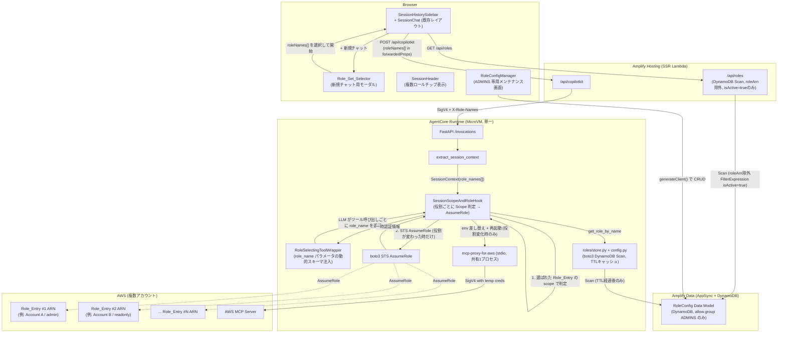

# Design Document: Role Set Switching

## Overview

`direct-role-switching` は「セッション開始時に1つの Role_Entry を選び、セッション中はそれ固定」というモデルを実現した（`BeforeToolCallEvent` フック内で `boto3 sts:AssumeRole` を直接呼び出し、`mcp-proxy-for-aws` サブプロセスに構築時 `env=` として一時認証情報を渡す方式。Admin ロールでの S3 バケット作成に実機で成功済み）。

本設計はこの土台をそのまま踏襲しつつ、「セッション開始時に複数の Role_Entry を選び（Role_Set）、セッション中は LLM がツール呼び出しごとにその中から自律的に1つを選ぶ」というモデルに一般化する。Role_Config は Account_Label を持つ Role_Entry のフラットな一覧となり、admin/readonly の混在・Admin エントリの複数保持が可能になる。Runtime は1つのまま、API_Route も単一固定 Runtime ARN 方式のまま変更しない。

さらに、requirements.md の2回目の方針転換（Role_Config の永続化方式の確定）を受け、Role_Config の永続化先を `AGENT_ROLES` 環境変数から DynamoDB テーブル（Amplify Gen 2 の Data_Model `RoleConfig`、以下 Role_Config_Table）へ変更する。これに伴い、これまで低優先度の概要記述に留めていた Requirement 8（Role_Config の画面メンテナンス）を正式な機能要件として設計に組み込み、管理者が Role_Entry を作成・更新・削除できるメンテナンス画面（`RoleConfigManager`）を追加する。Role_Entry の追加・変更・削除は Agent の再デプロイを必要とせず、TTL キャッシュの失効後に新規 Chat_Session から反映される。

### 方針転換の経緯（3回目: Role_Entry の削除方式を論理削除に変更）

上記の DynamoDB 永続化方式の確定後、設計レビューの過程で次の安全性ギャップが判明した。Role_Config_Table の主キーは Amplify Data Model が自動生成する `id`（UUID）であり、`Role_Name`（`name`）はキーではない。当初の設計では Role_Entry の削除を Role_Config_Table からのレコード物理削除として実装していたが、この方式には次の問題がある: 削除後に同じ `Role_Name` で新規 Role_Entry を作成すると、内部的には全く別のレコード（別の `id`、別の `Role_ARN` の可能性がある）になる。一方 `Chat_Session.roleNames` は `Role_Name` の文字列のみを保存しており、過去セッション復元時の照合（`resolveRestoredRoleSet`）は文字列一致でしか行われない。そのため、古い Role_Entry を使っていた過去セッションを復元すると、`Role_Name` 文字列が一致するために「利用可能」と誤判定され、実際には削除前とは異なる（新しい）Role_Entry が使われてしまう危険なギャップがあった。

この問題を受け、Role_Entry の削除方式を**論理削除**に変更した。Role_Config に `isActive`（Agent 側 `is_active`）フィールドを追加し、削除操作は `isActive` を `false` に設定するのみとし、レコード自体は Role_Config_Table に残す。あわせて、`Role_Name` の一意性チェックは `isActive` の値に関わらず Role_Config_Table 内の全レコード（アクティブ・非アクティブ双方）を対象に行うことで、非アクティブ化された `Role_Name` の再利用そのものを構造的に禁止する。再アクティブ化する操作（`isActive` を `false` から `true` に戻す操作）も提供しない。これにより、ある `Role_Name` と特定の `Role_ARN`/`id` の対応関係は、その `Role_Name` が一度でも使われた後は変化しないことが保証され、過去セッション復元時の文字列照合が安全になる。

### 設計方針

1. **フロントエンドの画面構成は既存を活かす**: ログイン直後の全画面 `RoleSelector`（`role_selection` 状態）を廃止し、既存のサイドバー＋メイン画面レイアウトにそのまま入る。新規チャット作成はサブダイアログでの複数選択に変わる。
2. **Agent 側のコア機構は既存を一般化するのみ**: `gateway/manager.py` の `ensure_role()`（役割が変わった時だけ AssumeRole + サブプロセス再起動、変わらなければ no-op）は既に「セッション中に役割が変わり得る」ことを前提に書かれており、そのままツール呼び出し単位の役割切り替えに使える。変更が必要なのは「どの役割を使うかをどこから読み取るか」（セッション単位の固定値 → そのツール呼び出しの `role_name` パラメータ）だけである。
3. **ツールスキーマの動的拡張**: Role_Set が2件以上のときだけ、対象4ツール（`call_aws` / `run_script` / `get_presigned_url` / `get_tasks`）の入力スキーマに `role_name`（enum = Role_Set 内の Role_Name）を必須パラメータとして注入する。1件のときはパラメータ自体を露出させない（Requirement 4.1, 4.2）。Strands はツールスキーマをターン毎に `ToolRegistry.get_all_tool_specs()` で毎回再取得するため（`strands/tools/registry.py`、`strands/event_loop/event_loop.py:153,528`）、`tool_spec` プロパティを動的にすることで実現できる。
4. **スコープ強制はツール呼び出し単位**: セッション単位の単一 `operation_scope` ではなく、そのツール呼び出しで選ばれた Role_Entry の `scope` を都度使う。
5. **Role_Config の永続化は DynamoDB テーブル、読み取り経路は利用者の権限に応じて分離する**（Requirement 1, 8）: 一般ユーザー向けのロール一覧取得（チャット用）は `/api/roles` Route Handler が DynamoDB を直接 Scan する経路のみとし、レスポンスからは常に `roleArn` を除外し、`isActive = true` のレコードのみを返す。管理者向けメンテナンス画面は Amplify Data Model の CRUD（`generateClient<Schema>()`）を直接使い、この Data Model 自体の GraphQL API 認可は `allow.group("ADMINS")` のみに絞る。この分離により、Role_ARN が非管理者に渡る経路は設計上存在しない。
6. **Agent 側は TTL キャッシュ付きで DynamoDB テーブルを都度読む**: 起動時に一度だけ環境変数を読む方式から、boto3 で DynamoDB テーブルを読み、短い TTL（デフォルト約30秒、環境変数で調整可能）でキャッシュする方式に変更する。これにより、メンテナンス画面での変更が Agent の再デプロイなしに、TTL 経過後の新規 Chat_Session 作成から反映される（Requirement 8.7）。
7. **Role_Entry の削除は論理削除とし、Role_Name の再利用を構造的に禁止する**（Requirement 1.8, 8.6, 8.8）: 削除操作は `RoleConfig.isActive` を `false` に設定するのみであり、レコード自体は Role_Config_Table に残す。`Role_Name` の一意性チェックは `isActive` の値に関わらず全レコードを対象に行うため、非アクティブ化された `Role_Name` は将来にわたって再利用できない。再アクティブ化する操作も提供しない。この方針は、`Role_Config_Table` の主キーが `id`（UUID）であり `Role_Name` ではないことに起因する安全性ギャップ（同一 `Role_Name` の削除・再作成による、過去セッション復元時の紐付き先の意図しない変化）を構造的に防ぐためのものである。

## Architecture



### 既存コンポーネントとの対応（direct-role-switching → role-set-switching）

| direct-role-switching | role-set-switching | 変更内容 |
|---|---|---|
| `RoleConfig`（name, displayName, roleArn, scope） | `RoleConfig`（+ `account_label`, + `is_active`） | Account_Label フィールド追加。削除は `is_active` を false にする論理削除に変更（レコードは残存） |
| `SessionContext.role_name: str \| None` | `SessionContext.role_names: tuple[str, ...]`（空 tuple = Role_Set なし） | 単一値 → 複数値 |
| `SessionScopeAndRoleHook`（セッション単位 scope、role_name はヘッダー由来のみ） | 同クラス。scope はツール呼び出し単位で選ばれた Role_Entry から導出。role_name はツール入力パラメータ（2件以上の時）またはセッションの唯一の Role_Entry（1件の時）から導出 | ロジック一般化 |
| `McpClientManager.ensure_role(role_name, role_arn)` | 変更なし | 既にツール呼び出し単位の役割変化に対応済み |
| なし | `roles/tool_schema.py`（新規、`RoleSelectingToolWrapper`） | role_name パラメータの動的スキーマ注入 |
| `RoleSelector.tsx`（全画面、単一選択） | `RoleSetSelectorDialog.tsx`（新規、モーダル、チェックボックス複数選択） | UI 全面差し替え |
| `SessionHeader`（displayName + scope 単一表示） | `SessionHeader`（Role_Set の複数チップ表示、`roleMissing` → 部分/全欠落表示に一般化） | 複数ロール対応 |
| `page.tsx`（`role_selection` 状態あり） | `page.tsx`（`role_selection` 状態を削除、新規チャットはダイアログ経由） | 状態マシン簡素化 |
| `ChatSession.roleName: string` + `operationScope` | `ChatSession.roleNames: string[]`（`operationScope` フィールドは削除） | スコープがロール単位になったためセッション単位の scope フィールドは意味を失う |
| `AGENT_ROLES` 環境変数（Agent 起動時に一度だけ JSON パース） | `RoleConfig` Data Model（DynamoDB、`roles/store.py` + `roles/config.py` が TTL キャッシュ付きで都度読み取り） | 永続化方式の変更。Role_Entry の追加・変更・削除に Agent 再デプロイが不要になる |
| `/api/roles`（`AGENT_ROLES` 環境変数のパース） | `/api/roles`（DynamoDB `Scan`、`ProjectionExpression` で `roleArn` を除外、`FilterExpression` で `isActive = true` のみ） | 実装をサーバーサイド DynamoDB 読み取りに変更。レスポンス構造・`roleArn` 非公開方針は変更なし。加えて非アクティブ（論理削除済み）レコードを除外する |
| なし | `RoleConfigManager.tsx` / `RoleConfigForm.tsx`（新規、ADMINS 専用メンテナンス画面） | Requirement 8 の格上げに対応。Role_Entry の CRUD を Amplify Data Model 経由で提供 |

## Components and Interfaces

### フロントエンド

#### Component 1: `RoleSetSelectorDialog`（新規、`src/components/agent/RoleSetSelectorDialog.tsx`）

`RoleSelector.tsx` の後継。全画面ではなくモーダルダイアログとして、サイドバーの「+ 新規チャット」ボタンから開く。

```typescript
export interface RoleSetSelectorDialogProps {
  isOpen: boolean;
  roles: RoleInfo[];          // GET /api/roles の結果（accountLabel 含む）
  isLoading: boolean;
  onConfirm: (roleNames: string[]) => void;
  onCancel: () => void;
}
```

- 各 `RoleInfo` をチェックボックス付きの行として表示（displayName + Account_Label バッジ + Operation_Scope バッジ）。admin/readonly が混在してもフィルタしない（Requirement 2.3）。
- 選択状態はダイアログ内のローカル state（`Set<string>`）で管理し、`canConfirmRoleSet(selection)` 純粋関数（後述）で「開始」ボタンの有効/無効を決める。
- 0件選択時は「開始」ボタンを非活性にし、"少なくとも1つのロールを選択してください" のバリデーションメッセージを表示する（Requirement 2.5）。
- `roles` が空、または取得に失敗した場合はダイアログを開かず、呼び出し元（`SessionHistorySidebar` の「+ 新規チャット」ボタン）がエラーメッセージを表示する（Requirement 2.7）。

#### Component 2: ロールセット選択の純粋ロジック（新規、`src/lib/agent/roleSetSelection.ts`）

`copilotProperties.ts` / `accessGates.ts` と同じ「UI ロジックを純粋関数に切り出す」パターンを踏襲する。

```typescript
/** 選択状態から「開始」ボタンが押せるかを判定する（Requirement 2.5） */
export function canConfirmRoleSet(selectedRoleNames: string[]): boolean {
  return selectedRoleNames.length > 0;
}

/**
 * 確定操作から Chat_Session 作成ペイロードを構築する。
 * 選択が0件の場合は null を返し、呼び出し元は Chat_Session を作成しない
 * （バイパス手段の有無を問わず、Requirement 2.5 の "SHALL NOT create a
 * Chat_Session with a Role_Set containing zero Role_Entry records under
 * any circumstance" を満たす）。
 */
export function buildRoleSetConfirmPayload(
  selectedRoleNames: string[],
): { roleNames: string[] } | null {
  if (selectedRoleNames.length === 0) return null;
  return { roleNames: [...selectedRoleNames] };
}
```

#### Component 3: `buildCopilotProperties`（変更、`src/lib/agent/copilotProperties.ts`）

`roleName: string` を `roleNames: string[]` に一般化する。`operationScope` は削除する（スコープはセッション単位ではなくロール単位で Agent 側が解決するため、フロントエンドから送る必要がない）。

```typescript
export function buildCopilotProperties(
  roleNames: string[] | undefined,
): { roleNames: string[] } | undefined {
  if (!roleNames || roleNames.length === 0) return undefined;
  return { roleNames: [...roleNames] };
}
```

`CopilotProvider` は `roleNames?: string[]` を受け取り、CopilotKit の `properties` としてそのまま渡す（`threadId` の扱いは変更なし）。CopilotKit の `forwardedProps` は JSON ボディの一部としてそのまま配列を運べるため、値を文字列化する必要はない。

#### Component 4: API Route `/api/copilotkit`（変更）

```typescript
const props = body?.body?.forwardedProps ?? body?.properties ?? {};
const roleNames: string[] = Array.isArray(props.roleNames) ? props.roleNames : [];

const sessionHeaders: Record<string, string> = {};
if (roleNames.length > 0) {
  sessionHeaders["X-Role-Names"] = JSON.stringify(roleNames);
}
```

`X-Operation-Scope` ヘッダーの送出は廃止する（Agent 側がツール呼び出しごとに選ばれた Role_Entry から scope を導出するため、セッション単位の scope をフロントエンドから伝える意味がなくなった）。既存の `AsyncLocalStorage` によるリクエストスコープ分離（direct-role-switching で導入済み、並行リクエスト間の競合防止）はそのまま維持する。

#### Component 5: `/api/roles`（変更: 実装を DynamoDB Scan に変更）

`AGENT_ROLES` 環境変数のパース（`parseRolesFromEnv`）を廃止し、Amplify Hosting のコンピューティングロールの権限で AWS SDK for JavaScript v3（`@aws-sdk/client-dynamodb` + `@aws-sdk/lib-dynamodb`）を用いて `RoleConfig` テーブルを直接 `Scan` する実装に置き換える。

```typescript
export interface RoleInfo {
  name: string;
  displayName: string;
  accountLabel: string;
  scope: "readonly" | "readwrite" | "admin";
}

const VALID_SCOPES = new Set<RoleInfo["scope"]>(["readonly", "readwrite", "admin"]);

/**
 * DynamoDB Scan の生アイテム（dict）を RoleInfo[] に変換する。
 * name / displayName / accountLabel が非空文字列、scope が有効な値であることを
 * 検証する。不正なアイテムはスキップし、有効なアイテムのみを返す
 * （AGENT_ROLES 時代の parseRolesFromEnv と同じ「有効な分だけ返す」方針を継続）。
 * roleArn は入力に含まれていても RoleInfo に存在しないフィールドのため、
 * 構造上コピーされない（Requirement 1.6）。
 */
export function toRoleInfoList(items: Record<string, unknown>[]): RoleInfo[] {
  const roles: RoleInfo[] = [];
  for (const item of items) {
    const { name, displayName, accountLabel, scope } = item;
    if (typeof name !== "string" || name.trim().length === 0) continue;
    if (typeof displayName !== "string" || displayName.trim().length === 0) continue;
    if (typeof accountLabel !== "string" || accountLabel.trim().length === 0) continue;
    if (typeof scope !== "string" || !VALID_SCOPES.has(scope as RoleInfo["scope"])) continue;
    roles.push({ name, displayName, accountLabel, scope: scope as RoleInfo["scope"] });
  }
  return roles;
}

export async function GET(req: NextRequest): Promise<Response> {
  const authHeader = req.headers.get("authorization");
  if (!extractBearerToken(authHeader)) {
    return Response.json({ error: "Unauthorized" }, { status: 401 });
  }

  try {
    const result = await docClient.send(
      new ScanCommand({
        TableName: process.env.ROLE_CONFIG_TABLE_NAME,
        // roleArn は API レスポンスに一切含めない（Requirement 1.6）。
        // これは呼び出し元が ADMINS かどうかに関わらず常に適用される —
        // roleArn を非管理者に渡す経路は /api/roles 経由には存在しない。
        // isActive = false（論理削除済み）のレコードは選択候補として
        // 一切返さない（Requirement 1.8）。
        ProjectionExpression: "#n, displayName, accountLabel, scope",
        FilterExpression: "isActive = :true",
        ExpressionAttributeNames: { "#n": "name" },
        ExpressionAttributeValues: { ":true": true },
      }),
    );
    const roles = toRoleInfoList(result.Items ?? []);
    return Response.json({ roles });
  } catch (err) {
    // DynamoDB 読み取り失敗時は空配列を返す（Requirement 1.7 と同様の
    // フォールバック方針。フロントエンドは空リストとして扱い、
    // Role_Set_Selector を開かずエラー表示する）
    logger.error("roles.scan_failed", { error: String(err) });
    return Response.json({ roles: [] });
  }
}
```

`roleArn` は引き続き除外する。呼び出し元が ADMINS グループに属するかどうかに関わらず、`/api/roles` のレスポンスには常に `roleArn` を含めない（Requirement 1.6）。管理者が Role_ARN を確認・編集する経路は Component 11（`RoleConfigManager`）の Amplify Data Model 直接アクセスのみであり、`/api/roles` はその経路とは完全に分離されている。

#### Component 6: `useRoles` / `useChatSessions`（変更）

- `useRoles` は型が `RoleInfo`（+ accountLabel）に追従するだけで、フック自体のロジック変更は不要。
- `useChatSessions.createSession` の入力を `{ roleNames: string[] }` に変更する。`operationScope` パラメータは削除する。

#### Component 7: `resolveRestoredRoleSet`（変更、`src/lib/agent/useSessionRestore.ts` を一般化）

`resolveRestoredRole`（単一ロール解決）を配列版に一般化する。Requirement 3.4/3.5/3.6 に対応。

```typescript
export interface RoleSetRestoreResult {
  /** 現在の Role_Config に存在する Role_Entry（表示・送信に使う有効な Role_Set） */
  available: RoleInfo[];
  /** 現在の Role_Config に存在しない Role_Name（欠落インジケーター表示用） */
  unavailableNames: string[];
}

/**
 * 過去 Chat_Session の storedRoleNames を現在の Role_Config に対して解決する。
 * storedRoleNames 自体は変更しない（Data_Model 側の永続値は不変のまま、
 * Requirement 3.5 の "SHALL NOT modify the Role_Names persisted"）。
 */
export function resolveRestoredRoleSet(
  storedRoleNames: string[],
  availableRoles: RoleInfo[],
): RoleSetRestoreResult {
  const byName = new Map(availableRoles.map((r) => [r.name, r]));
  const available: RoleInfo[] = [];
  const unavailableNames: string[] = [];
  for (const name of storedRoleNames) {
    const match = byName.get(name);
    if (match) available.push(match);
    else unavailableNames.push(name);
  }
  return { available, unavailableNames };
}

/** 送信可否の判定（Requirement 3.6: 有効な Role_Entry が0件なら送信不可） */
export function canSendInRestoredSession(result: RoleSetRestoreResult): boolean {
  return result.available.length > 0;
}
```

**Is_Active 導入に伴うこの関数自体の変更は不要**: `resolveRestoredRoleSet` の入力 `availableRoles: RoleInfo[]` は、既に `/api/roles`（Component 5、`isActive = true` のレコードのみを返す設計）から取得したデータである。したがって `isActive = false` の Role_Entry は `availableRoles` に最初から含まれておらず、`resolveRestoredRoleSet` はそのような Role_Name を自動的に `unavailableNames` 側に振り分ける。つまり「Role_Config に存在するが `isActive` が false」の Role_Name と「Role_Config に存在しない」Role_Name は、この関数にとって区別不要であり、どちらも同一に「利用不可」として扱われる。これは Requirement 3.5/3.6 の新しい文言（"A Role_Name whose corresponding Role_Entry exists in the current Role_Config but has an Is_Active value of false SHALL be treated identically to a Role_Name that does not exist in the current Role_Config at all"）を、`/api/roles` の `isActive` フィルタリングと `resolveRestoredRoleSet` の既存ロジックの組み合わせだけで自動的に満たしていることを意味する。

`unavailableNames.length > 0 && available.length > 0` の場合は「一部のロールが利用できません（欠落: ...）」という部分欠落インジケーターを表示しつつ送信は許可する（Requirement 3.5）。`available.length === 0` の場合は全欠落インジケーターを表示し送信を禁止する（Requirement 3.6）。

#### Component 8: `SessionHeader`（変更）

単一の `displayName` + `operationScope` 表示を、Role_Set の複数チップ表示に変更する。

```typescript
export interface RoleChip {
  name: string;
  displayName: string;
  accountLabel: string;
  scope: string;
  missing?: boolean;  // 現在の Role_Config に存在しない場合 true
}

export interface SessionHeaderProps {
  roleChips: RoleChip[];
  onNewSession?: () => void;
}
```

各チップは「displayName + Account_Label」をラベルとし、既存の scope バッジ配色（`SCOPE_COLORS`）をそのまま再利用する。`missing: true` のチップは既存の `roleMissing` 表示（オレンジ色の欠落インジケーター文言）と同じスタイルで個別に表示する。

#### Component 9: `SessionHistorySidebar`（変更なし）

新規チャット作成ボタン（`onCreateSession`）と、`updatedAt` 降順の履歴一覧はそのまま維持する。`onCreateSession` の意味だけが変わる: 直接セッションを作るのではなく `RoleSetSelectorDialog` を開くコールバックに置き換える（呼び出しシグネチャは変更不要、`page.tsx` 側の実装を変えるだけ）。

#### Component 10: `page.tsx`（状態マシン変更）

```
[*] → unauthenticated
unauthenticated → authenticated: ログイン
  （認証後は role_selection を経由せず、直接サイドバー + メイン画面に入る）
authenticated → dialog_open: 「+ 新規チャット」クリック
dialog_open → session_active: Role_Set 確定（roleNames.length >= 1）
dialog_open → authenticated: キャンセル
session_active → dialog_open: 「+ 新規チャット」クリック（別セッションを新規作成）
session_active → error: 復元した Role_Set が全て利用不可（Requirement 3.6）
```

`role_selection` 状態と、それに紐づく全画面 `RoleSelector` 表示分岐を削除する。セッション0件時の空状態表示（「チャットセッションがありません」）のボタンも `RoleSetSelectorDialog` を開くように変更する。

新規追加: 認証後、常に表示される右上の管理者向けリンクボタン（Component 11 参照）。

#### Component 11: 管理者向け設定画面リンク（Requirement 8.1, 8.2）

`page.tsx` のメイン画面レイアウト右上（サイドバー折りたたみボタンと反対側、`SessionHeader` の外側で常時表示される位置）に、`ADMINS` グループに属するユーザーにのみ表示するリンクボタンを追加し、Component 18（`RoleConfigManager`）画面を開く。

```typescript
// src/lib/agent/accessGates.ts に追加（既存の canAccessAdminControls と同じパターン）
export function canAccessRoleConfigSettings(groups: string[]): boolean {
  return groups.includes("ADMINS");
}
```

- Cognito グループは `fetchAuthSession()` の ID トークンの `cognito:groups` クレームから取得する（既存の `catalogAuthorization.ts` / `accessGates.ts` が使っている取得元と同じ）。
- リンク先の画面は Component 18 で定義する `RoleConfigManager`（`src/components/agent/RoleConfigManager.tsx`）である。表示位置は `structure` ルールに従いトップページ（`src/app/page.tsx`）内のモーダル/パネル切り替えとし、新たなサブページは作らない。
- 非 ADMINS ユーザーにはボタン自体を描画しない（クリック不能な非活性ボタンではなく、非表示。Requirement 8.1）。
- `canAccessRoleConfigSettings` が false のユーザーが直接 `RoleConfigManager` の表示状態に到達しようとした場合の防御として、`RoleConfigManager` コンポーネント自身も `groups` を受け取り、`canAccessRoleConfigSettings(groups)` が false の場合は「このページを表示する権限がありません」というアクセス拒否メッセージのみを描画し、CRUD フォームやデータ取得を行わない（Requirement 8.2）。実際のデータアクセス制御は Amplify Data Model の `allow.group("ADMINS")` 認可がサーバーサイドで強制するため、このフロントエンド側チェックは UX 目的の二重防御である。

### Agent 側（`agents/app/AWS_MCP_Agent/`）

#### Component 12: `roles/config.py`（変更: 環境変数パースから TTL キャッシュ付き DynamoDB 読み取りへ）

`RoleConfig` に `account_label: str` と `is_active: bool` を追加する。`VALID_SCOPES` や個々のフィールド検証ロジックは変更しない。Role_Name の一意性チェックを追加する（Requirement 1.1: "unique within Role_Config"）— 重複する `name` を持つエントリは2件目以降を無効エントリとして扱い、エラーログを出して除外する（first occurrence wins、Property 1 の方針を継続）。

データソースを `AGENT_ROLES` 環境変数の起動時一度きりのパースから、`roles/store.py`（Component 20、新規）経由の DynamoDB `Scan` + TTL キャッシュに変更する。

```python
@dataclass(frozen=True)
class RoleConfig:
    name: str
    display_name: str
    account_label: str
    role_arn: str
    scope: str
    is_active: bool


ENV_VAR_ROLE_CONFIG_CACHE_TTL_SECONDS = "ROLE_CONFIG_CACHE_TTL_SECONDS"
DEFAULT_CACHE_TTL_SECONDS = 30.0

_cache_lock = threading.Lock()
_cached_role_configs: list[RoleConfig] = []
_cache_loaded_at: float | None = None


def _cache_ttl_seconds() -> float:
    raw = os.environ.get(ENV_VAR_ROLE_CONFIG_CACHE_TTL_SECONDS, "").strip()
    if not raw:
        return DEFAULT_CACHE_TTL_SECONDS
    try:
        return max(0.0, float(raw))
    except ValueError:
        return DEFAULT_CACHE_TTL_SECONDS


def get_role_configs(now: float | None = None) -> list[RoleConfig]:
    """Return the cached, active-only RoleConfig list, refreshing from DynamoDB
    if the TTL has elapsed.

    The returned list is filtered to `is_active is True` entries only -- the
    Agent never offers an inactive (logically deleted) Role_Entry as a
    selection candidate, regardless of whether it otherwise satisfies the
    field requirements in Requirement 1.1 (Requirement 1.8).

    On a refresh failure (DynamoDB access denied, table missing, timeout, etc.),
    the previous cached value is kept and an error is logged (Requirement 1.5's
    "no valid Role_Entry" fallback only applies when no successful load has ever
    occurred).
    """
    global _cached_role_configs, _cache_loaded_at
    current_time = now if now is not None else time.monotonic()

    with _cache_lock:
        is_stale = (
            _cache_loaded_at is None
            or (current_time - _cache_loaded_at) >= _cache_ttl_seconds()
        )
        if not is_stale:
            return _cached_role_configs

        try:
            raw_items = store.scan_role_config_items()
        except Exception as exc:
            logger.error("roles.config.refresh_failed", extra={"error": str(exc)})
            if _cache_loaded_at is None:
                return []  # 一度も成功していない場合は空リスト（Requirement 1.5）
            return _cached_role_configs  # 直前の成功値を維持

        # _parse_items は is_active の値を問わず全レコードに対して
        # フィールド検証・一意性チェック(first occurrence wins)を行う
        # （一意性チェックは isActive の値に関わらず全レコードが対象という
        # Requirement 8.3/8.4 の方針を Agent 側の防御的チェックとしても反映する）。
        # その後、is_active が true のものだけをキャッシュ対象として保持する。
        role_configs = [rc for rc in _parse_items(raw_items) if rc.is_active]
        _cached_role_configs = role_configs
        _cache_loaded_at = current_time

        if not role_configs:
            logger.error("roles.config.no_valid_entries", extra={"item_count": len(raw_items)})

        return role_configs


def get_role_by_name(name: str) -> RoleConfig | None:
    for role_config in get_role_configs():
        if role_config.name == name:
            return role_config
    return None
```

`_parse_entry` / `_parse_items` は入力形式が「DynamoDB Scan の生アイテム（dict のリスト）」に変わる点を除き、フィールド検証ロジック（必須文字列フィールド・scope の妥当性・一意性チェック）は変更しない。`_parse_entry` は DynamoDB アイテムの `isActive` フィールドを読み取り `RoleConfig.is_active` に設定する（欠落時は防御的に `False` として扱う）。テーブル名は `ROLE_CONFIG_TABLE_NAME` 環境変数から `roles/store.py` が取得する（設計判断4、Component 20 参照）。

**責務分担の明記**: `get_role_configs()` が返す（そして `get_role_by_name()` が参照する）一覧は常に `is_active = True` のレコードのみである。Agent は Role_Set 選択候補の提示・ツールスキーマ生成（`roles/tool_schema.py`）・ツール呼び出し単位の Role_Entry 解決（`roles/hook.py`）のいずれにおいても、このアクティブなレコードのみの一覧を参照する。一方、Role_Name の一意性を一次的に保証する責務は Agent 側にはなく、フロントエンドの管理画面（`roleConfigValidation.ts`、Component 19）が担う。`_parse_items` 内の重複排除ロジック（first occurrence wins）は、Agent が DynamoDB から取得した生データを内部的に安全に扱うための防御的処理であり、Role_Config_Table 全体の一意性制約を強制する責務を Agent に負わせるものではない。

#### Component 13: `context/session_context.py`（変更）

`role_name: str | None` を `role_names: tuple[str, ...]` に一般化する。ヘッダー名は `X-Role-Names`（JSON 配列文字列）。

```python
HEADER_ROLE_NAMES = "X-Role-Names"

@dataclass(frozen=True)
class SessionContext:
    role_names: tuple[str, ...]   # 空 tuple = Role_Set なし（Requirement 6.1）
    # operation_scope は削除 — scope はツール呼び出し単位で Role_Entry から導出する
```

抽出ロジック: `X-Role-Names` を JSON 配列としてパースし、各要素について `get_role_by_name` で存在確認する。存在しない要素は個別に警告ログを出して除外する（フロントエンドは既に `resolveRestoredRoleSet` で存在するものだけを送るため、通常は起こらないが、Agent 側でも防御的に検証する）。JSON パースに失敗した場合は空 tuple として扱う（例外を投げない、既存方針の継続）。

#### Component 14: `roles/hook.py`（書き換え）

`SessionScopeAndRoleHook._on_before_tool_call` を、セッション単位の単一 scope/role_name 判定から、ツール呼び出し単位の Role_Entry 選択判定に書き換える。

```python
async def _on_before_tool_call(self, event: BeforeToolCallEvent) -> None:
    tool_name = event.tool_use["name"]
    normalized = _strip_gateway_prefix(tool_name)

    if normalized not in AWS_CREDENTIAL_TOOLS:
        return  # 資格情報を必要としないツールは scope 判定の対象外（Requirement 5.1 のスコープ限定）

    ctx = current_session_context.get()
    role_set = ctx.role_names if ctx is not None else ()

    if not role_set:
        self._reject_empty_role_set(event, tool_name)   # Requirement 6.1
        return

    if len(role_set) == 1:
        role_name = role_set[0]                          # Requirement 4.2: 自動選択
    else:
        role_name = event.tool_use["input"].pop("role_name", None)
        if role_name is None:
            self._reject_missing_role_name_param(event, tool_name)  # Requirement 6.3
            return
        if role_name not in role_set:
            self._reject_invalid_role_name(event, tool_name, role_name)  # Requirement 4.7/6.2
            return

    role_config = get_role_by_name(role_name)
    if role_config is None:
        self._reject_unknown_role(event, tool_name, role_name)
        return

    # スコープ強制は選ばれた Role_Entry 単位、STS 呼び出しより前（Requirement 5.1, 5.2）
    if not is_allowed(tool_name, role_config.scope):
        event.cancel_tool = build_rejection_message(tool_name, role_config.scope)
        return

    try:
        await self._mcp_client_manager.ensure_role(role_name, role_config.role_arn)
    except Exception as exc:
        self._reject_assume_role_failure(event, role_name, exc)  # Requirement 7.1, 7.2
```

`event.tool_use["input"].pop("role_name", None)` により、LLM が指定した `role_name` パラメータをツール実行前に取り除く（`mcp-proxy-for-aws` 側の実際の AWS API はそのようなパラメータを受け付けないため、下流に渡してはならない）。`BeforeToolCallEvent.tool_use` は Strands のフック API で書き込み可能な属性である（`_can_write` に含まれる）。

`McpClientManager.ensure_role()`（`gateway/manager.py`）は変更不要。既に「アクティブな role_name と異なる場合のみ AssumeRole + サブプロセス再起動、同じなら no-op」という、まさにツール呼び出し単位の役割切り替えに必要な挙動を実装済みである（Requirement 4.5, 4.6, 7.4, 7.5 を満たす）。

#### Component 15: `roles/tool_schema.py`（新規）

Role_Set のサイズに応じて、対象4ツールの入力スキーマに `role_name` パラメータを動的に注入する。

```python
"""Dynamic tool-schema augmentation for role_name selection.

Strands re-reads every registered AgentTool's `tool_spec` property fresh on
every event-loop turn (ToolRegistry.get_all_tool_specs(), called from
strands/event_loop/event_loop.py at both the initial and every subsequent
turn). This lets `tool_spec` be computed dynamically from
`current_session_context` without needing per-request tool objects or a
Strands SDK patch.
"""

from __future__ import annotations

from strands.types.tools import AgentTool, ToolGenerator, ToolSpec, ToolUse

from roles.hook import current_session_context

ROLE_NAME_PARAM = "role_name"


class RoleSelectingToolWrapper(AgentTool):
    """Wraps a credential-requiring AgentTool to expose a dynamic role_name parameter.

    When the current SessionContext's Role_Set has 2+ entries, `tool_spec`
    includes a required `role_name` string parameter whose enum is exactly
    the current Role_Set's Role_Names (Requirement 4.1). When the Role_Set
    has exactly 1 entry (or is empty), no such parameter is exposed
    (Requirement 4.2) -- the wrapped hook (roles/hook.py) resolves the sole
    entry automatically in that case.

    `stream()` delegates unmodified to the wrapped tool: by the time a tool's
    `stream()` runs, `BeforeToolCallEvent` has already fired and
    `roles/hook.py` has already popped `role_name` from `tool_use["input"]`,
    so the wrapped tool never sees the pseudo-parameter.
    """

    def __init__(self, wrapped: AgentTool) -> None:
        super().__init__()
        self._wrapped = wrapped

    @property
    def tool_name(self) -> str:
        return self._wrapped.tool_name

    @property
    def tool_type(self) -> str:
        return self._wrapped.tool_type

    @property
    def tool_spec(self) -> ToolSpec:
        spec = dict(self._wrapped.tool_spec)
        ctx = current_session_context.get()
        role_names = ctx.role_names if ctx is not None else ()

        if len(role_names) < 2:
            return spec  # Requirement 4.2 -- no parameter exposed

        schema = dict(spec["inputSchema"]["json"])
        properties = dict(schema.get("properties", {}))
        properties[ROLE_NAME_PARAM] = {
            "type": "string",
            "enum": list(role_names),
            "description": (
                "Which configured AWS role/account to use for this specific "
                "tool call. Choose based on which account or permission "
                "level the requested operation targets."
            ),
        }
        schema["properties"] = properties
        schema["required"] = list({*schema.get("required", []), ROLE_NAME_PARAM})
        spec["inputSchema"] = {"json": schema}
        return spec

    async def stream(self, tool_use: ToolUse, invocation_state: dict, **kwargs) -> ToolGenerator:
        async for event in self._wrapped.stream(tool_use, invocation_state, **kwargs):
            yield event
```

`main.py` の `_build_template_agent` で、`Agent(...)` 構築直後に対象4ツール名（Gateway プレフィックス込み）を `RoleSelectingToolWrapper` に差し替える（`agent.tool_registry.registry[name] = RoleSelectingToolWrapper(existing_tool)`）。`ag_ui_strands.StrandsAgent.__init__` はテンプレート Agent の `tool_registry.registry` の値をこの後にスナップショットするため、差し替えはそれより前に行う必要がある。

#### Component 16: `prompts/system.py`（変更）

`operation_scope: str` 単一値を前提にしたシステムプロンプト生成を、Role_Set 全体（複数の displayName・Account_Label・scope）を説明する形に一般化する。LLM に対し「ツール呼び出しごとに `role_name` パラメータで対象アカウント/権限レベルを選ぶ」ことを明示する一文を追加する。個々の Role_ARN やアカウント ID は埋め込まない方針は維持する（既存方針の継続）。

#### Component 17: `main.py`（変更)

`extract_session_context` の戻り値の型変更に追従するのみ。`SessionScopeAndRoleHook` と `RoleSelectingToolWrapper` の適用箇所を追加する。`/invocations` ハンドラの構造（`current_session_context.set/reset` によるリクエストスコープ伝播）は変更しない。

### 管理者向けメンテナンス画面（新規、Requirement 8）

#### Component 18: `RoleConfigManager.tsx` / `RoleConfigForm.tsx`（新規、`src/components/agent/`）

ADMINS グループに属するユーザーのみがアクセスできる Role_Entry の一覧表示・作成・更新・削除画面。

```typescript
// src/components/agent/RoleConfigManager.tsx
export interface RoleConfigManagerProps {
  groups: string[];   // Cognito cognito:groups クレーム
  onClose: () => void;
}
```

- `canAccessRoleConfigSettings(groups)`（Component 11 で定義）が false の場合、CRUD フォームやデータ取得を一切行わず「このページを表示する権限がありません」のみを描画する（Requirement 8.2）。
- true の場合、`generateClient<Schema>()` で生成した Amplify Data クライアントを使い、`client.models.RoleConfig.list()` / `.create()` / `.update()` をクライアントサイドから直接呼び出す。サーバー側の認可は Data Model の `allow.group("ADMINS")` が強制するため、フロントエンドは追加の認可チェックを実装しない（多重の信頼境界を作らない）。**論理削除方針に伴い、`.delete()` は使用しない**。削除操作は `client.models.RoleConfig.update({ id, isActive: false })` として実装する。
- **一覧表示の既定はアクティブなレコードのみとし、トグルで非アクティブなレコードも表示できるようにする**。デフォルトでは `isActive = true` のレコードのみを表示し、一覧上部の「非アクティブなエントリを表示」トグルを ON にすると `isActive = false` のレコードも一覧に含め、視覚的に区別できるバッジ（例: グレー表示 + 「非アクティブ」ラベル）を付与する。この設計判断の理由は、一意性チェック（Requirement 8.3, 8.4 で全レコードを対象とする）の根拠として、管理者が過去に非アクティブ化した `Role_Name` の履歴を確認できる必要があるためである。非アクティブなレコードには編集ボタン・削除ボタンを表示しない（既に論理削除済みであり、再アクティブ化操作を提供しないため操作対象がない）。
- 一覧表示は Role_Name・表示名・Account_Label・Operation_Scope バッジ・（非アクティブなら）非アクティブバッジを表示する（`roleArn` はマスクせずそのまま表示してよい。Requirement 1.6 の `roleArn` 非公開制約は `/api/roles` 経路のみに適用され、ADMINS 専用の CRUD 画面はその制約の対象外である）。
- `RoleConfigForm.tsx`: 作成・更新共通のフォームコンポーネント。表示名・Account_Label・Role_ARN・Operation_Scope の入力欄を持ち、送信前に `roleConfigValidation.ts`（Component 19）でクライアントサイド検証を行う。検証エラーはフィールド単位のインラインエラーとして表示する（Requirement 8.4 の "validation message identifying the invalid field"）。非アクティブ化された `Role_Name` を新規作成フォームに入力した場合も、既存のアクティブな `Role_Name` と重複した場合と同一の一意性エラーメッセージを表示する（Error Handling 参照）。
- **削除操作**: 確認ダイアログを経由する（既存の破壊的操作パターンを踏襲）。ダイアログの文言は物理削除を想起させる「削除すると元に戻せません」ではなく、論理削除であることが分かる文言（例: 「このロールを無効化します。無効化すると Role_Name '{name}' は今後再利用できません。よろしいですか？」）とする。確認後は `isActive: false` への更新を実行する。
- **再アクティブ化操作は提供しない**。非アクティブなレコードの表示行には「再アクティブ化」ボタン等の操作を一切配置しない（Requirement 8.8）。
- 作成・更新・削除（論理削除としての `isActive` 更新）の各 API 呼び出しが失敗した場合（権限エラー、ネットワークエラー、DynamoDB 側の制約エラー等）は、操作を確定させず、エラーメッセージを表示する（Error Handling 参照）。

#### Component 19: `roleConfigValidation.ts`（新規、`src/lib/agent/roleConfigValidation.ts`）

`connectionValidation.ts` 等の既存パターン（UI ロジックを純粋関数に切り出す）を踏襲する。React やネットワーク呼び出しに依存しない。

```typescript
export interface RoleConfigInput {
  name: string;
  displayName: string;
  accountLabel: string;
  roleArn: string;
  scope: string;
}

export interface RoleConfigValidationErrors {
  name?: string;
  displayName?: string;
  accountLabel?: string;
  roleArn?: string;
  scope?: string;
}

const VALID_SCOPES = new Set(["readonly", "readwrite", "admin"]);

/**
 * Role_Entry 作成・更新フォームの入力を検証する。
 * 一意性チェックは Role_Config_Table 内の全 Role_Name の一覧
 * （isActive の値に関わらない、アクティブ・非アクティブ双方のレコードの
 * name。更新時は自分自身の元の name を除外したもの）を引数で受け取り、
 * この関数は純粋関数のまま保つ（Requirement 8.3, 8.4, 8.5, 8.8）。
 * existingNames に非アクティブなレコードの name を含めることで、
 * 一度非アクティブ化された Role_Name の再利用を拒否する。
 */
export function validateRoleConfigInput(
  input: RoleConfigInput,
  existingNames: string[],
): RoleConfigValidationErrors {
  const errors: RoleConfigValidationErrors = {};

  if (!input.name.trim()) {
    errors.name = "Role_Name は必須です";
  } else if (existingNames.includes(input.name)) {
    errors.name = "この Role_Name は既に使用されています";
  }

  if (!input.displayName.trim()) errors.displayName = "表示名は必須です";
  if (!input.accountLabel.trim()) errors.accountLabel = "Account_Label は必須です";
  if (!input.roleArn.trim()) errors.roleArn = "Role_ARN は必須です";
  if (!VALID_SCOPES.has(input.scope)) errors.scope = "Operation_Scope が不正です";

  return errors;
}

/** バリデーションエラーが1件もない場合のみ送信可能（Requirement 8.3, 8.5） */
export function canSubmitRoleConfig(errors: RoleConfigValidationErrors): boolean {
  return Object.keys(errors).length === 0;
}
```

呼び出し側（`RoleConfigForm.tsx`）は、更新時に `existingNames` から編集対象自身の現在の `name` を除外して渡すことで、「既存の Role_Entry の自分自身の Role_Name は一意性チェックに違反しない」という Requirement 8.5 の要求（"treating the Role_Entry's own existing Role_Name as satisfying the uniqueness check"）を満たす。

呼び出し側は `existingNames` を構築する際、`client.models.RoleConfig.list()` の結果を `isActive` でフィルタせず、取得した**全レコード**の `name` をそのまま渡す。これにより、非アクティブ化された Role_Name も一意性チェックの対象に含まれ、Requirement 8.8（"THE System SHALL treat that Role_Entry's Role_Name as permanently unavailable for reuse"）を満たす。

### Agent 側 DynamoDB アクセス（新規、Requirement 1, 8.7）

#### Component 20: `roles/store.py`（新規、`agents/app/AWS_MCP_Agent/roles/store.py`）

boto3 の DynamoDB アクセスを `roles/config.py` から分離する。`config.py` はドメインロジック（検証・キャッシュ TTL 判定）に専念し、`store.py` は「テーブルから生アイテムを取得する」ことだけを担当する（`gateway/manager.py` と `roles/sts.py` の既存の責務分離パターンを踏襲）。

```python
"""boto3 DynamoDB access for the RoleConfig table.

Isolates the raw AWS SDK call from roles/config.py's caching and validation
logic, mirroring the existing separation between roles/sts.py (STS calls)
and roles/hook.py (hook logic).
"""

from __future__ import annotations

import os

import boto3

ENV_VAR_ROLE_CONFIG_TABLE_NAME = "ROLE_CONFIG_TABLE_NAME"

_dynamodb_resource = boto3.resource("dynamodb")


def scan_role_config_items() -> list[dict]:
    """Scan the RoleConfig DynamoDB table and return raw items.

    Raises whatever boto3/botocore exception occurs (e.g. ClientError for
    AccessDenied or ResourceNotFoundException) -- the caller (roles/config.py)
    is responsible for catching these and falling back to the previous
    cached value or an empty list (Requirement 1.5, Error Handling).
    """
    table_name = os.environ.get(ENV_VAR_ROLE_CONFIG_TABLE_NAME, "").strip()
    if not table_name:
        raise RuntimeError(f"{ENV_VAR_ROLE_CONFIG_TABLE_NAME} is not set")

    table = _dynamodb_resource.Table(table_name)
    items: list[dict] = []
    response = table.scan()
    items.extend(response.get("Items", []))
    while "LastEvaluatedKey" in response:
        response = table.scan(ExclusiveStartKey=response["LastEvaluatedKey"])
        items.extend(response.get("Items", []))
    return items
```

ページネーション（`LastEvaluatedKey`）を扱う点以外、意図的にロジックを持たない薄いラッパーとする。テーブル名は `ROLE_CONFIG_TABLE_NAME` 環境変数から取得し、Amplify バックエンドデプロイ時に生成される実際のテーブル名を `agents/agentcore/agentcore.json` の `envVars` に設定する運用とする（設計判断4）。この値はバックエンドの再デプロイ時のみ変わり、Role_Entry 単位の追加・変更では変わらない。

## Data Models

### RoleConfig（新規: Amplify Data Model、DynamoDB に永続化）

Role_Config_Table を Amplify Gen 2 の Data_Model として定義する。requirements.md の2回目の方針転換により、Role_Config の永続化先はこのテーブルに確定した。

```typescript
// amplify/data/resource.ts に追加
RoleConfig: a
  .model({
    name: a.string().required(),
    displayName: a.string().required(),
    accountLabel: a.string().required(),
    roleArn: a.string().required(),
    scope: a.ref("OperationScope").required(),
    isActive: a.boolean().required().default(true),
  })
  .authorization((allow) => [allow.group("ADMINS")]),
```

| フィールド | 型 | 説明 |
|---|---|---|
| name | string (required) | Role_Name。Role_Config_Table 内で一意であることが期待されるが、DynamoDB のキー制約には依存しない（下記参照） |
| displayName | string (required) | UI 表示名 |
| accountLabel | string (required) | 対象 AWS アカウントを識別する表示用ラベル |
| roleArn | string (required) | IAM Role_ARN |
| scope | `OperationScope` enum 参照 (required) | Operation_Scope（既存の `OperationScope` enum をそのまま再利用） |
| isActive | boolean (required, default: true) | Role_Entry がアクティブ（選択候補として提示可能）かどうか。**削除操作はこのフィールドを `false` に設定するのみであり、レコード自体を Role_Config_Table から除去しない（論理削除）**。`true` から `false` に戻す操作（再アクティブ化）は Role_Config maintenance screen 上に一切提供しない（Requirement 8.8） |

**認可**: `allow.group("ADMINS")` のみ。作成・読み取り・更新・削除のすべての操作が ADMINS グループに属するユーザーに限定される。`allow.authenticated()` は付与しない。これにより、この Data Model の GraphQL API（AppSync）自体は ADMINS 専用であり、一般ユーザーの Role 一覧取得（チャット用）は `/api/roles` Route Handler（Component 5、DynamoDB 直接 `Scan`、Cognito グループに関わらず `roleArn` を非公開、かつ `isActive = true` のレコードのみを返す）経由でのみ行われる。**この分離により、Role_ARN が非管理者に渡る経路は設計上存在しない。**

**一意性の保証（Is_Active の値に関わらず全レコードが対象）**: Role_Name（`name`）の一意性は DynamoDB のプライマリキー制約（Amplify Data Model の自動生成 `id` が実質的な主キーとなる）には依存せず、アプリケーション側で保証する。この一意性チェックは **`isActive` の値に関わらず、Role_Config_Table 内の全レコード（アクティブ・非アクティブ双方）を対象に行う**。これにより、非アクティブ化（論理削除）された `Role_Name` は将来にわたって再利用できない。具体的には:
- フロントエンド: `roleConfigValidation.ts`（Component 19）の `validateRoleConfigInput` が、作成・更新時に既存の Role_Name 一覧（`isActive` の値に関わらない全レコードの `name`）との重複を検証する。
- Agent 側: `roles/config.py`（Component 12）が DynamoDB から取得した生アイテムの一覧を検証する際、重複する `name` を持つエントリを2件目以降は無効エントリとして除外する（first occurrence wins）。ただし Agent が保持・提示する Role_Entry 一覧自体は `is_active = true` のものに限定される（下記 Component 12 参照）。Role_Name の一意性を保証する一次的な責務はフロントエンドの管理画面側（`roleConfigValidation.ts`）にあり、Agent 側の重複排除ロジックは自己防御的な二次チェックである。

**なぜ論理削除か**: Role_Config_Table の主キーは `id`（UUID）であり `Role_Name` ではないため、削除を物理削除で実装すると、削除後に同じ `Role_Name` で新規作成した Role_Entry は内部的に別のレコード（別の `id`・別の `Role_ARN` の可能性がある）になる。`Chat_Session.roleNames` は `Role_Name` の文字列のみを保存し、過去セッション復元時の照合（`resolveRestoredRoleSet`）は文字列一致でしか行わないため、物理削除+再作成を許すと、古い Role_Entry を指していた過去セッションが誤って「新しい別の Role_Entry」に紐付いてしまう危険がある。論理削除 + `Role_Name` 再利用の構造的禁止により、この危険を設計上排除する。

**IAM 変更（高感度変更）**: 本テーブルへのアクセスのため、以下の IAM 権限追加が必要である。`security` ルールに従い、いずれも対象テーブル ARN のみに限定した最小権限とする。
1. **AgentCore Runtime の実行ロール**に、当該 DynamoDB テーブル ARN に限定した `dynamodb:Scan`（および将来 `GetItem` を使う場合は `dynamodb:GetItem`）権限を追加する。
2. **Amplify Hosting のコンピューティングロール**に、同テーブルへの同等の読み取り専用権限（`dynamodb:Scan`、テーブル ARN 限定）を追加する。これは `/api/roles` Route Handler が boto3 相当（AWS SDK for JavaScript v3）で DynamoDB を直接読むために必要である。
3. Amplify Data Model 自体（`allow.group("ADMINS")`）の認可設定は Amplify が自動的にリゾルバレベルの権限を構成するため、上記1・2とは別に管理者向け CRUD 用の追加 IAM ポリシーを手動で用意する必要はない。

いずれの変更もテーブル ARN を明示的に絞った最小権限とし、書き込み権限（`PutItem`/`UpdateItem`/`DeleteItem`）はAgentCore Runtime・Amplify Hosting のコンピューティングロールのどちらにも付与しない（書き込みは ADMINS ユーザーが Amplify Data Model の GraphQL API 経由で行うため、これらのロールには不要）。

### SessionContext（ランタイム、Agent 側、変更）

| フィールド | 型 | 変更 |
|---|---|---|
| role_names | tuple[str, ...] | **変更**（旧 `role_name: str \| None` を一般化。空 tuple = Role_Set なし） |
| operation_scope | — | **削除**（scope はツール呼び出し単位で Role_Entry から導出するため、セッション単位の値は不要） |

### ChatSession（DynamoDB、変更）

```typescript
ChatSession: a
  .model({
    ownerUserId: a.string().required(),
    roleNames: a.string().array().required(),   // 旧 roleName: a.string().required() を置換
    sessionName: a.string().required(),
    startedAt: a.datetime(),
    updatedAt: a.datetime().required(),
    // operationScope: 削除 — スコープは Role_Entry ごとに決まるため、
    // セッション単位の単一値というフィールド自体が意味を失う
  })
  .secondaryIndexes((index) => [
    index("ownerUserId").sortKeys(["updatedAt"]).queryField("listChatSessionByOwnerUpdatedAt"),
  ])
  .authorization((allow) => [allow.owner()]),
```

**破壊的スキーマ変更**: `roleName`（単数、必須） → `roleNames`（配列、必須）、`operationScope` フィールドの削除。Migration Plan は direct-role-switching と同様: sandbox 環境は `amplify sandbox delete` → 再作成。本番環境は運用者が既存 ChatSession レコードの手動移行（`roleName` → `roleNames: [roleName]` への変換）または再登録のいずれかを選択する。

### RoleInfo（API レスポンス、`/api/roles`、変更: ソースが DynamoDB Scan に変わる）

```typescript
export interface RoleInfo {
  name: string;
  displayName: string;
  accountLabel: string;
  scope: "readonly" | "readwrite" | "admin";
}
```

`roleArn` は引き続き公開しない。フィールド構成自体は変更しないが、値のソースが「`AGENT_ROLES` 環境変数のパース結果」から「`RoleConfig` テーブルへの `Scan`（`ProjectionExpression` で `roleArn` を除外）」に変わる（Component 5 参照）。

### API リクエストヘッダー（Frontend → Agent、変更）

| ヘッダー | 旧 | 新 |
|---|---|---|
| Role_Set 伝播 | `X-Role-Name`（単一文字列） | `X-Role-Names`（JSON 配列文字列、例: `["admin-a","readonly-b"]`） |
| スコープ伝播 | `X-Operation-Scope` | **削除**（Agent 側がツール呼び出しごとに Role_Entry から導出） |

## Correctness Properties

*A property is a characteristic or behavior that should hold true across all valid executions of a system-essentially, a formal statement about what the system should do. Properties serve as the bridge between human-readable specifications and machine-verifiable correctness guarantees.*

### Property 1: Role_Config のロード — アクティブな有効エントリのみの保持と全フィールドの保存

*For any* list of raw DynamoDB item dicts (as returned by a Scan on the RoleConfig table) mixing well-formed items (each with a unique, non-empty name/displayName/accountLabel/roleArn, a valid scope, and an isActive value) and malformed items (missing fields, wrong types, invalid scope, or a duplicate name), the Role_Config loading logic SHALL return exactly the subset of well-formed items whose isActive value is true (first occurrence wins on duplicate names, applied before the isActive filter), with every field (including accountLabel) preserved unchanged, regardless of how scope values, accountLabel values, or isActive values are distributed across items.

**Validates: Requirements 1.1, 1.2, 1.3, 1.4, 1.8**

### Property 2: 有効かつアクティブなエントリが0件の場合は空リスト

*For any* raw DynamoDB Scan result that yields zero well-formed-and-active items (an empty item list, a list of only malformed items, or a list where every well-formed item has isActive false), the Role_Config loading logic SHALL return an empty list.

**Validates: Requirements 1.5**

### Property 3: /api/roles レスポンスは accountLabel を含み roleArn を除外し isActive=false を除外する

*For any* list of raw DynamoDB item dicts representing Role_Entry records with varying isActive values, the GET /api/roles response SHALL include name, displayName, accountLabel, and scope for each Role_Entry whose isActive value is true, SHALL exclude every Role_Entry whose isActive value is false, and SHALL NOT include roleArn for any entry — regardless of whether roleArn is present in the underlying DynamoDB item.

**Validates: Requirements 1.6, 1.7**

### Property 4: Role_Set 選択状態は選択操作を正確に反映する

*For any* list of available Role_Entry records (including combinations mixing "admin" and "readonly" scope) and any sequence of checkbox toggle operations, the resulting selected-set state SHALL equal exactly the set of Role_Entry records that were toggled an odd number of times, regardless of their Operation_Scope values.

**Validates: Requirements 2.1, 2.2, 2.3**

### Property 5: Role_Set 確定は非空選択でのみ Chat_Session 作成ペイロードを生成する

*For any* selected Role_Name list, `buildRoleSetConfirmPayload` SHALL return a payload whose roleNames equals exactly the selection when the selection is non-empty, and SHALL return null (preventing Chat_Session creation) when the selection is empty — and `canConfirmRoleSet` SHALL return true if and only if the selection is non-empty.

**Validates: Requirements 2.4, 2.5**

### Property 6: CopilotKit properties は Role_Set の Role_Names を一貫して含む

*For any* non-empty array of Role_Names, `buildCopilotProperties` SHALL produce an object whose `roleNames` field equals exactly that array, and SHALL do so consistently across repeated invocations with the same input (simulating every chat request sent throughout a Chat_Session's lifetime).

**Validates: Requirements 2.6**

### Property 7: Role_Config 取得失敗時は Role_Set_Selector を開けない

*For any* roles-fetch result that is either an empty list or a failure, the "can open Role_Set_Selector" predicate SHALL be false and an error indication SHALL be present, and no Chat_Session creation payload SHALL be produced from that state.

**Validates: Requirements 2.7**

### Property 8: Chat_Session の Role_Names 永続化は往復不変

*For any* non-empty array of Role_Names, building a ChatSession create-input from it and reading the `roleNames` field back SHALL yield an array equal to the original, and no session-update code path SHALL alter that field afterward.

**Validates: Requirements 3.2**

### Property 9: 過去セッション復元は現在の Role_Config との一致/不一致を正確に分類する

*For any* stored Role_Names array and any current list of available Role_Entry records, `resolveRestoredRoleSet` SHALL return `available` equal to exactly the intersection (in stored order) and `unavailableNames` equal to exactly the set difference, SHALL leave the input `storedRoleNames` array unmutated, and `canSendInRestoredSession` SHALL return true if and only if `available` is non-empty.

**Validates: Requirements 3.4, 3.5, 3.6**

### Property 10: role_name パラメータの動的スキーマ露出は Role_Set のサイズに一致する

*For any* Role_Set, the computed `tool_spec` of a credential-requiring tool SHALL include a required `role_name` parameter whose enum equals exactly the current Role_Set's Role_Names when the Role_Set has 2 or more entries, and SHALL NOT include a `role_name` parameter at all when the Role_Set has exactly 1 entry.

**Validates: Requirements 4.1, 4.2**

### Property 11: 有効な role_name の選択は正しい ARN での AssumeRole と資格情報注入を引き起こす

*For any* Role_Set and any Role_Name within it, invoking the hook with that Role_Name (with STS mocked to succeed) SHALL result in exactly one AssumeRole call using that Role_Entry's Role_ARN, and the resulting environment SHALL contain non-empty values for AWS_ACCESS_KEY_ID, AWS_SECRET_ACCESS_KEY, and AWS_SESSION_TOKEN.

**Validates: Requirements 4.3, 4.4**

### Property 12: 役割の変化は都度追従し、他の呼び出しの役割を持ち越さない

*For any* Role_Set and any sequence of Role_Name selections across successive tool calls, each call whose selected Role_Name differs from the Role_Name the shared subprocess is currently running as SHALL trigger a fresh AssumeRole using that call's own Role_Entry's Role_ARN, and after that call the active credentials SHALL correspond to that call's selected Role_Name — never to any other call's Role_Name.

**Validates: Requirements 4.5, 4.6**

### Property 13: role_name の Role_Set 内外での挙動は正確に分岐する

*For any* Role_Set and any candidate Role_Name string, the hook SHALL attempt AssumeRole and permit tool execution to proceed if and only if the candidate is a member of the Role_Set; if and only if it is not a member, the hook SHALL cancel the tool call with an error identifying the invalid Role_Name and SHALL make zero AssumeRole calls.

**Validates: Requirements 4.7, 6.2**

### Property 14: AssumeRole 失敗はロール名と失敗種別を含むキャンセルを生成する

*For any* Role_Set/Role_Name combination for which AssumeRole is mocked to raise, the hook SHALL cancel the tool call without injecting any credentials, and the cancellation message SHALL contain both the Role_Name and a representation of the failure category (e.g. AccessDenied, ExpiredToken, or other).

**Validates: Requirements 4.8, 7.1, 7.2**

### Property 15: スコープ強制はツール呼び出しごとに選ばれた Role_Entry の scope に独立に従う

*For any* Role_Set containing Role_Entry records with differing Operation_Scope values, and for any two tool calls within the same session each selecting a different entry, each call's allow/reject decision SHALL depend solely on that call's own selected entry's Operation_Scope — rejecting write-classified tool calls under a "readonly" entry (with zero AssumeRole calls and a rejection message identifying that entry's Role_Name and scope) and permitting them under a "readwrite" or "admin" entry — independently of which entry, if any, was selected by the other call.

**Validates: Requirements 5.1, 5.2, 5.3, 5.4, 5.5, 5.6**

### Property 16: 空の Role_Set はゼロ AssumeRole でキャンセルされる

*For any* credential-requiring tool call made while the Role_Set is empty, the hook SHALL cancel the call with a "no role configured" style message and SHALL make zero AssumeRole calls.

**Validates: Requirements 6.1**

### Property 17: 2件以上の Role_Set で role_name 省略時はゼロ AssumeRole でキャンセルされる

*For any* Role_Set with 2 or more entries and any credential-requiring tool call that omits the role_name parameter, the hook SHALL cancel the call with a message indicating that a Role_Name must be specified, and SHALL make zero AssumeRole calls.

**Validates: Requirements 6.3**

### Property 18: STS 失敗時にツール呼び出し内での自動再試行・代替ロールへの切替は発生しない

*For any* single tool call invocation for which the mocked AssumeRole call is configured to fail exactly once, the hook SHALL record exactly one AssumeRole attempt before cancelling that call — no automatic retry and no automatic substitution of a different Role_Entry occurs within that same call.

**Validates: Requirements 7.3**

### Property 19: 1つの Role_Entry での失敗は同一セッション内の他の Role_Entry を使う呼び出しに影響しない

*For any* Role_Set with 2 or more entries, if AssumeRole is mocked to fail for one entry on one tool call, a subsequent tool call within the same session that selects a different, unaffected entry (with AssumeRole mocked to succeed for it) SHALL succeed, with credentials injected for that unaffected entry.

**Validates: Requirements 7.4**

### Property 20: 以前失敗した Role_Entry も後続の呼び出しでは再試行される

*For any* Role_Set and Role_Name, if AssumeRole is mocked to fail on an earlier tool call selecting that Role_Name, a later, independent tool call that again selects the same Role_Name (with AssumeRole now mocked to succeed) SHALL cause the hook to attempt AssumeRole again for that Role_Name — never short-circuiting to the earlier failure — and SHALL succeed.

**Validates: Requirements 7.5**

### Property 21: Role_Entry 作成・更新のバリデーションゲートは Is_Active に関わらない全レコードを対象に一意性と必須フィールドを正確に強制する

*For any* candidate RoleConfigInput and any list of existing Role_Names drawn from Role_Config_Table records regardless of their isActive value (excluding, for an update, the entry's own current name), `validateRoleConfigInput` SHALL report a `name` error if and only if the name is empty or duplicates a name present in that list (whether the matching record is active or inactive), SHALL report an error for each of displayName/accountLabel/roleArn that is empty, SHALL report a `scope` error if and only if the scope is not one of the valid Operation_Scope values, and `canSubmitRoleConfig` SHALL return true if and only if the resulting error object is empty.

**Validates: Requirements 8.3, 8.4, 8.5**

### Property 22: Role_Entry 削除は該当エントリを非アクティブ化するのみで Role_Config_Table のレコードを除去しない

*For any* list of Role_Entry records and any Role_Name within that list, deleting the Role_Entry with that Role_Name SHALL result in a Role_Config_Table state that contains the same set of records as before (same count, same set of ids), where the record matching that Role_Name has its isActive value set to false and every other field unchanged, every other record's isActive value and other fields unchanged, and SHALL leave the table state unchanged if the given Role_Name did not match any existing record.

**Validates: Requirements 8.6**

### Property 23: 非アクティブ化された Role_Name は将来のバリデーションで常に重複として拒否される（再利用不可の恒久性）

*For any* Role_Name that appears in a list of existing Role_Names with isActive false (i.e. previously deactivated), and for any subsequent candidate RoleConfigInput whose name equals that Role_Name, `validateRoleConfigInput` SHALL report a `name` error for that candidate — this holds regardless of how much time has elapsed, how many other Role_Entry records have been created or deactivated in between, and regardless of whether the candidate is being submitted as a creation (not an update of that same deactivated record).

**Validates: Requirements 8.8**

## Error Handling

### Frontend 側

| エラー条件 | ハンドリング |
|---|---|
| GET /api/roles が 401 | ログイン画面にリダイレクト |
| GET /api/roles が 500、または空配列 | `RoleSetSelectorDialog` を開かず「利用可能なロールがありません」を表示し、Chat_Session 作成を防止する（Requirement 2.7） |
| 「開始」を0件選択でクリック | 非活性のため到達しないが、防御的に `buildRoleSetConfirmPayload` が null を返し何もしない |
| 過去セッションの Role_Names が一部利用不可 | 「一部のロールが利用できません: {unavailableNames}」を表示。残りの `available` で送信は継続可能（Requirement 3.5） |
| 過去セッションの Role_Names が全て利用不可 | 「元のロールがすべて見つかりません」を表示し、送信を禁止（Requirement 3.6） |
| 非 ADMINS ユーザー | 管理者向け設定リンクボタン自体を非表示。直接 `RoleConfigManager` に到達しようとしてもアクセス拒否メッセージのみ表示（Requirement 8.1, 8.2） |
| `RoleConfigManager` での Role_Entry 作成/更新が検証エラー | 送信をブロックし、フィールド単位のインラインエラーを表示（Requirement 8.4） |
| `RoleConfigManager` で非アクティブ化された（論理削除済みの）Role_Name を使って新規作成しようとした場合 | アクティブな Role_Name と重複した場合と同一の一意性エラー（"この Role_Name は既に使用されています"）を `name` フィールドに表示し、送信をブロックする。この Role_Name がアクティブかどうかをエラーメッセージ上で区別しない（Requirement 8.8） |
| `RoleConfigManager` での Role_Entry 作成/更新/削除（論理削除）が権限エラー（403 等） | 操作を確定させず、「この操作を行う権限がありません」を表示 |
| `RoleConfigManager` での Role_Entry 作成/更新/削除（論理削除）がネットワークエラー | 操作を確定させず、「保存に失敗しました。再試行してください」を表示し、一覧を再取得可能にする |

### Agent 側

| エラー条件 | ハンドリング | ユーザーへの影響 |
|---|---|---|
| Role_Config_Table からの読み取り失敗（AccessDenied、テーブル不存在、タイムアウト等） | 直前に成功したキャッシュ値を維持したままエラーログを出す。一度も成功していない場合は空リストとして扱う（Requirement 1.5 のフォールバックに従う） | 直前の成功時点の Role_Config が使われ続ける。初回から失敗している場合は資格情報を要するツール呼び出しが全て「no role configured」で拒否される |
| Role_Config_Table から取得した全アイテムが不正、または0件 | error ログを出し、当該取得結果は空リストとして扱う（TTL 経過後の次回取得で再試行） | 資格情報を要するツール呼び出しは全て「no role configured」で拒否 |
| `X-Role-Names` の JSON パース失敗 | 空 tuple として扱う（例外を投げない） | 上記と同様 |
| `X-Role-Names` 内の Role_Name が現在の Role_Config に存在しない | 該当要素を警告ログ付きで除外し、残りで Role_Set を構成 | 通常はフロントエンドが事前にフィルタするため発生しないが、防御的に処理 |
| Role_Set が空でツール呼び出し | キャンセル、"no role configured" | セッションを新規作成するよう案内 |
| Role_Set が2件以上で role_name 省略 | キャンセル、"must specify role_name" | LLM が role_name を再送するよう促すエラーメッセージ |
| role_name が Role_Set に存在しない | キャンセル、"invalid role_name" | 同上 |
| 選ばれた Role_Entry の scope が readonly で write 操作 | キャンセル、role_name + scope を含む拒否メッセージ | 「readwrite/admin を含む Role_Set で新規セッションを開始してください」 |
| STS AssumeRole: AccessDenied / ExpiredToken / その他 | キャンセル、role_name + 失敗種別を含むメッセージ | 「Role '{name}' の引き受けに失敗しました: {category}」 |

### `/api/roles`（DynamoDB Scan の失敗）

| エラー条件 | ハンドリング |
|---|---|
| DynamoDB `Scan` が例外（AccessDenied、テーブル不存在、タイムアウト等）を投げる | エラーをログに記録し、空配列（`{ roles: [] }`）を返す。フロントエンドは Requirement 2.7 のフォールバック（`RoleSetSelectorDialog` を開かずエラー表示）で処理する |

## Testing Strategy

### Unit / Example Tests

| テスト対象 | テスト内容 |
|---|---|
| `roles/config.py` | 正常な DynamoDB アイテムのパース（accountLabel・isActive 含む）、重複 name の除外、フィールド欠落、`isActive = false` のアイテムが `get_role_configs()` の戻り値から除外されること |
| `roles/config.py`（TTL キャッシュ） | モック化した `roles/store.py` を使い、TTL 経過前は再読込しないこと、経過後は再読込すること、読み取り失敗時に直前のキャッシュ値を維持すること、一度も成功していない場合は空リストを返すことを確認 |
| `roles/store.py` | モック化した boto3 DynamoDB リソースで、`Scan` の呼び出しとページネーション（`LastEvaluatedKey`）の処理を確認 |
| `context/session_context.py` | `X-Role-Names` の JSON 配列解析、不正 JSON、存在しない Role_Name の除外 |
| `roles/tool_schema.py` | Role_Set が0件/1件/2件以上のときの `tool_spec` の具体例確認 |
| `RoleSetSelectorDialog` | 0件選択時のボタン非活性、admin/readonly 混在時の表示 |
| `SessionHeader` | 部分欠落・全欠落チップの表示切り替え |
| `/api/roles/route.ts` | 認証なし→401、DynamoDB `Scan` の正常レスポンス（accountLabel 含む、roleArn 非公開）、`isActive = false` のアイテムが `FilterExpression` により除外されること、`Scan` 失敗時に空配列を返すこと |
| `RoleConfigManager` / `RoleConfigForm` | 非 ADMINS ユーザーへのアクセス拒否表示、作成・更新フォームの検証エラー表示、削除確認ダイアログの文言（論理削除である旨）、非アクティブ表示トグルの挙動、非アクティブなレコードに編集・削除・再アクティブ化ボタンが表示されないこと、削除操作が `.delete()` ではなく `isActive: false` への `.update()` として送信されること |
| Migration 確認 | `roleName`（単数）/ `operationScope` フィールド参照、および `AGENT_ROLES` 環境変数への参照がコードベースに残っていないこと（grep 検証、direct-role-switching と同様） |

### Property-Based Tests

本設計のコアロジック（純粋関数層 + モック化した STS/DynamoDB/サブプロセス層）に対して Property-Based Testing を適用する。

- **ライブラリ**: Python 側は `hypothesis`（既存 `pyproject.toml` の dev 依存に追加済み）、TypeScript 側は `fast-check`（既存 `package.json` に追加済み、`accessGates.adminGate.pbt.test.ts` 等の先行実装パターンを踏襲）
- **設定**: 各プロパティテストは最低100イテレーション
- **タグ形式**: `Feature: role-set-switching, Property {N}: {property_text}`
- 各 Correctness Property は単一のプロパティベーステストとして実装する（本設計のプロパティ1〜23に対応。Property 21・23 は `roleConfigValidation.ts` を対象とする TypeScript/`fast-check` テスト、Property 22 は Role_Config_Table の状態変化（論理削除としての `isActive` 更新）を対象とする純粋関数レベルのテストとする）
- Agent 側の `roles/hook.py` / `gateway/manager.py` に対するプロパティテストは、`boto3 sts:assume_role` と `MCPClient.stop/start` をモック化し、実際の AWS 呼び出し・サブプロセス起動を行わない
- Agent 側の `roles/config.py`（Property 1, 2）は、`roles/store.py` の `scan_role_config_items` をモック化し、実際の DynamoDB 呼び出しを行わない

### Integration Tests

| テスト | 内容 |
|---|---|
| Agent 起動テスト | `ROLE_CONFIG_TABLE_NAME` が有効なテーブル（複数アカウント、複数 scope 混在の Role_Entry を含む）を指す状態で `/ping` が 200 を返すこと |
| E2E 複数ロールセッション | Role_Set に admin + readonly を選択 → admin エントリでの書き込み系ツール成功、readonly エントリでの同ツール拒否を同一セッション内で確認 |
| E2E ロール欠落復元 | Role_Config のロールを（`RoleConfigManager` から）論理削除（`isActive: false`）した状態で、削除前に作成した Chat_Session を復元し、部分欠落/全欠落の両パターンの表示を確認 |
| E2E Role_Name 再利用不可 | `RoleConfigManager` で Role_Entry を論理削除 → 同じ `Role_Name` で新規 Role_Entry を作成しようとすると一意性エラーで拒否されることを確認（Requirement 8.8） |
| E2E メンテナンス画面からの反映（Requirement 8.7） | `RoleConfigManager` で Role_Entry を新規追加 → Agent を再デプロイせず、TTL（`ROLE_CONFIG_CACHE_TTL_SECONDS`）経過後に開始した新規 Chat_Session の Role_Set_Selector にその Role_Entry が選択可能として表示されることを確認 |

### Migration Testing

- `amplify sandbox delete` → 再作成で `roleNames` 配列スキーマおよび新規 `RoleConfig` モデルがデプロイされること
- `ChatSession.roleName`（単数）および `ChatSession.operationScope` への参照がコードベースに残っていないこと（grep 検証）
- `AGENT_ROLES` 環境変数、`parseRolesFromEnv` への参照がコードベースに残っていないこと（grep 検証）
- `agents/agentcore/agentcore.json` の `envVars` に `ROLE_CONFIG_TABLE_NAME` が設定され、`AGENT_ROLES` エントリが削除されていること
