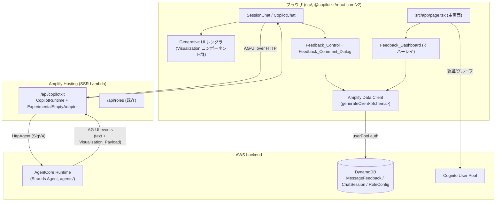
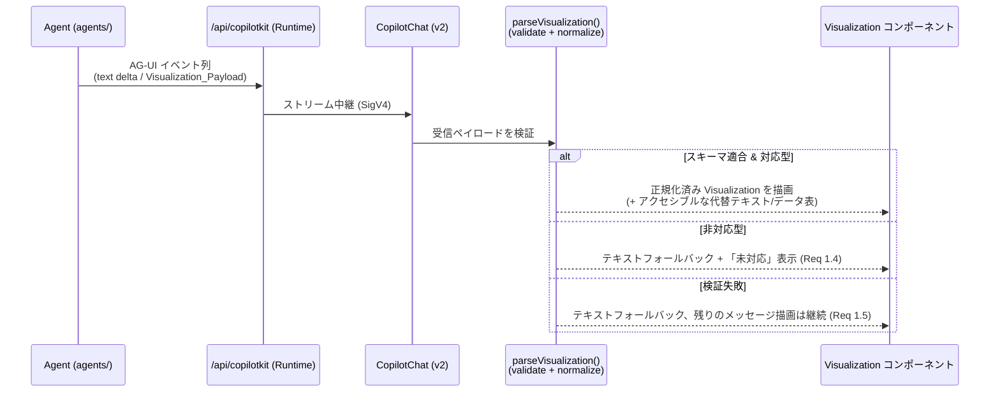
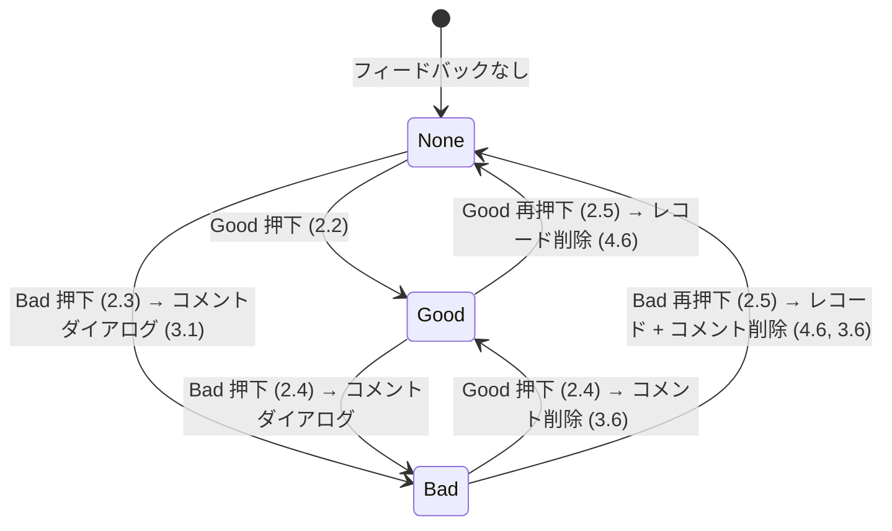
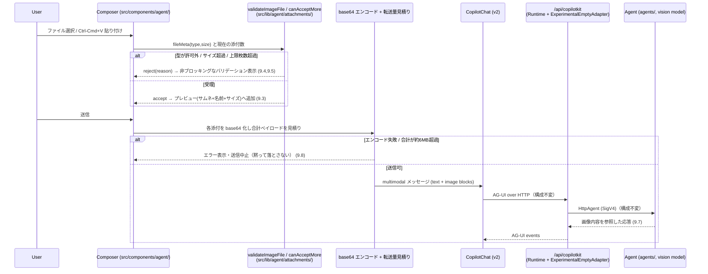
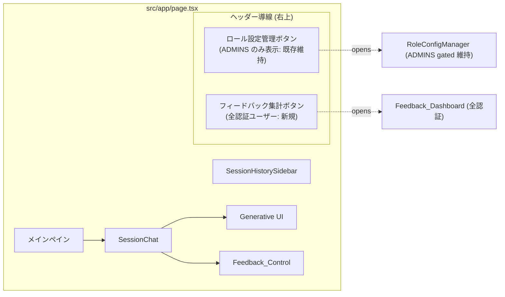

# 設計ドキュメント: UI/UX Enhancements

## Overview

本設計は、機能開発が概ね完了した本アプリケーション（Next.js App Router + CopilotKit `@copilotkit/react-core/v2` + AG-UI + Amplify Gen 2）に対する UI/UX 強化を、既存アーキテクチャを壊さずに段階的に実装するための技術方針を定義する。requirements.md の 8 つの Requirement を、次の 6 つの実装イニシアチブへ対応付ける。

1. **Generative UI（回答のリッチ表示）** — Agent が AG-UI プロトコルで送出する `Visualization_Payload`（棒/折れ線/円グラフ・表）を、スキーマ検証・正規化・テキストフォールバック・アクセシビリティを備えて Chat_UI 内に描画する（Req 1、Req 8.2/8.3/8.4）。
2. **Good/Bad フィードバック操作** — CopilotKit の **ビルトインメッセージコントロール**（`AssistantMessage` の `onThumbsUp`/`onThumbsDown` + `feedback` プロップ）を用いて Good/Bad を提供し、押下時の状態遷移（記録/更新/クリア）と楽観的 UI を実装する。独自の `FeedbackControl` は設けず、状態遷移・永続化ロジック（`nextFeedbackState` / `useMessageFeedback`）のみを配線する（Req 2）。
3. **Bad コメント収集ダイアログ** — Bad 評価時に任意コメント（最大 1000 文字）を収集する `Feedback_Comment_Dialog` を実装する（Req 3）。
4. **MessageFeedback データモデル + 認可** — Feedback を Amplify Gen 2 Data_Model として `amplify/data/resource.ts` に段階的に追加する（Req 4、Req 8.5）。
5. **Feedback_Dashboard（全認証ユーザー向け）** — 全ユーザー横断の集計・傾向・Bad コメント一覧を、認証済みの全ユーザーが閲覧できるダッシュボードとして主画面上の導線に載せる（Req 5、Req 8.6）。
6. **ビジュアルリニューアル** — HTML モック先行確認（Req 6）と、Design_Tokens・コントラスト・キーボード操作・レスポンシブを満たす品質基準（Req 7）を適用する。あわせて、アシスタントメッセージ下部の操作行（Good/Bad + 再生成 + コピー）は、独自の `Message_Action_Row` を設けず **CopilotKit のビルトインメッセージコントロール**（`AssistantMessage` 既定描画が持つ regenerate/copy と、`onThumbsUp`/`onThumbsDown` 供給時に表示される thumbs up/down）に一本化する（Req 2.8–2.10）。セッションヘッダーの冗長な「新規セッション」ボタンを撤去してサイドバー「新規チャット」に一本化する点は維持する（Req 7.5）。
7. **画像入力（アップロード + スクリーンショット貼り付け）** — `Composer`（`src/components/agent/`）にファイル選択・クリップボード貼り付け・添付プレビュー・純粋バリデーションを実装し、送信時に base64 インライン画像コンテンツとして既存の AG-UI 経路で Agent へ送る。Agent 側（`agents/`）はビジョン対応 Bedrock モデルでインライン画像を処理する。専用オブジェクトストレージ（S3 等）は使わない（Req 9、Req 8.4/8.7）。

### 設計変更 (Option A): CopilotKit ビルトインコントロールへの切替

当初は独自の `FeedbackControl`（Good/Bad）と `MessageActionRow`（再生成 + コピー + Good/Bad を束ねる行）を実装し、CopilotKit 既定の操作行を CSS で隠す方針だった。しかし実行中アプリで、CopilotKit 既定の操作行（再生成 + コピー）と独自 `MessageActionRow` が **二重に重なって表示**される不具合が生じた。隠蔽用の CSS セレクタ（`.copilotKitMessageControls`）が実際の v1.59 DOM に一致しなかったためである。

これを受け、**独自コントロールの実装を止め、CopilotKit のビルトインメッセージコントロールを使う（Option A）**。`@copilotkit/react-ui` v1.59 の既定 `AssistantMessage` は、単一の操作行（`copilotKitMessageControls`）に **再生成 + コピー** を常に描画し、`onThumbsUp`/`onThumbsDown` が渡されたときのみ **thumbs up/down** を追加描画して `feedback`（`"thumbsUp" | "thumbsDown" | null`）に応じてハイライトする（`node_modules/@copilotkit/react-ui/dist/index.mjs` の `AssistantMessage` 実装で確認済み）。

したがって、独自の `FeedbackControl` / `MessageActionRow` とその CSS を廃し、`MessageFeedbackProvider` 内に **薄いラッパー `FeedbackAssistantMessage`** のみを残す。ラッパーは既定 `AssistantMessage`（`DefaultAssistantMessage`）に対し、`useMessageFeedback` の状態から算出した `feedback` を注入し、`onThumbsUp`/`onThumbsDown` を feedback リデューサ + Bad コメントダイアログへ配線する。`CopilotChat` は per-message の `feedback` を受け取るプロップ（`messageFeedback`）を **提供しない**ため、per-message の `feedback` はこの薄いラッパー経由で注入する。

**rationale:** (1) 重複/重なりのある操作行を解消する、(2) ネイティブ UX（既定のアイコン・ラベル・配置）に揃える、(3) 保守すべき独自 UI コードを削減する。この切替後も、Good/Bad 表示（Req 2.1）、3 状態の視覚区別（Req 2.6、`feedback` ハイライト + 押下でのクリア）、再生成（Req 2.8, 2.9）、コピー（Req 2.8, 2.10）、およびセッションヘッダーの「新規セッション」ボタン撤去（Req 7.5）はすべてビルトインコントロール + 既存の状態遷移/永続化ロジックで満たされる。

### 設計の指針（要件由来の制約）

- 主画面は既存どおり `src/app/page.tsx` に構築し、新規サブページを作らない（Req 8.1、`structure` ルール）。Feedback_Dashboard も `RoleConfigManager` と同じくオーバーレイ/パネルとして主画面上に載せる。
- CopilotKit の import は `@copilotkit/react-core/v2` に統一し、`ブラウザ → /api/copilotkit（SSR Lambda, CopilotRuntime + ExperimentalEmptyAdapter）→ HttpAgent（SigV4）→ AgentCore Runtime` の接続構成を一切変更しない（Req 8.2、8.3）。
- 発言内容の正のデータソースは AgentCore Memory に一本化済み。Feedback は発言内容とは別の付随メタデータとして新規 `MessageFeedback` に保存し、`ChatMessage` への発言内容書き込みは復活させない。
- Agent が可視化ペイロードを送出する処理は `agents/` に閉じ、`src/` にエージェントランタイムロジックを持ち込まない（Req 8.4、`structure` ルール）。
- 画像入力は既存の接続経路（`ブラウザ → /api/copilotkit → HttpAgent(SigV4) → AgentCore`）を一切変更せず、base64 インライン画像コンテンツを AG-UI メッセージに載せて送る（Req 8.7、9.6）。S3 等のオブジェクトストレージは導入しない。画像の検証ロジックは UI/インフラから分離した純粋モジュール（`src/lib/agent/attachments/`）に置き、UI コンポーネントはそれを呼び出すだけにする（`amplify-frontend` ルール）。ビジョン処理（画像コンテンツを解釈するモデル呼び出し）は `agents/` 側に閉じる（Req 8.4、9.7）。

### 高感度変更フラグ（要レビュー）

本設計には次の **高感度変更（auth/data）** が含まれる。`security` / `repo-workflow` / `amplify-backend` ルールに従い、明示的にフラグを立てる。

> 🚩 **[高感度] MessageFeedback の read 認可を全認証ユーザーへ開放（Req 4.3, 5.2, 8.6）**
> `MessageFeedback` の read 認可を `allow.authenticated().to(["read"])`（全オーナー横断の読み取り）とし、create/update/delete は `allow.owner()`（所有者のみ）に限定する。
> **プライバシー影響:** これにより、**認証済みの任意のユーザーが他ユーザーの投稿した Bad の自由記述コメント（Feedback_Comment）を閲覧できる**。これは Feedback_Dashboard を ADMINS 限定にせず全ユーザーへ開放するという要件変更（Req 5.1）の直接的な帰結である。設計・実装・レビュー時に、この読み取り開放の妥当性（コメントに個人情報や機微情報が書かれ得ること）を運用者が受容していることを確認する必要がある。
> **緩和策（設計上の前提）:** create/update/delete は owner 限定のままとし、なりすまし投稿は不可能（Req 4.4, 4.7）。Feedback は発言内容そのものではなく評価メタデータに限定される。

> 🚩 **[高感度] Amplify Data スキーマへのモデル追加（Req 8.5）**
> `amplify/data/resource.ts` に `MessageFeedback` を **追加**する。既存 `ChatSession`（`allow.owner()`）および `RoleConfig`（`allow.group("ADMINS")`）の認可・フィールドは一切変更しない。スキーマ変更は Amplify のデプロイ（sandbox / Amplify Hosting）を伴うため、後述の「デプロイ影響」に記載する。

> ℹ️ **[非高感度・注記] 画像入力は auth/data-at-rest の新規面を追加しない（Req 9, 8.7）**
> 画像は S3 等のオブジェクトストレージに保存せず、DynamoDB にも永続化しない。既存の SigV4 経路上に base64 インライン画像コンテンツとして一時的に載るだけであり、新たな認証・認可・保存データの面は生じない（IAM/認証/データ保存の高感度変更には該当しない）。ただし **画像バイトがモデルへインライン送信され、リクエストペイロードが増大する** ため、AG-UI 経路（API Gateway + Lambda）の約 6MB 転送上限を超え得る点に注意する。上限超過・エンコード失敗は **エラーとして表面化させ、添付を黙って落とさない**（Req 9.8）。これは後述の「Error Handling」に規定する。

### 影響レイヤーとデプロイ影響（AGENTS.md 検証原則）

| レイヤー | 変更内容 | デプロイ影響 |
| --- | --- | --- |
| **Frontend（`src/`）** | Generative UI レンダラ、Feedback ダイアログ + ビルトイン thumbs 配線（`FeedbackAssistantMessage`）、Feedback_Dashboard、Design_Tokens、CopilotKit ビルトイン操作行（再生成 + コピー + Good/Bad）、`Composer`（画像添付/貼り付け/プレビュー）、画像添付の純粋バリデーション（`src/lib/agent/attachments/`）。すべて `src/app/page.tsx` 上に構築 | Amplify Hosting の Git push で自動ビルド・デプロイ。データモデル・接続構成の変更なし |
| **Amplify backend（`amplify/`）** | `MessageFeedback` モデル追加（read 全認証開放）。画像入力によるバックエンド定義変更は **なし**（S3 等を追加しない） | `amplify sandbox`（反復開発）→ Amplify Hosting デプロイで反映。既存モデル無変更のため後方互換 |
| **Agent（`agents/`）** | `Visualization_Payload` を AG-UI で送出する処理、および **インライン画像コンテンツを単一のビジョン対応 Bedrock モデル（Converse API / Strands `BedrockModel`）へ渡す処理**（`agents/app/` 内）。既定モデルは **Claude Sonnet 5**、モデル ID は **環境変数で構成可能**（ハードコードしない） | `agentcore deploy` で手動デプロイ。設定モデルがビジョン対応であることが前提（モデルルーティングなし）。デプロイリージョンでのモデル可用性・クロスリージョン推論プロファイル（例: ap-northeast-1 は `jp.anthropic.claude-sonnet-5`）の要否を確認。フロント結合テストは Amplify Hosting デプロイ環境で実施 |
| **転送経路（不変）** | `/api/copilotkit`（CopilotRuntime + ExperimentalEmptyAdapter）→ HttpAgent(SigV4) → AgentCore。画像は既存 AG-UI メッセージにインライン base64 で相乗り | 構成変更なし。API Gateway + Lambda の約 6MB ペイロード上限に留意（Req 9.8） |
| **CI/CD** | フロント lint + 型チェック、Agent の ruff + インポート確認 | 既存 CI ワークフローに準拠 |

このイニシアチブは複数レイヤーにまたがるため、`repo-workflow` ルールに従い、リファクタ・機能追加・インフラ変更を混在させず、レビューしやすい単位（例: データモデル追加、Generative UI、Feedback、Dashboard、ビジュアル）に分割して PR 化することを推奨する。

## Architecture

### 全体構成（接続構成は不変）



- **変更しない部分:** ブラウザ→`/api/copilotkit`→`HttpAgent`(SigV4)→AgentCore Runtime の経路、`ExperimentalEmptyAdapter`、v2 import（Req 8.2, 8.3）。
- **追加する部分:** AG-UI イベントから `Visualization_Payload` を取り出して描画する Generative UI レンダラ（ブラウザ側）、Feedback の Amplify Data 経由の永続化、Feedback_Dashboard。

### Generative UI のデータフロー（Req 1, 8.4）



`Visualization_Payload` の送出（Agent 側）は `agents/app/` 内に閉じる。AG-UI のイベント（`main.py` の `EventEncoder`/`agui_agent.run(...)` が流すイベント列）に、可視化用の構造化データを **カスタムイベント / ツール結果** として載せる。フロントは受信したペイロードを `parseVisualization()` に通してから描画する。フロントは可視化データを生成するランタイムロジックを持たない（Req 8.4）。

> **スコープ外の確定事項（要件の Out of Scope に準拠）:** 具体的なチャートライブラリ選定、AG-UI 上の正確なイベント種別（カスタムイベント名か tool-render か）、DynamoDB の GSI 物理設計、集計クエリの実装方式は、タスク実装フェーズで確定する。本設計は型定義・境界・振る舞い・検証点を規定する。

### Feedback の状態遷移（Req 2, 3, 4）



状態遷移は純粋なリデューサ `nextFeedbackState(current, activatedSentiment)` に集約し、UI・永続化から分離してユニット/プロパティテスト可能にする（`amplify-frontend` ルール: UI ロジックとインフラを分離）。永続化は「楽観的更新 → Amplify Data 呼び出し → 失敗時ロールバック」（Req 2.7）で行う。

### 画像入力のデータフロー（Req 9, 8.7）

接続経路は不変のまま、画像は `Composer` で選択/貼り付け → 純粋バリデーション → base64 化 → 既存 AG-UI メッセージへ text と並ぶ画像コンテンツブロックとして相乗りさせる。永続化・S3 は介在しない。



### 画面構成（主画面 = page.tsx、サブページを作らない）



既存 `page.tsx` の右上導線（現状は ADMINS のみ「ロール設定管理」ボタンを表示）に、**全認証ユーザー向けの「フィードバック集計」ボタンを併置**する（Req 5.3, 8.6）。ロール設定管理ボタンの ADMINS ゲート（`canAccessRoleConfigSettings(groups)`）は変更しない。

## Components and Interfaces

### フロントエンド コンポーネント（`src/components/agent/`）

新規コンポーネントは既存の `src/components/agent/` 配下に、小さく合成可能な単位で追加する（`amplify-frontend` ルール）。

1. **`Visualization`（新規, `src/components/agent/visualization/`）** — `Visualization_Payload` を受け取り、正規化後に型に応じた子コンポーネント（`BarChartView` / `LineChartView` / `PieChartView` / `DataTableView`）へディスパッチする。非対応型・検証失敗時は `VisualizationFallback`（テキスト表現 + 理由表示）を描画する（Req 1.1, 1.2, 1.4, 1.5）。すべての Visualization に、タイトルと全データ値を伝えるアクセシブルな代替（`<figure>` + 視覚的に隠したデータ表、`aria-label`/`figcaption`）を付与する（Req 1.7, 1.8）。
2. **`VisualizationFallback`（新規）** — 生ペイロードをテキスト/簡易表として表示し、「この可視化タイプは未対応です」等の注記を添える。
3. **`FeedbackAssistantMessage`（薄いラッパー, `MessageFeedbackProvider` 内）** — Good/Bad の専用 UI コンポーネント（`FeedbackControl`）は **設けない**。代わりに CopilotKit 既定の `AssistantMessage`（`DefaultAssistantMessage`）に対し、`useMessageFeedback` の `Feedback_Sentiment` を `feedback`（good→`"thumbsUp"`, bad→`"thumbsDown"`, null→`null`）にマップして注入し、`onThumbsUp`/`onThumbsDown` を feedback リデューサ（`onGood`/`onBad`）+ Bad コメントダイアログへ配線する薄いラッパーのみを残す（Req 2.1, 2.6）。既定 `AssistantMessage` が `feedback` に応じて thumbs をハイライトすることで 3 状態の視覚区別を満たす。`CopilotChat` は `messageFeedback`（per-message の feedback マップ）を受け取らないため、per-message の `feedback` はこのラッパー経由で注入する。
4. **`FeedbackCommentDialog`（新規）** — Bad 押下時に開く任意入力ダイアログ。最大 1000 文字のバリデーション（超過時は送信不可 + バリデーションメッセージ）を持つ（Req 3.1–3.5）。コメント無し送信・キャンセルも許容（Req 3.2, 3.4）。
5. **`FeedbackDashboard`（新規）** — 全ユーザー横断の集計（Good 件数 / Bad 件数 / Good 比率）、時系列トレンドの Visualization、Bad + コメント一覧、0 件時の空状態を表示する（Req 5.2, 5.4–5.7）。集計値の可視化には (1) の `Visualization` を再利用する。
6. **`page.tsx`（改修）** — 右上導線に「フィードバック集計」ボタン（全認証ユーザー）を追加し、`showFeedbackDashboard` 状態でオーバーレイ表示する。既存の ADMINS ボタン・状態機械は維持（Req 5.3, 8.1, 8.6）。
7. **メッセージ操作行（CopilotKit ビルトイン, 独自 `MessageActionRow` は廃止）** — 独自の `MessageActionRow` は **実装しない**。アシスタントメッセージ下部の操作行は CopilotKit 既定の `AssistantMessage` が描画する単一の `copilotKitMessageControls` 行に一本化する。この行は **再生成（regenerate）** と **コピー（copy-to-clipboard, `navigator.clipboard`）** を常に持ち（Req 2.8, 2.9, 2.10）、`FeedbackAssistantMessage` が `onThumbsUp`/`onThumbsDown` を供給するときのみ **Good/Bad（thumbs up/down）** を同一行に追加描画する（Req 2.1, 2.8）。再生成は既定コントロールが該当アシスタントメッセージの元プロンプトに対する再応答を Agent に要求し、コピーは既定コントロールが応答テキストをクリップボードへ書き込む。これに伴い、セッションヘッダーの冗長な「新規セッション」ボタンを撤去し、サイドバーの「新規チャット」を新規 Chat_Session 開始の単一導線とする（Req 7.5）。
8. **`Composer` / `MessageComposer`（新規, `src/components/agent/`）** — メッセージ送信前の入力領域。次を担う。
   - **ファイル選択コントロール**: `<input type="file" accept="image/png,image/jpeg,image/webp,image/gif" multiple>` により 1 個以上の画像を選択（Req 9.1）。
   - **貼り付けハンドラ**: テキスト入力にフォーカスがある間の `paste` イベント（Ctrl+V / Cmd+V）で `clipboardData` の画像 blob を捕捉し、保留メッセージへ添付（Req 9.2）。
   - **添付プレビューストリップ**: 各 `Image_Attachment` をサムネイル + ファイル名 + サイズで表示し、項目ごとの削除ボタンを備える（Req 9.3）。
   - **バリデーション**: 選択/貼り付け/送信の各時点で純粋関数 `validateImageFile` / `withinMessageBudget` / `canAcceptMore`（下記ロジック層）を呼び、型許可外・単一画像 3MB 超過・メッセージ合計 3MB 予算超過（主要ゲート）・3 枚超過を非ブロッキングに拒否表示（Req 9.4, 9.5）。
   - **キーボード操作/アクセシビリティ**: 添付コントロールと各削除コントロールをキーボード操作可能にし、`aria-label` を付与（Req 9.10）。
   - **送信時変換**: 受理済み添付を base64 化し、CopilotKit/AG-UI の multimodal メッセージ（text + image content blocks）として送出。**現在ターンの画像のみをインライン送出し、過去ターンの Image_Attachment バイナリはスレッドから strip して再送しない**（Req 9.9）。エンコード失敗・転送上限超過はエラー表示（Req 9.6, 9.8）。base64 化と転送量見積りのユーティリティは `src/lib/agent/attachments/` に置き、UI からは呼び出すだけとする。

### フロントエンド ロジック（`src/lib/agent/` — 純粋関数, テスト対象）

インフラ非依存の純粋ロジックを分離し、`vitest` + `fast-check` でテストする（既存 `accessGates.ts` / `*.pbt.test.ts` の慣習に合わせる）。

```typescript
// src/lib/agent/visualization/schema.ts
export type VisualizationType = "bar" | "line" | "pie" | "table";

export interface VisualizationPayload {
  type: VisualizationType;
  title: string;
  // series/labels/rows は type により意味が異なる正規化前の構造
  series: Array<{ label: string; value: number }> | Array<{ name: string; points: Array<{ x: string | number; y: number }> }>;
  columns?: string[];
  rows?: Array<Array<string | number>>;
}

/** 検証結果: 成功なら正規化済みペイロード、失敗なら理由付きエラー */
export type VisualizationParseResult =
  | { ok: true; payload: NormalizedVisualizationPayload }
  | { ok: false; reason: "invalid_schema" | "unsupported_type"; raw: unknown };

/** 生ペイロードを検証し、対応型なら正規化して返す（Req 1.1, 1.4, 1.5） */
export function parseVisualization(raw: unknown): VisualizationParseResult;

/** 正規化のみ（検証済み入力を正準形へ）。round-trip の対象（Req 1.6） */
export function normalizeVisualization(p: VisualizationPayload): NormalizedVisualizationPayload;

/** スキーマ適合判定（純粋述語）。round-trip の再検証に使用（Req 1.6） */
export function isValidVisualization(p: unknown): p is VisualizationPayload;

/** 可視化の全データ値を読み上げ可能なテキスト/表へ変換（Req 1.7, 1.8） */
export function toAccessibleTable(p: NormalizedVisualizationPayload): { caption: string; columns: string[]; rows: Array<Array<string | number>> };
```

```typescript
// src/lib/agent/feedback/feedbackState.ts
export type FeedbackSentiment = "good" | "bad";
export interface FeedbackState {
  sentiment: FeedbackSentiment | null; // null = フィードバックなし
  comment: string | null;              // bad のときのみ意味を持つ
}

/**
 * Feedback トグルの純粋リデューサ（Req 2.2, 2.3, 2.4, 2.5, 3.6）
 * - none + X            → X
 * - 反対の sentiment 押下 → 押下した sentiment に更新（bad→good 時は comment を破棄）
 * - 同じ sentiment 押下   → none（クリア）
 */
export function nextFeedbackState(current: FeedbackState, activated: FeedbackSentiment): FeedbackState;

/** コメント長バリデーション（Req 3.5, 最大 1000 文字） */
export const FEEDBACK_COMMENT_MAX = 1000;
export function isValidComment(comment: string): boolean; // length <= 1000
```

```typescript
// src/lib/agent/feedback/aggregate.ts
export interface FeedbackRecordView {
  ownerUserId: string;
  messageId: string;
  sentiment: FeedbackSentiment;
  comment: string | null;
  createdAt: string; // ISO
}
export interface FeedbackAggregate {
  goodCount: number;
  badCount: number;
  total: number;
  goodRatio: number; // total === 0 のとき 0
  badWithComments: FeedbackRecordView[]; // sentiment === "bad" のみ
}
/** 全ユーザー横断の集計（Req 5.4, 5.6, 5.7） */
export function aggregateFeedback(records: FeedbackRecordView[]): FeedbackAggregate;
```

```typescript
// src/lib/agent/attachments/imageAttachment.ts（新規・純粋ロジック, PBT 対象）
/** 送信前の画像添付。base64 データは送信直前に付与する（検証はメタデータで行う） */
export interface ImageAttachment {
  id: string;
  filename: string;
  contentType: string; // 例: "image/png"
  sizeBytes: number;
  dataBase64?: string; // 送信時に設定。検証時は未設定でよい
}

/** 拒否理由（総和型）。UI はこれを非ブロッキングなメッセージへマップする */
export type ImageAttachmentError =
  | "unsupported_type"        // 許可外の MIME タイプ（Req 9.4）
  | "file_too_large"          // 単一画像が 3MB 超過（Req 9.5(a)）
  | "message_budget_exceeded" // 1 メッセージの生バイト合計が 3MB 超過（Req 9.5(b)）
  | "too_many"                // 1 メッセージあたり 3 枚超過（Req 9.5(c)）
  | "encode_failed"           // base64 化失敗（Req 9.8）
  | "payload_too_large";      // 合計 base64 ペイロードが転送上限超過（Req 9.8）

/** 検証に必要な最小限のファイルメタ（File 全体に依存しない＝テスト容易） */
export interface ImageFileMeta {
  filename: string;
  contentType: string;
  sizeBytes: number;
}

// --- 画像上限（確定・保守的な値）---------------------------------------------
// 根拠: Amplify SSR Lambda のリクエストペイロードは約 6MB が上限。base64 化で
// 生バイトは約 1.33 倍に膨らみ、さらに JSON エンベロープ・テキスト・メッセージ
// 履歴のオーバーヘッドが乗る。加えて Bedrock Converse は 1 画像あたり ≤3.75MB。
// これらを踏まえ、生バイトで保守的に「1 画像 3MB / 1 メッセージ合計 3MB / 3 枚」
// を採用する。1 メッセージ合計予算（MESSAGE_IMAGE_BUDGET_BYTES）が主要なゲート。
export const IMAGE_MAX_BYTES = 3 * 1024 * 1024;            // 3MB: 単一画像の生バイト上限（Req 9.5(a)）
/** 主要ゲート: 1 メッセージの添付画像の生バイト合計上限（Req 9.5(b)） */
export const MESSAGE_IMAGE_BUDGET_BYTES = 3 * 1024 * 1024; // 3MB: メッセージあたりの生バイト合計上限
export const IMAGE_MAX_COUNT = 3;                          // 1 メッセージあたり最大 3 枚（Req 9.5(c)）
/**
 * AG-UI 経路（Amplify SSR Lambda + API Gateway）の概算ペイロード上限（Req 9.8）。
 * 実効的に使える上限は、エンベロープ/テキスト/base64 膨張（約 1.33x）を差し引くと
 * 約 5MB（約 6MB のうち）。base64 化後サイズはこの実効上限に対して判定する。
 */
export const TRANSPORT_MAX_BYTES = 6 * 1024 * 1024;
/** base64 判定に用いる実効ペイロード上限（約 5MB）。オーバーヘッドを差し引いた usable ceiling */
export const EFFECTIVE_TRANSPORT_MAX_BYTES = 5 * 1024 * 1024;
export const ACCEPTED_IMAGE_TYPES = ["image/png", "image/jpeg", "image/webp", "image/gif"] as const;

/** 検証結果（総和型）。例外は投げない＝全域関数 */
export type ValidationResult =
  | { ok: true }
  | { ok: false; reason: ImageAttachmentError };

/**
 * 単一ファイルの受理可否（純粋・全域）。
 * 型が ACCEPTED_IMAGE_TYPES に含まれ、かつ sizeBytes <= IMAGE_MAX_BYTES(3MB) のときだけ accept（Req 9.4, 9.5(a)）。
 */
export function validateImageFile(meta: ImageFileMeta): ValidationResult;

/**
 * 現在の添付数に対して incoming 枚を追加できるか（純粋・全域）。
 * current + incoming <= IMAGE_MAX_COUNT(3) のときだけ accept（Req 9.5(c)）。
 */
export function canAcceptMore(currentCount: number, incoming: number): ValidationResult;

/**
 * 【主要ゲート】1 メッセージの添付画像の生バイト合計が予算内かの純粋述語（Req 9.5(b)）。
 * sum(rawByteSizes) <= MESSAGE_IMAGE_BUDGET_BYTES のときだけ accept。
 * 超過時は "message_budget_exceeded" を理由に ok: false（例外は投げない＝全域）。
 */
export function withinMessageBudget(rawByteSizes: number[]): ValidationResult;

/** 合計 base64 ペイロードが実効転送上限内かの純粋述語（Req 9.8。エラー表面化の判定に使用） */
export function withinTransportLimit(base64ByteSizes: number[]): ValidationResult;
```

```typescript
// src/lib/agent/accessGates.ts（既存に追記）
/** Feedback_Dashboard は全認証ユーザーに開放（Req 5.1, 8.6）。ADMINS を要求しない */
export function canAccessFeedbackDashboard(isAuthenticated: boolean): boolean; // = isAuthenticated
// 既存 canAccessRoleConfigSettings(groups) は変更しない（ADMINS gate 維持）
```

### 永続化フック（`src/lib/agent/feedback/useMessageFeedback.ts`）

`generateClient<Schema>()`（既存 `RoleConfigManager` と同じパターン）で `MessageFeedback` を操作する React フック。

- `recordFeedback(messageId, chatSessionId, sentiment, comment?)` — `nextFeedbackState` で次状態を決め、楽観的に UI を更新してから create/update/delete を実行。1 ユーザー × 1 Message_Id で高々 1 レコードを維持し、存在すれば update、無ければ create、クリアなら delete（Req 4.5, 4.6, 5 の upsert 方針）。
- 失敗時は最後に永続化成功した状態へロールバックしエラー表示（Req 2.7）。
- owner は Amplify の `allow.owner()` が自動付与する identity claim に一致させ、他ユーザー identity では記録しない（Req 4.7）。

### API Route（変更なし）

`/api/copilotkit`（CopilotRuntime + `ExperimentalEmptyAdapter` + `HttpAgent` SigV4）と `/api/roles` は本仕様では変更しない（Req 8.3）。Generative UI は既存の AG-UI ストリームに載る構造化データをフロント側で解釈するだけであり、Route の責務は変わらない。

**画像入力のメッセージ形状（CopilotKit / AG-UI 境界, Req 9.6, 8.7）:** 画像は Route の実装を変えずに、ユーザーメッセージの `content` を「テキストブロック + 画像ブロック」の配列（multimodal content）として送ることで既存経路に相乗りさせる。画像ブロックは base64 のインラインデータ（例: `{ type: "image", source: { type: "base64", mediaType: "image/png", data: "<base64>" } }` 相当の、CopilotKit v2 / AG-UI が受理する画像コンテンツ形）で表現し、S3 参照や別エンドポイントは用いない。`CopilotRuntime` → `HttpAgent(SigV4)` → AgentCore の流路・署名・アダプタ構成は不変。**転送制約:** この経路は API Gateway + Lambda を通るため、リクエスト全体は約 6MB を上限とする。合計サイズ超過やエンコード失敗はフロントで検出してエラー表示し、添付を黙って落とさない（Req 9.8。Route 側は通常のエラーレスポンスを返すのみ）。

> ⚠️ **[設計注記] 過去ターンの画像バイトを再送しない（Req 9.9）**
> CopilotKit はターンごとにメッセージスレッド全体を再送する。もし過去ターンの `Image_Attachment` の base64 バイナリをそのまま含め続けると、会話が進むにつれてリクエストが肥大化し、容易に約 6MB のペイロード上限を超えてしまう。したがって **Frontend は「現在のターンの画像バイトのみ」をインライン送出し、過去ターンの Image_Attachment のバイナリデータは送信メッセージから除去/省略しなければならない**。会話履歴としての画像の文脈は、テキスト（および AgentCore Memory 側の履歴保持）に依存させ、画像バイトそのものは再送しない。これは各リクエストを転送上限内に保つための必須制約である（送信直前にスレッドから履歴画像ブロックを strip する）。

### Agent 側（`agents/app/`）

`Visualization_Payload` を AG-UI プロトコルで送出する処理を `agents/app/` 内に追加する（Req 1.3, 8.4）。`main.py` の `/invocations` が既に `EventEncoder` で AG-UI イベントを流しているため、可視化データはその枠組みに載せる（カスタムイベント or tool 結果）。`Visualization_Schema` はフロント（`schema.ts`）と Agent 側で **合意された同一構造** とし、双方に型/バリデーションを置く。Agent 側の詳細実装は本フロント設計のスコープ外（`strands-agent` / `structure` ルール）。

**画像入力の受理とビジョン処理（Req 9.7, 8.4）:** Agent は AG-UI 経由で届く multimodal メッセージ（text + base64 インライン画像ブロック）を受理し、Strands エージェント経由で **ビジョン対応の Bedrock モデル** へ画像コンテンツを渡して、応答が画像内容を参照できるようにする。この画像処理ロジックは `agents/` に閉じ、`src/` にはビジョン処理ロジックを置かない（Req 8.4）。

**アプローチ（モデルルーティングなし・単一マルチモーダルモデル）:** テキストのみのメッセージも text+image のメッセージも、**単一のビジョン対応マルチモーダルモデル**で処理する。入力の種類に応じてモデルを切り替える／ルーティングすることは **しない**。Bedrock Converse API（Strands `BedrockModel`）の content-block 形式はモデル非依存であり、ビジョン対応モデルはテキスト単独と text+image の両モダリティを同一の Converse コンテンツ形式でそのまま扱えるためである。画像が無いときに安価なテキスト専用モデルへ振り分けるといった **モデルルーティングは現時点でスコープ外**とし、将来のコスト最適化のための拡張ポイントとしてのみ位置づける。

**構成可能性（モデル ID は環境変数）:** 使用するモデル ID は **ハードコードせず環境変数で構成可能**にする。これにより、モデルの差し替え（別世代・別プロバイダへの切替）はコード変更ではなく設定変更で完結する。

**デフォルトモデル: Claude Sonnet 5（Anthropic）** — 2026-06-30 に Amazon Bedrock で提供開始された、画像入力（Image input）と Converse API に対応するマルチモーダルモデルを既定とする。Bedrock のモデル ID:
- ベース: `anthropic.claude-sonnet-5`
- クロスリージョン推論プロファイル: `us.anthropic.claude-sonnet-5` / `eu.anthropic.claude-sonnet-5` / `au.anthropic.claude-sonnet-5` / `jp.anthropic.claude-sonnet-5`
- グローバル: `global.anthropic.claude-sonnet-5`

ap-northeast-1（日本）へのデプロイでは `jp.` の推論プロファイル（`jp.anthropic.claude-sonnet-5`）が適切である。

**実装時の検証ノート:**
1. **リージョン可用性:** デプロイ対象リージョンで当該モデルが利用可能かを確認し、クロスリージョン推論プロファイル ID の指定が必要かどうかを確認する。
2. **Converse 経路の受理確認:** Sonnet 5 世代は新しい Messages/bedrock-mantle エンドポイントも公開しているため、Strands `BedrockModel`（Converse 経路）が対象リージョンでこのモデル ID を受理することを **スモークテストで検証**する。受理されない場合は、近い世代の Converse 対応モデル（例: Claude Sonnet 4.6 `anthropic.claude-sonnet-4-6`）へフォールバックする。
3. **ビジョン対応必須:** 環境変数で設定するモデルは **必ずビジョン対応**でなければならない。非ビジョンモデルを設定すると画像リクエストはエラーになる（運用ノートとして明記）。

検証は `testing` ルールに従い、ローカルは `uvicorn` / `agentcore dev` + `curl` によるスモーク（`/invocations` にインライン画像ブロックを含むリクエストを投げて受理と応答を確認）で行い、フロント↔Agent の完全な結合は Amplify Hosting デプロイ環境で確認する（ローカル結合不可）。

## Data Models

### MessageFeedback（新規 Amplify Gen 2 Data_Model）

`amplify/data/resource.ts` の `a.schema({ ... })` に、既存 `ChatSession` / `RoleConfig` を変更せず **追記** する（Req 4.1, 4.2, 8.5）。

```typescript
// amplify/data/resource.ts へ追記（既存モデルは無変更）
MessageFeedback: a
  .model({
    ownerUserId: a.string().required(),   // Cognito sub（owner claim と一致）
    chatSessionId: a.string().required(), // 紐づく Chat_Session
    messageId: a.string().required(),     // AG-UI 上の Message_Id
    sentiment: a.enum(["good", "bad"]),   // Feedback_Sentiment
    comment: a.string(),                  // 任意、bad のときのみ、<= 1000 文字
    createdAt: a.datetime().required(),   // 作成タイムスタンプ
  })
  .secondaryIndexes((index) => [
    // (owner, message) の upsert 検索と、集計/トレンド用の走査に用いる想定。
    // 具体的な GSI 構成・集計クエリ方式は実装フェーズで確定（要件 Out of Scope）。
    index("ownerUserId").sortKeys(["messageId"]).queryField("listFeedbackByOwnerMessage"),
  ])
  // 🚩 高感度: read を全認証ユーザーへ開放、CUD は owner 限定（Req 4.3, 4.4）
  .authorization((allow) => [
    allow.owner().to(["create", "read", "update", "delete"]),
    allow.authenticated().to(["read"]),
  ]),
```

**認可の意味（Req 4.3, 4.4, 4.7）:**
- `allow.owner()` — レコード所有者は自分の Feedback を作成・読み取り・更新・削除できる。
- `allow.authenticated().to(["read"])` — 認証済みの任意ユーザーが **全オーナー横断で read** できる（Feedback_Dashboard の全ユーザー集計・他ユーザーの Bad コメント閲覧を支える。🚩 上述のプライバシー影響を伴う）。
- create/update/delete は owner 以外に付与しない → なりすまし投稿・改ざん・削除は不可（Req 4.4, 4.7）。

**フィールドと要件の対応（Req 4.1）:** `ownerUserId`＝owner、`chatSessionId`＝Chat_Session、`messageId`＝Message_Id、`sentiment`＝Feedback_Sentiment（"good"/"bad"）、`comment`＝任意の Feedback_Comment、`createdAt`＝作成タイムスタンプ。

**一意性（Req 4.5）:** 1 つの (`ownerUserId`, `messageId`) に対し高々 1 レコード。フロントの `useMessageFeedback` が既存レコードを検索して update / なければ create / クリア時 delete することで保証する（DynamoDB 側の物理的一意制約ではなくアプリ層の upsert 方針。並行操作の競合は「最後に成功した永続化状態」へ収束させる）。

**認可モード:** `defineData` の `defaultAuthorizationMode: "userPool"` を継承（Req 4.2）。既存モデルと一貫。

**既存モデルへの影響:** なし。`ChatSession`（`allow.owner()`）・`RoleConfig`（`allow.group("ADMINS")`）・`Todo` の定義と認可は無変更（Req 8.5）。

### Visualization_Schema（フロント/Agent 合意の構造 — 永続化しない）

`Visualization_Payload` は DynamoDB に保存せず、AG-UI ストリーム上の一時データとしてのみ扱う（発言内容の正データソースは AgentCore Memory）。構造は前掲 `schema.ts` の `VisualizationPayload` を正とし、`type ∈ {bar, line, pie, table}`、`title: string`、および型に応じた `series` / `columns` + `rows` を持つ。`normalizeVisualization` が数値・ラベル・欠損の正準化を行い、`isValidVisualization` が再検証する（Req 1.6 の round-trip 対象）。

### Image_Attachment（永続化しない・インライン送出のみ）

`Image_Attachment`（前掲 `imageAttachment.ts` の `ImageAttachment`）は **Amplify Data / DynamoDB / S3 のいずれにも永続化しない**（Req 8.7, 9.6）。ブラウザ内の保留メッセージ状態としてのみ保持し、送信時に base64 化して AG-UI メッセージの画像コンテンツブロックに載せて Agent へ渡す。したがって新規 Data_Model は追加せず、認可・保存データの新規面も生じない（前掲「非高感度・注記」参照）。検証に用いるメタ（`filename` / `contentType` / `sizeBytes`）と定数（`IMAGE_MAX_BYTES`=3MB / `MESSAGE_IMAGE_BUDGET_BYTES`=3MB / `IMAGE_MAX_COUNT`=3 / `ACCEPTED_IMAGE_TYPES` / `TRANSPORT_MAX_BYTES` / `EFFECTIVE_TRANSPORT_MAX_BYTES`）はフロントの純粋ロジック層に閉じる。さらに、過去ターンの画像バイトは送信スレッドから strip し再送しない（Req 9.9）。

## Correctness Properties

*プロパティとは、システムのすべての妥当な実行にわたって成り立つべき特性・振る舞いであり、システムが何をすべきかについての形式的な言明である。プロパティは、人間可読な仕様と機械検証可能な正しさ保証との橋渡しとなる。*

本機能には純粋関数（可視化の検証/正規化、Feedback リデューサ、集計、アクセスゲート、**画像添付バリデーション**）が含まれ、これらは「for all 入力」で成り立つ普遍的プロパティを持つため、プロパティベーステスト（PBT）が適切である。一方、Amplify の認可強制・AG-UI 送出・画像のインライン転送/ビジョン処理・描画のトーン等はインテグレーション/例示/スモークで扱う（Testing Strategy 参照）。以下は上記 prework に基づき冗長性を排除して整理したコアプロパティである。画像入力については、型許可リスト・単一画像サイズ上限・メッセージ合計予算・枚数上限の純粋バリデーションを Property 9 として追加する（9.6/9.7/9.8/9.9/9.10 の転送・ビジョン・再送抑止・エラー表面化・アクセシビリティは外部境界/UI のため PBT ではなくスモーク/例示/エッジで扱う）。

### Property 1: Visualization_Payload の validate/normalize ラウンドトリップ

*For all* Visualization_Schema に適合する `Visualization_Payload` `p` について、`normalizeVisualization(p)` の結果 `n` は再び `isValidVisualization(n)` を満たし、`n` は `p` と同一の可視化タイプ（`type`）および同一のデータ値（系列・ラベル・行）を表す。さらに正規化は冪等である（`normalizeVisualization(n)` は `n` と等価）。

**Validates: Requirements 1.6**

### Property 2: parse は全域であり、非適合は必ずフォールバックへ分類される

*For all* 任意の入力 `x`（構造不明・不正・非対応型を含む）について、`parseVisualization(x)` は例外を投げず、次のいずれかを返す — (a) `x` が Schema 適合かつ対応型（bar/line/pie/table）なら `ok: true` で正規化済みペイロード、(b) 対応型でないなら `ok: false, reason: "unsupported_type"`、(c) Schema 非適合なら `ok: false, reason: "invalid_schema"`。`ok: true` のとき正規化ペイロードの `type` は対応 4 種のいずれかであり、`ok: false` のときは常にテキストフォールバックへ導かれる。

**Validates: Requirements 1.1, 1.4, 1.5**

### Property 3: アクセシブルな代替はタイトルと全データ値を含む

*For all* Schema 適合の `Visualization_Payload` `p` について、`toAccessibleTable(normalizeVisualization(p))` の出力は `p.title` を `caption` に含み、かつ `p` が保持するすべてのデータ値（各系列値・各セル値）を `rows` 内に含む。チャート型（bar/line/pie）についても下地データ値が表形式で取得可能である。

**Validates: Requirements 1.7, 1.8**

### Property 4: Feedback トグルリデューサ

*For all* 現在の Feedback 状態 `s`（`sentiment ∈ {good, bad, null}`、`comment`）と押下された `activated ∈ {good, bad}` について、`nextFeedbackState(s, activated)` は次を満たす — (a) `s.sentiment === null` なら結果は `activated`、(b) `s.sentiment` が `activated` と反対なら結果は `activated`（かつ `activated === good` で `bad` から遷移した場合 `comment` は破棄され `null`）、(c) `s.sentiment === activated` なら結果は `null`（クリア）。結果の `sentiment` が `bad` でない場合、結果の `comment` は常に `null` である。

**Validates: Requirements 2.2, 2.3, 2.4, 2.5, 3.6**

### Property 5: コメント長バリデーション

*For all* 文字列 `c` について、`isValidComment(c)` が `true` であることと `c` の長さが 1000 以下であることは同値である（境界 1000 は有効、1001 は無効）。

**Validates: Requirements 3.5**

### Property 6: (owner, messageId) 単位の upsert 不変条件

*For all* 同一 (`ownerUserId`, `messageId`) に対する Feedback アクション列（good/bad の記録・更新・クリアの任意の並び）について、アクション列を適用した後のローカル Feedback ストアには、その (`ownerUserId`, `messageId`) の組に対応するレコードが高々 1 件しか存在しない。直近のアクションがクリアであれば対応レコードは 0 件（削除済み）である。

**Validates: Requirements 4.5, 4.6**

### Property 7: 全ユーザー横断の集計不変条件

*For all* Feedback レコードの集合 `R`（複数オーナー混在を含む）について、`aggregateFeedback(R)` は次を満たす — `goodCount + badCount === total`、`total === |R|`（閲覧者に依存せず入力集合全体を反映）、`total > 0` のとき `goodRatio === goodCount / total`・`total === 0`（空集合）のとき `goodRatio === 0` かつ全カウント 0（エラーにならない）、`badWithComments` の全要素は `sentiment === "bad"` である。

**Validates: Requirements 5.2, 5.4, 5.6, 5.7**

### Property 8: アクセスゲート（Dashboard は全認証・RoleConfig は ADMINS）

*For all* 認証状態 `isAuthenticated` と Cognito グループ集合 `groups` について、`canAccessFeedbackDashboard(isAuthenticated)` は `isAuthenticated` と同値であり（ADMINS 所属を要求しない）、`canAccessRoleConfigSettings(groups)` は `groups` に `"ADMINS"` が含まれることと同値である（既存 ADMINS ゲート維持）。

**Validates: Requirements 5.1, 8.6**

### Property 9: 画像添付バリデーション（型許可リスト・サイズ上限・合計予算・枚数上限）

*For all* ファイルメタ `m`（`contentType`・`sizeBytes` を任意に変化させる）について、`validateImageFile(m)` が `ok: true` を返すことは、`m.contentType ∈ ACCEPTED_IMAGE_TYPES` **かつ** `m.sizeBytes <= IMAGE_MAX_BYTES`（3MB）が成り立つことと同値である（型が許可外なら `unsupported_type`、型は許可だがサイズ超過なら `file_too_large` を理由に必ず `ok: false` を返し、例外は投げない＝全域）。さらに *for all* 生バイトサイズ列 `sizes` について、`withinMessageBudget(sizes)` が `ok: true` を返すことは `sum(sizes) <= MESSAGE_IMAGE_BUDGET_BYTES`（3MB）と同値である（超過時は `message_budget_exceeded` を理由に `ok: false`）。さらに *for all* 非負整数 `current` と `incoming` について、`canAcceptMore(current, incoming)` が `ok: true` を返すことは `current + incoming <= IMAGE_MAX_COUNT`（3）と同値である（超過時は `too_many` を理由に `ok: false`）。3 つの述語はいずれも全域（例外を投げない）であり、境界値（`sizeBytes === IMAGE_MAX_BYTES` は有効・`+1` は無効、`sum(sizes) === MESSAGE_IMAGE_BUDGET_BYTES` は有効・`+1` は無効、`current + incoming === IMAGE_MAX_COUNT` は有効・`+1` は無効）を含む。

**Validates: Requirements 9.4, 9.5**

## Error Handling

| ケース | 要件 | 振る舞い |
| --- | --- | --- |
| Visualization_Payload の Schema 検証失敗 | 1.5 | `parseVisualization` は例外を投げず `ok: false` を返す。テキストフォールバックを描画し、アシスタントメッセージの残り（他のテキスト/可視化ブロック）の描画を中断しない。 |
| 非対応の可視化タイプ | 1.4 | テキストフォールバック + 「この可視化タイプは未対応です」の注記を表示。 |
| Feedback の記録/更新/クリアの永続化失敗 | 2.7 | 楽観的更新をロールバックし、ビルトイン thumbs の `feedback` を最後に永続化成功した状態へ戻す。非破壊的なインラインエラー表示（`role="alert"`）を出す。 |
| コメント 1000 文字超過 | 3.5 | ダイアログの送信を無効化し、文字数上限のバリデーションメッセージを表示（送信操作自体を防止）。 |
| Feedback 0 件 | 5.7 | Dashboard はエラーではなく空状態（例: 「まだフィードバックがありません」）を表示。`aggregateFeedback([])` は 0 値を返す。 |
| MessageFeedback の read 失敗（ネットワーク/権限） | 5.7 系 | Dashboard はエラーインジケーターと再試行導線を表示（空状態とは区別）。集計は行わない。 |
| AgentCore Memory からの履歴復元失敗（既存経路） | 既存 | 既存の `useSessionMemoryRestore` の retry 導線を維持（本仕様で変更しない）。 |
| 並行操作による Feedback 競合 | 4.5 | 「最後に成功した永続化状態」へ収束させる（アプリ層 upsert）。物理一意制約には依存しない。 |
| 画像の base64 エンコード失敗 | 9.8 | `encode_failed` を検出してエラー表示し、送信を中止。添付を黙って落とさない（`role="alert"` の非破壊的表示）。 |
| リクエストペイロードが転送上限（実効 ~5MB / 上限 ~6MB）超過 | 9.8 | 送信前に合計 base64 サイズを見積り、`withinTransportLimit` で実効上限（`EFFECTIVE_TRANSPORT_MAX_BYTES` ~5MB）を超えれば `payload_too_large` を検出してエラー表示し送信を防止。どの添付も黙って落とさない。 |
| 非対応の画像タイプを添付 | 9.4 | `validateImageFile` が `unsupported_type` を返し、当該ファイルを受理しない。非ブロッキングなバリデーションメッセージを表示（他の操作は継続可能）。 |
| 単一画像が 3MB 超過 | 9.5(a) | `validateImageFile` が `file_too_large` を返し受理しない。単一画像上限（3MB）を示すバリデーションメッセージを表示。 |
| メッセージの生バイト合計が 3MB 予算超過 | 9.5(b) | `withinMessageBudget` が `message_budget_exceeded` を返し追加を防止（主要ゲート）。超過した上限（合計 3MB）を明示するバリデーションメッセージを表示。 |
| 添付枚数が 3 枚を超過 | 9.5(c) | `canAcceptMore` が `too_many` を返し追加を防止。枚数上限（3 枚）を示すバリデーションメッセージを表示。 |
| 過去ターンの画像バイトを再送してしまう | 9.9 | 送信直前にメッセージスレッドから過去ターンの Image_Attachment のバイナリ（base64）を strip/省略し、現在ターンの画像のみをインライン送出する。履歴はテキスト + AgentCore Memory に依存させ、画像バイトは再送しない（ペイロード肥大を防止）。 |
| Agent の設定モデルがビジョン非対応 | 9.7 | Agent 側でエラーまたはテキストのみ応答となる。運用ノートとしてビジョン対応モデルの設定を前提とする（`agents/` 側で扱う）。 |

## Testing Strategy

`testing` ルール（最も狭い検証を先に、フロントは lint/型チェック優先、Amplify はデプロイ/設定影響を記載、Agent はスモーク/インポート確認）に従い、次の層で検証する。

### 1. 静的検証（最優先・最も狭い）
- **lint + 型チェック**（`tsc` / ESLint、既存 CI `.github/workflows/ci.yml`）: 型安全、`@copilotkit/react-core/v2` のみを import し v1 を含まないこと（Req 8.2）、`src/app/` に新規サブページが増えないこと（Req 8.1）、`src/` に Agent ランタイムロジック（可視化生成・画像ビジョン処理）が無いこと（Req 8.4）を確認。あわせて、画像添付の検証ロジックが `src/lib/agent/attachments/` の純粋モジュールに分離され UI コンポーネントに散在しないこと、画像送出が既存 `/api/copilotkit` + SigV4 経路のみを用い新規接続/ストレージを導入していないこと（Req 8.7）を確認。

### 2. ユニットテスト（`vitest`）
- 特定例・エッジ・エラー経路に限定して記述し、網羅はプロパティテストに委ねる（過剰なユニットテストを避ける）。
- 対象: 4 可視化タイプの各描画（Req 1.2）、Bad 押下でのダイアログ起動とコメント有り/無し/キャンセル（Req 3.1–3.4）、永続化失敗時のロールバック（Req 2.7）、Dashboard のトレンド描画と空状態（Req 5.5, 5.7）、コントラスト比計算関数と使用トークンペアの列挙検証（Req 7.2）。
- **`FeedbackAssistantMessage`（ビルトイン配線, Req 2.1, 2.6, 2.8–2.10, 7.5）**: 独自 Good/Bad ボタン UI ではなく、薄いラッパーの配線を検証する — sentiment→`feedback` のマッピング（good→`"thumbsUp"`, bad→`"thumbsDown"`, null→`null`）、`onThumbsUp`/`onThumbsDown` が context の `onGood`/`onBad` に配線されること（生成完了かつ messageId 確定時のみ）、生成途中/id 未確定時はフィードバック配線が付かず既定描画のみになること。再生成・コピーは CopilotKit ビルトインが担うため独自テストは行わない。セッションヘッダーの「新規セッション」ボタンが撤去されサイドバー「新規チャット」が単一導線であること（Req 7.5）は既存どおり検証する。
- **画像入力の UI/エッジ**（Req 9.1–9.3, 9.8, 9.9, 9.10）: ファイル選択コントロールの存在（accept 属性）、フォーカス中の paste で画像添付、プレビュー（サムネ+名前+サイズ）と個別削除、エンコード失敗/ペイロード超過時のエラー表示（黙って落とさない）、**送信時に過去ターンの画像バイトがスレッドから strip され再送されないこと（Req 9.9）**、添付/削除コントロールのキーボード操作と `aria-label`（Req 9.10）。網羅的な型/サイズ/合計予算/枚数判定は Property 9 に委ね、ここでは代表例のみ。

### 3. プロパティテスト（`vitest` + `fast-check`）
既存 `src/lib/agent/*.pbt.test.ts` の慣習に合わせ、既存の PBT ライブラリ `fast-check`（`package.json` に導入済み）を使用し、自前実装しない。各プロパティテストは **最低 100 回反復**（`{ numRuns: 100 }`）し、設計プロパティを参照するタグコメントを付す。

タグ形式: `Feature: ui-ux-enhancements, Property {番号}: {プロパティ本文}`

| Property | 実装ファイル（想定） | 生成器の要点 |
| --- | --- | --- |
| 1 ラウンドトリップ | `src/lib/agent/visualization/schema.pbt.test.ts` | 適合ペイロード生成器（type×系列/表、Unicode・大きな数値・空系列などのエッジを含む） |
| 2 parse 全域/フォールバック | 同上 | 適合/非対応型/不正構造/`unknown` を混在生成 |
| 3 アクセシブル代替 | 同上 | 適合ペイロード生成器 |
| 4 Feedback リデューサ | `src/lib/agent/feedback/feedbackState.pbt.test.ts` | 状態 × 押下 sentiment の全組合せ |
| 5 コメント長 | 同上 | 任意長文字列（境界 1000/1001、Unicode 含む） |
| 6 upsert 不変 | `src/lib/agent/feedback/messageFeedbackStore.pbt.test.ts` | アクション列（good/bad/clear の任意列）生成器 |
| 7 集計不変 | `src/lib/agent/feedback/aggregate.pbt.test.ts` | 複数オーナー混在のレコード集合（空集合を含む） |
| 8 アクセスゲート | `src/lib/agent/accessGates.pbt.test.ts`（既存へ追記） | `isAuthenticated: boolean` × `groups`（ADMINS 有無・任意グループ） |
| 9 画像添付バリデーション | `src/lib/agent/attachments/imageAttachment.pbt.test.ts` | `validateImageFile`: `contentType`（許可/非許可 MIME 混在）× `sizeBytes`（3MB 境界・境界+1・0・超過）。`withinMessageBudget`: 生バイトサイズ列（合計が 3MB 予算の境界・境界+1・空配列・単一/複数要素）。`canAcceptMore`: `current`/`incoming`（3 枚境界・境界+1 周辺、0 を含む） |

各プロパティは **1 プロパティ = 1 プロパティテスト** で実装する。

### 4. Amplify バックエンド（デプロイ/設定影響）
- `amplify sandbox` で `MessageFeedback` の追加を反復検証（`amplify-backend` ルール）。既存 `ChatSession`/`RoleConfig` 定義・認可が無変更であることを差分で確認（Req 8.5）。
- 🚩 **認可のインテグレーション検証（高感度・デプロイ環境）:** owner による CRUD、別ユーザーによる read 可・CUD 拒否（Req 4.3, 4.4）、記録される owner が現在の認証ユーザー sub と一致すること（Req 4.7）、Dashboard が all-authenticated read で全ユーザーの Bad コメントを取得できること（Req 5.2, 5.8）を、Amplify Hosting デプロイ環境で 1–3 例ずつ確認する。ローカルでは SigV4 + コンピューティングロールが必要なため結合検証しない（`testing` ルール）。

### 5. Agent（スモーク/インポート確認）
- `agents/` の可視化ペイロード送出は、`uvicorn` または `agentcore dev` で起動し `curl` で `/invocations` を叩いて AG-UI イベントに `Visualization_Payload` が含まれることをスモーク確認（Req 1.3）。Python 側の Schema バリデーション（合意構造）は `hypothesis` によるプロパティ/例示テストを既存 `agents/app/**/test_*_pbt.py` の慣習で追加可能。ruff lint + インポート確認を優先（`testing` ルール）。
- **画像ビジョンのスモーク**（Req 9.7）: `uvicorn` / `agentcore dev` で起動し、`curl` で `/invocations` に **text + base64 インライン画像ブロック** を含む AG-UI リクエストを送り、Agent が画像を受理し画像内容を参照した応答を返すことをスモーク確認する（AgentCore Runtime 不要）。既定モデルは **Claude Sonnet 5**（`anthropic.claude-sonnet-5` 系、ビジョン + Converse 対応）で、モデル ID は **環境変数で構成**する（ハードコードしない）。スモーク時に次を検証する — (a) 設定した環境変数のモデル ID を Strands `BedrockModel`（Converse 経路）が対象リージョンで受理すること（受理不可なら近世代の Converse 対応モデル `anthropic.claude-sonnet-4-6` 等へフォールバック）、(b) デプロイリージョンでのモデル可用性とクロスリージョン推論プロファイルの要否（例: ap-northeast-1 は `jp.anthropic.claude-sonnet-5`）、(c) 設定モデルがビジョン対応であること（非対応時はエラー/テキストのみ応答となる挙動をノート）。ruff lint + インポート確認を優先。
- フロント↔Agent の Generative UI **および画像入力** の結合は Amplify Hosting デプロイ環境で確認（SigV4 + コンピューティングロールが必要なためローカル結合不可、`testing` ルール）。

### 6. ビジュアル/アクセシビリティ/レスポンシブ（例示・手動）
- Design_Tokens の一貫適用（Req 7.1）、コントラスト（Req 7.2）、キーボード操作 + 可視フォーカス（Req 7.3）、幅 1024px 以上で横スクロールなし（Req 7.4）、既存機能のリグレッション保持（Req 7.5）を確認。UI_Mock（Req 6）は静的 HTML として単体でブラウザ表示できること、実アプリのルーティング/ナビに接続しないことを確認する。
